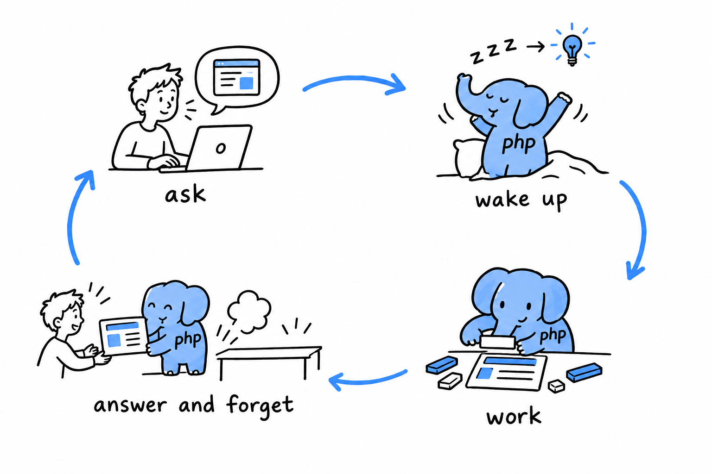
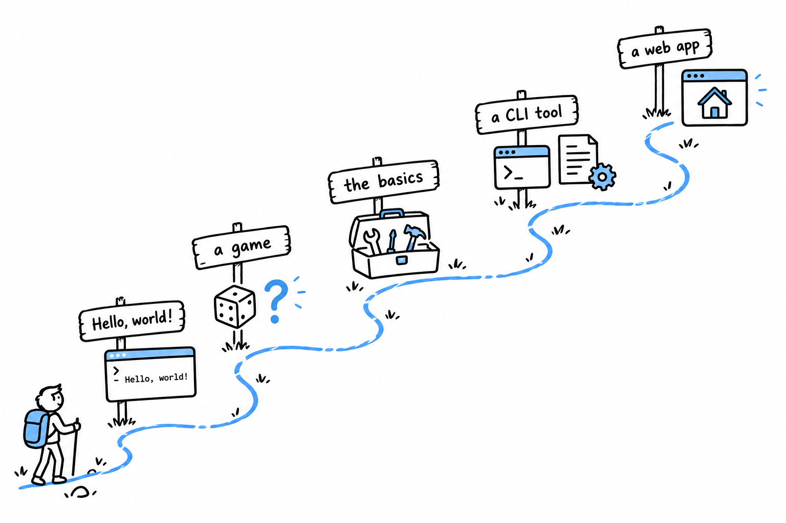

# Introduction

Right now, somewhere, someone is opening a web page. Maybe a shop, maybe a blog, maybe an online encyclopedia. Behind a good share of those pages, a small program just woke up, did its job in a few milliseconds, sent back the answer, and disappeared. That program was very likely written in PHP.

That rhythm, **wake up, work, disappear**, is the heart of how PHP works on the web. Understand it before anything else: it explains a lot of the language's character.

Picture a waiter with no memory at all. Each time a customer walks in, the waiter takes the order, prepares it, brings it, and immediately forgets the whole thing. The next customer gets exactly the same fresh start. Nothing from the previous order lingers: no crumbs, no leftover plates, no half-finished conversation.

That is a PHP page. **Every visit starts the program from scratch, runs it top to bottom, and throws everything away.** It sounds wasteful. In practice it is one of the most reliable ways ever found to serve millions of people a day: a bug affects one visit instead of poisoning the whole server, and when you need more capacity, you simply add more waiters.

> A PHP program is born for one visitor, answers, and forgets. The next visitor gets a clean slate.

The web is PHP's home, but it is not the whole story. PHP is also a perfectly good language for **small tools you run from a terminal**: renaming a thousand files, reading a spreadsheet export, sending a batch of emails, cleaning up a folder. No browser, no web server, just a script and its result.

This book starts there, on purpose. In a terminal, you type a command and the answer appears on the next line. **That instant feedback is the fastest way to learn a language.** The web, with its requests, pages, and forms, comes later, once the language itself feels familiar.

You need one skill to begin: **opening a terminal and typing a command**. If you can `cd` into a folder and run a program, you have everything required.

You do not need to have programmed before. If you have never written a line of code, every idea in the early chapters is built from the ground up, and nothing later assumes you skipped ahead. If you already know another language, you will recognize the shapes (variables, loops, functions) and can move faster, keeping an eye out for the places where PHP does a familiar thing in its own way.

Learning a language is a lot like learning to ride a bike. You do not start with the physics of balance. You get on, wobble, and ride a few meters. The explanations make much more sense once you have felt the thing move. So the book follows that order.

> First you ride. Then you learn why the bike stays up.

1. **A first program.** Install PHP and make it print a sentence.
2. **A small game.** A number-guessing game in thirty lines, built before you know what most of the words mean.
3. **The fundamentals.** Each piece of that game (variables, types, decisions, loops, functions), explained properly now that you have seen it work.
4. **A real tool.** A command line program that reads files and handles errors the way real, working software does.
5. **A web application.** A small site built from first principles, with no framework hiding what happens.

Each project is bigger than the last, and each one only uses what you have already seen.

There are two ways to read this book.

**If PHP is your first language**, read in order. Each chapter leans on the ones before it, and the later projects are much easier when the early habits are in place.

**If you already program** and just need to know how PHP does things (how its types behave, how its objects differ from its arrays, what its modern syntax looks like), treat the book as a reference and jump to the chapter you need. Chapters stand on their own as much as they can, and link back to earlier material whenever they rely on it.

One thing before you start: **install PHP**. [Chapter 1](ch01-00-getting-started.md) shows how, and it takes a few minutes. Then keep a terminal open next to this book and run every example as you meet it.

> Reading about swimming does not teach you to swim. Reading about PHP does not teach you PHP. Typing it does.
