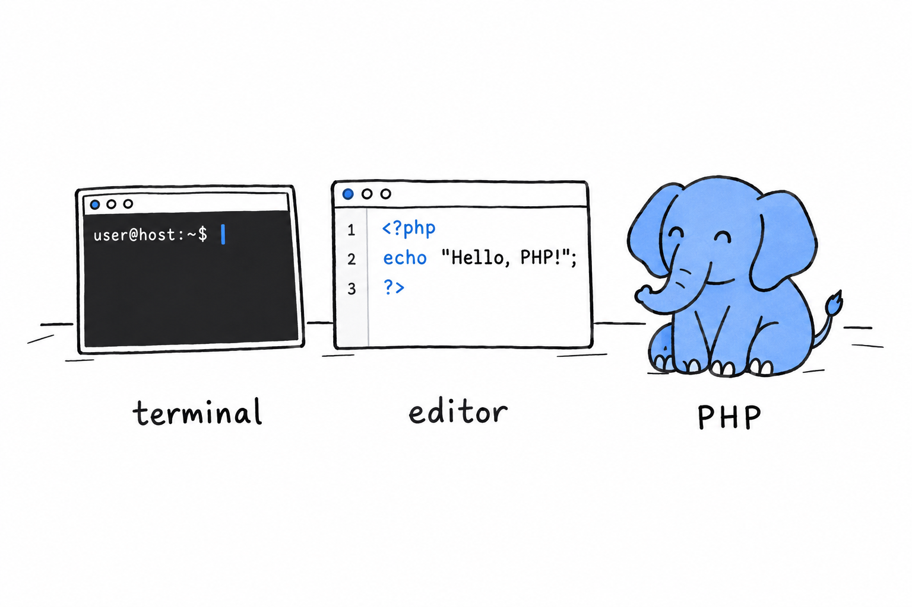

# Getting Started

Time to write some PHP.

You need three things, and you probably have two of them already: **a terminal, a text editor, and PHP itself**.

**The terminal** is where you will run your programs.

**The text editor** is where you will write them. Any editor that saves plain text will do, and if you do not have a favorite, [Visual Studio Code](https://code.visualstudio.com/) is free and works everywhere.

**PHP** is the program that reads your files and does what they say. Installing it is the only real setup in this book.

Notice what is not on the list. No web server, no framework, no build tool. PHP started life on the web, and most PHP code still ends up serving web pages eventually, but you do not need Apache, nginx, or a browser to learn the language. Everything in this chapter runs from your terminal, and that is on purpose: a terminal answers immediately, and immediate answers are what make a language click.

> No web server, no framework, no build tool. Just a terminal, and a language that answers right away.

> [!NOTE]
> This book assumes **PHP 8.1 or newer**. PHP has been around for thirty years, and the internet is full of tutorials that show code that either no longer works or, worse, still works but nobody would write today. We stick to modern PHP throughout. It is a genuinely nicer language than its old reputation suggests, and there is no reason to learn it as it was in 2010.
