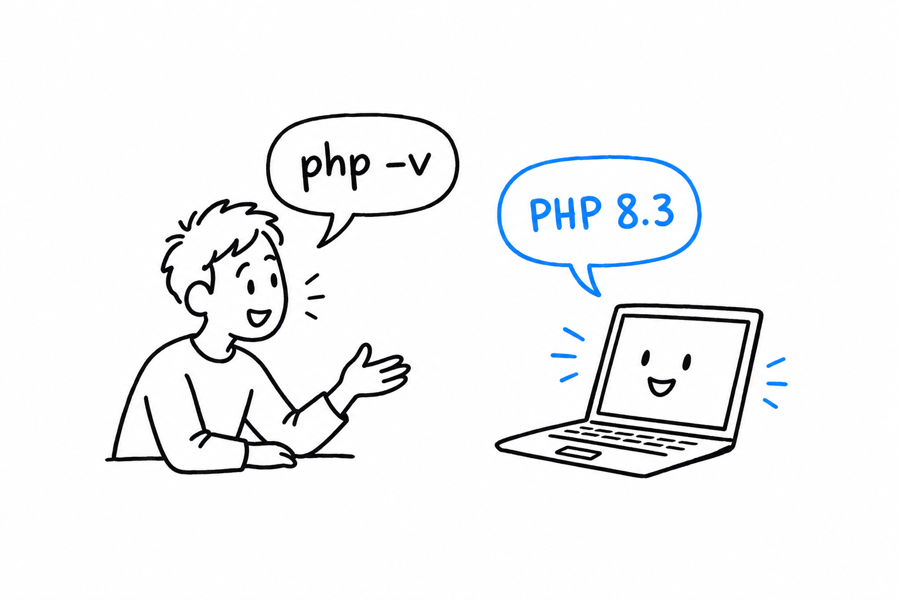
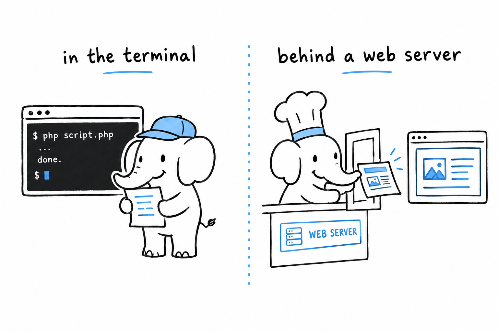

# Installation

## Opening a terminal

**A terminal is a conversation with your computer.** You type a sentence, press Enter, and the computer answers on the next line. No buttons, no menus, just words going back and forth. Every example in this book happens there, so the first job is to find yours.



**macOS.** Press `Cmd+Space`, type "Terminal", press Enter. That opens Terminal.app, and it is all you need.

**Linux.** Every desktop ships one, usually called Terminal, Konsole, or GNOME Terminal. Look in the applications menu, or try `Ctrl+Alt+T`.

**Windows.** Press `Win`, type "Terminal", and open Windows Terminal. It is the default on Windows 11 and available from the Microsoft Store on Windows 10. Inside it you can use Command Prompt or PowerShell; both work for this book.

## Do you already have PHP?

Ask your computer. Type this and press Enter:

```console
$ php -v
PHP 8.3.6 (cli) (built: ...) (NTS)
```

> [!TIP]
> In the terminal examples of this book, the `$` at the start of a line stands for the prompt your terminal shows while it waits for you. **Do not type it.** Type what follows.

Now read the answer. There are three possibilities:

- **It starts with `PHP 8`.** PHP is installed and recent enough. Skip ahead to [Hello, World!](ch01-02-hello-world.md).
- **It starts with `PHP 7` or lower.** You have an old version. Install a new one below.
- **It says something like `command not found`.** The computer simply does not know the word `php` yet. That is not a mistake on your part, it just means nothing is installed. Read on.

## Installing PHP

**macOS.** Recent versions of macOS do not ship PHP at all. Install it with [Homebrew](https://brew.sh/):

```console
$ brew install php
```

**Linux.** Your distribution's package manager has it. On Ubuntu or Debian:

```console
$ sudo apt install php-cli
```

Distribution packages can lag a year or two behind. If the version you get is too old, the [Ondřej Surý repository](https://launchpad.net/~ondrej/+archive/ubuntu/php) tracks new releases closely.

**Windows.** Download the "Non Thread Safe" zip from [windows.php.net](https://windows.php.net/download/), unzip it somewhere simple like `C:\php`, and add that folder to your `PATH` so the terminal can find it. If you would rather have an installer do this for you, [Laragon](https://laragon.org/) or [WampServer](https://www.wampserver.com/) bundle PHP with a friendly setup.

**Anywhere, with Docker.** If you do not want to install anything on your machine, and Docker is already there:

```console
$ docker run --rm -it php:8.3-cli bash
```

This gives you a temporary shell, with PHP ready to go, inside a small isolated environment. Everything you type happens in that box, and closing it leaves your computer untouched.

## Checking it worked

**Close your terminal, open a new one**, and run `php -v` again. You should see a version number this time.

> [!TIP]
> A terminal learns the list of programs it knows when it starts. If you installed PHP and the terminal still says `command not found`, nine times out of ten the fix is simply to open a new one.

## Good to know: PHP wears two hats

While reading about PHP online, you will run into names like `php-cli`, `php-fpm`, and `mod_php`. **They are the same language wearing different hats.**



The first hat, **`php-cli`**, is the one you just installed. It runs a script from your terminal and prints the result, the way Python or Ruby would.

The second hat is **the web server version**. It sits behind a server like nginx or Apache and answers page requests.

This book only needs the first hat for a long while. When the web arrives, you will already know the language, and only the hat will change.
