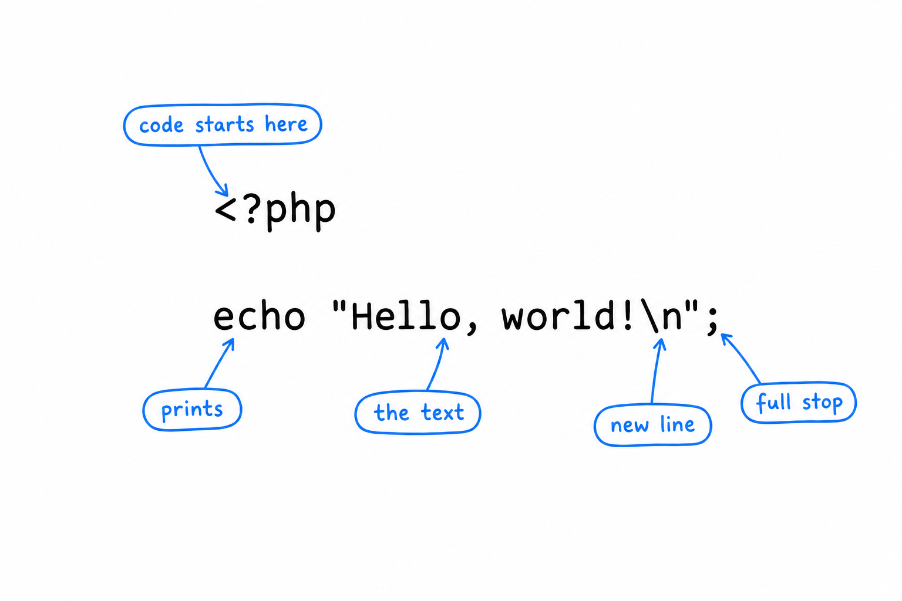
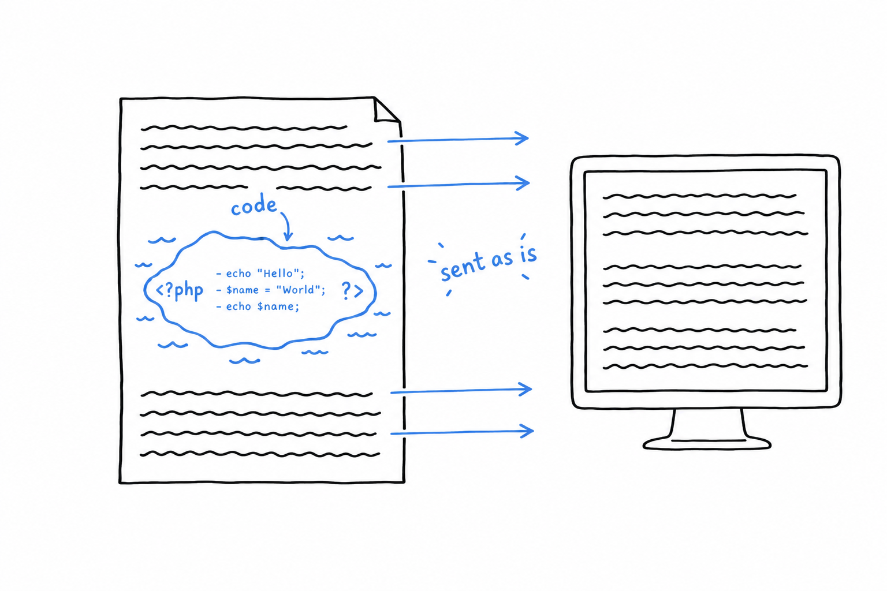
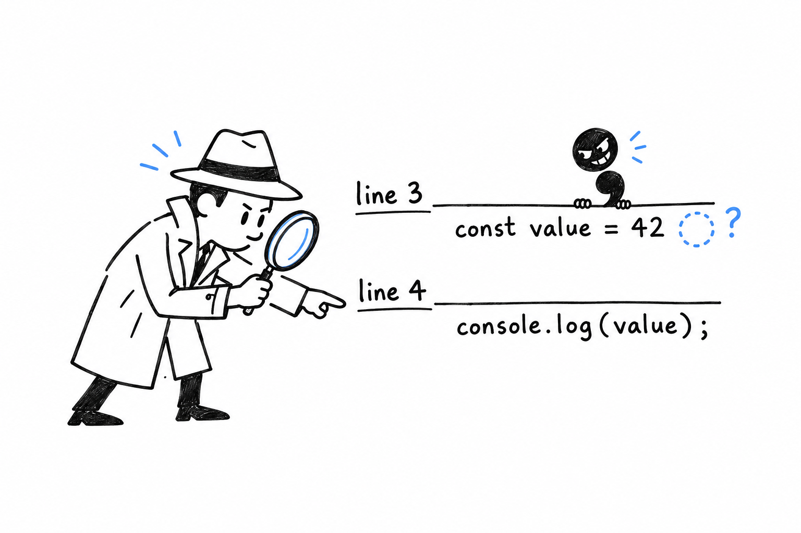
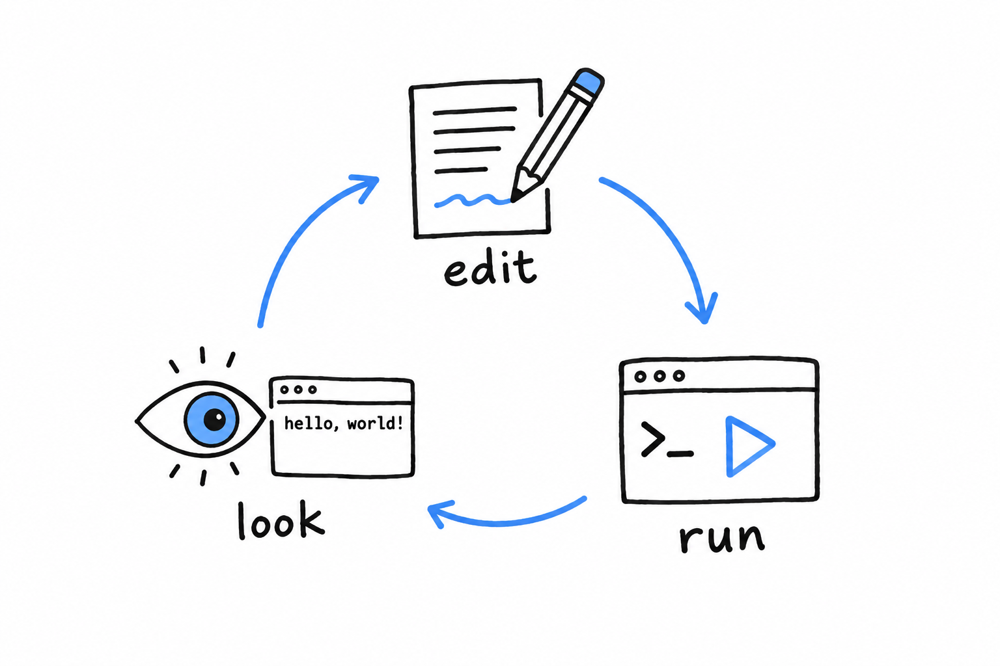

# Hello, World!

Time to make PHP say something.

Open your text editor, create a file called `hello.php`, anywhere you like, and type these lines in it:

```php
<?php

echo "Hello, world!\n";
```

Save it. Then, in your terminal, go to the folder where you saved it and run:

```console
$ php hello.php
Hello, world!
```

That is a complete PHP program. It is short, but **every character in it is doing a job**. Let's take it apart.



## `<?php`, the opening tag

PHP was born as a way to sprinkle small bits of logic inside web pages. That origin left a permanent mark: a PHP file is plain text by default, and **only what sits between `<?php` and `?>` is treated as code**. Everything outside the tags is sent to the output exactly as written.



In a file that contains only code, like ours, you write the opening tag once, at the very top, and nothing else. Two habits follow from this.

- **Nothing goes before `<?php`.** Not even a blank line, because that blank line would be sent to the output before your program even starts.
- **Do not close the tag at the end of the file.** Leaving `?>` out looks like an oversight, but it is deliberate: a stray space or newline after a closing tag gets sent to the output too, and that kind of invisible character causes maddening bugs. A tag that was never closed cannot leak anything.

## `echo`, the program's voice

**`echo` prints whatever follows it.** It is how a PHP program talks. You will use it constantly, and you will meet two cousins along the way: `print`, which does almost the same thing, and `printf`, for when the text needs formatting.

`echo` is not a function, so it does not need parentheses. `echo("Hello")` works too, because PHP is relaxed about it, but the bare form is what you will see everywhere.

## `"Hello, world!\n"`, the text

Text between quotes is called a **string**. This one ends with `\n`, which is not two characters printed on screen: it is the instruction "go to the next line", the same as pressing Enter. Without it, the next thing the program prints would land right after the exclamation mark.

PHP has two kinds of quotes, and the difference matters. **Double quotes** tell PHP to look inside the text and translate special sequences such as `\n`. **Single quotes** tell PHP to leave the text alone: `'Hello, world!\n'` prints a literal backslash followed by an `n`.

> Double quotes look inside the text. Single quotes leave it alone. Neither is better; you will choose between them all the time.

## `;`, the full stop

**Every statement in PHP ends with a semicolon**, the way sentences end with a period. Forget one, and PHP will complain, but not where you expect. Try it: remove the semicolon and add a second line.

```php
<?php

echo "Hello, world!\n"
echo "Nice to meet you.\n";
```

```console
$ php hello.php
PHP Parse error:  syntax error, unexpected token "echo", expecting "," or ";" in hello.php on line 4
```

PHP blames line 4, and line 4 is perfectly innocent. The missing semicolon is on line 3: PHP only noticed the problem when it reached the next word and could not make sense of it.



> [!TIP]
> When a baffling error points at a line that looks fine, **the real culprit is usually just above**.

## Running it, again and again

`php hello.php` hands your file to PHP, which reads it from top to bottom and does what it says. There is no compile step, no build, nothing left behind.



> Edit the file. Run it. Look at the result. Edit, run, look.

That tight loop is the single biggest difference in feel between PHP and a compiled language, and this book leans on it constantly. **Whenever you wonder what a piece of code does, the fastest answer is to run it.**

For quick one-liners, PHP also has an interactive mode. Type `php -a` and you get a prompt where each line runs as soon as you press Enter:

```console
$ php -a
Interactive shell

php > echo "Hello, world!\n";
Hello, world!
php > exit
```

Handy for checking a detail. Not a place to build real programs, but nobody builds real programs in an interactive shell in any language.

You have now written, run, broken, and fixed a PHP program. That is the whole rhythm of the craft, in miniature. [Chapter 2](ch02-00-guessing-game-tutorial.md) uses it to build a game.
