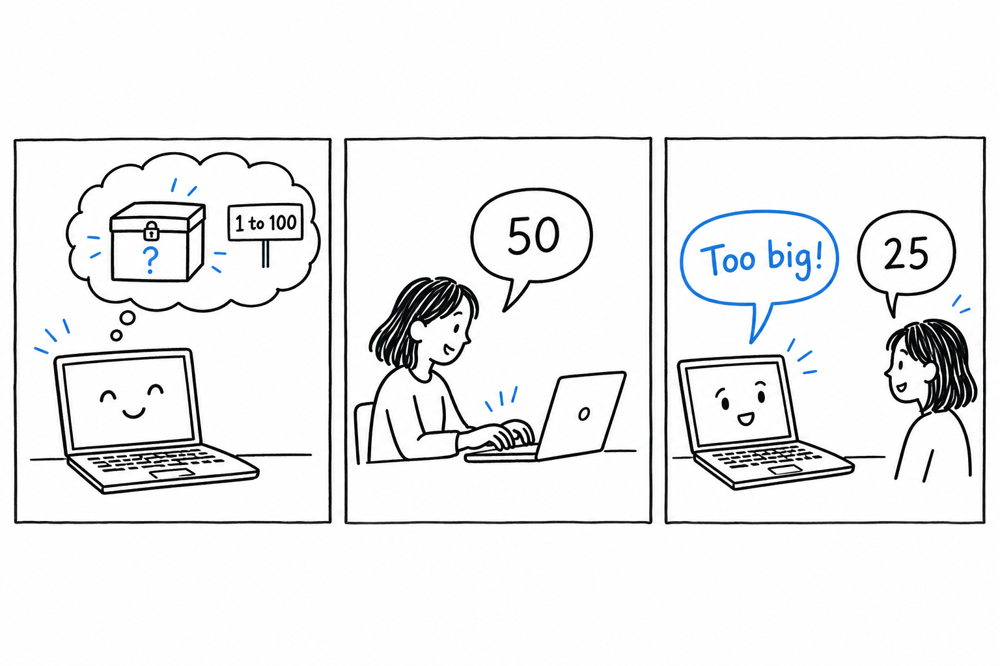
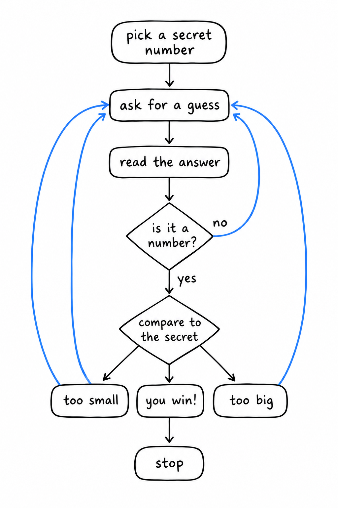
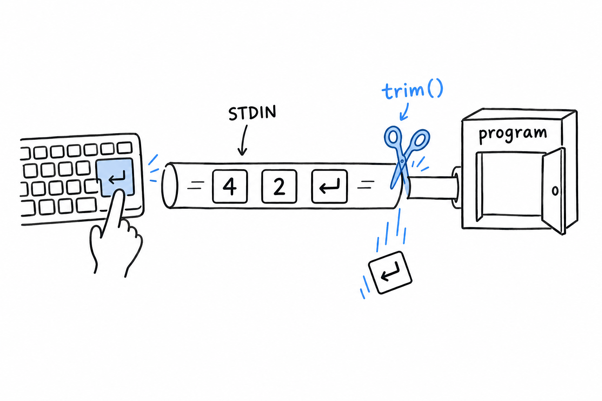
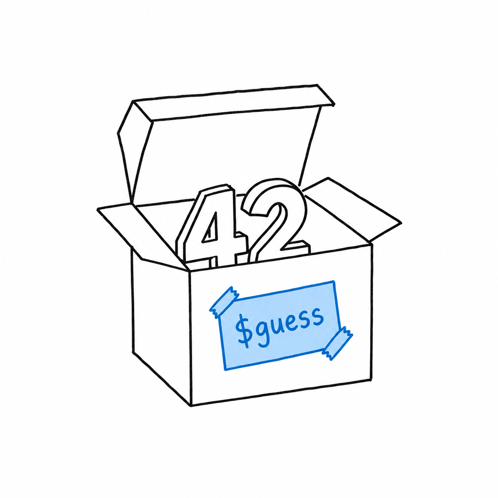
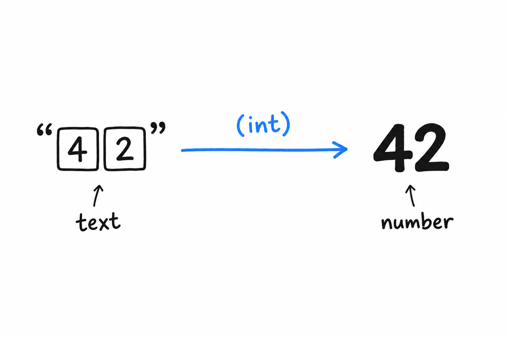
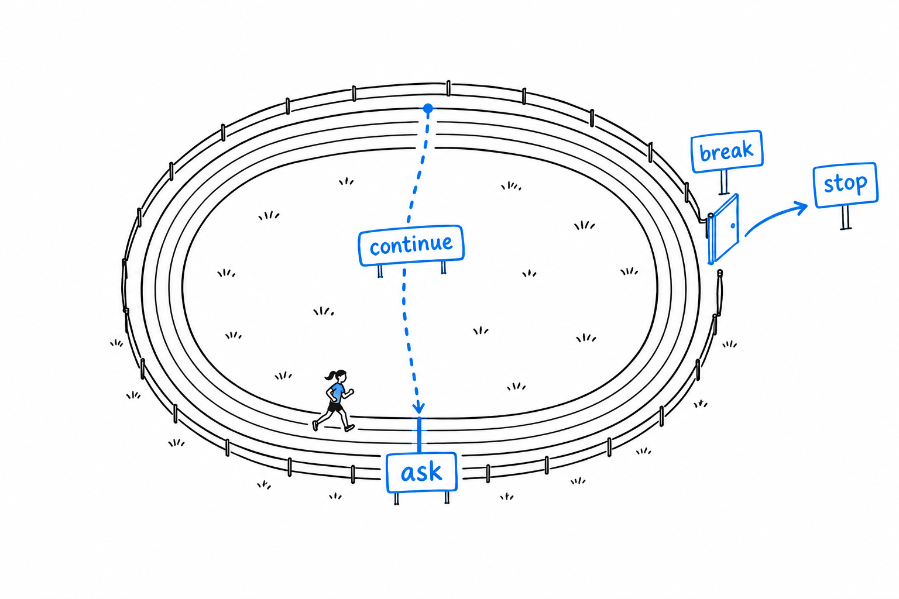

# Programming a Guessing Game

Let's build a game.

The rules are simple. **The computer secretly picks a number between 1 and 100. You type a guess. The computer answers "too small" or "too big", and you try again, until you find it.**



Small as it is, this game contains most of what real programs are made of: input, output, a decision, a loop, and a bit of cleaning up of what the user typed. That is why it comes before any theory.

**You will meet a few words you do not fully understand yet. That is normal, and it is the point.** You get to see PHP in motion first, and [Chapter 3](ch03-00-common-programming-concepts.md) goes back and explains each piece properly.

## The game on one drawing

Before typing anything, here is the whole program as a drawing. Every box will become a few lines of PHP.



Read it once from top to bottom. Pick a secret. Ask. Read the answer. Is it even a number? If not, ask again. Compare it to the secret. Too small, too big, or found. If found, stop.

> Pick a secret. Ask. Read. Check. Compare. Answer. Loop back. That is the whole plan.

Now let's build it, one box at a time.

## Step 1: asking the player

Create a file called `guessing_game.php`:

```php
<?php

echo "Guess the number!\n";
echo "Please input your guess.\n";

$guess = trim(fgets(STDIN));

echo "You guessed: {$guess}\n";
```

Run it, type a number, press Enter:

```console
$ php guessing_game.php
Guess the number!
Please input your guess.
42
You guessed: 42
```

The first two lines you already know: `echo` prints text. The interesting line is the one in the middle, and it does three things at once. Let's read it from the inside out.

**`fgets(STDIN)` waits for the player to type a line and press Enter, then hands that line to the program.** `STDIN` is the name of the channel where keyboard input arrives, the same one every command line tool reads from.



There is a catch: the line you get includes the Enter key itself, as an invisible newline character at the end. You almost never want it, so **`trim()` cuts it off**. `trim()` removes spaces and line breaks from both ends of a text, and wrapping it around `fgets(STDIN)` is such a common pair that you will soon type it on reflex.

Finally, `$guess = ...` stores the result. **`$guess` is a variable: a labeled box where the program keeps a value to use later.** In PHP every variable name starts with `$`. There is nothing to declare and no type to announce: you put something in the box, and the box exists.



> A variable is a labeled box. Put something in it, and the box exists.

The last line shows the box's content back to the player. Inside double quotes, `{$guess}` is replaced with whatever the variable holds. The curly braces are optional for a simple name like this one, but they make it obvious where the name ends, and that clarity pays off later with longer expressions.

## Step 2: picking a secret number

The computer needs a number to hide. PHP has a function for exactly that:

```php
<?php

$secretNumber = random_int(1, 100);

echo "Guess the number!\n";
echo "The secret number is between 1 and 100.\n";
echo "Please input your guess.\n";

$guess = trim(fgets(STDIN));

echo "You guessed: {$guess}\n";
```

**`random_int(1, 100)` returns a random whole number between 1 and 100**, both included, and we tuck it into a second box, `$secretNumber`.

> [!TIP]
> `random_int()` is a high-quality random generator, more than a game needs. It is also the right one to reach for whenever you need randomness in PHP, so you may as well learn the good habit now.

Run the program a few times. The secret changes each time, but you cannot tell yet, because nothing compares it to your guess. Let's fix that.

## Step 3: comparing

```php
<?php

$secretNumber = random_int(1, 100);

echo "Guess the number!\n";
echo "Please input your guess.\n";

$guess = (int) trim(fgets(STDIN));

if ($guess < $secretNumber) {
    echo "Too small!\n";
} elseif ($guess > $secretNumber) {
    echo "Too big!\n";
} else {
    echo "You win!\n";
}
```

**The `if` block is the decision from the drawing.** PHP checks the first condition: is the guess smaller than the secret? If so, it prints "Too small!" and skips the rest. If not, it checks the second condition. If neither is true, the guess is neither smaller nor bigger, so it must be equal, and the `else` branch runs. Exactly one of the three messages is printed.

There is a second change, small and easy to miss: `(int)` in front of `trim(fgets(STDIN))`.



**Everything that comes from the keyboard arrives as text.** When the player types 42, the program receives the two characters "4" and "2", not the number forty-two. PHP is often willing to compare text and numbers anyway, and it usually guesses right, but "usually" is not a word you want in a comparison. **`(int)` converts the text into a real integer**, explicitly, so both sides of `<` are numbers and there is nothing left to guess.

> "42" is text. 42 is a number. `(int)` turns the first into the second, and says so out loud.

[Chapter 3](ch03-00-common-programming-concepts.md) returns to this idea, called type juggling, and to why being explicit about it is a good reflex.

## Step 4: trying again

Right now, the game ends after one guess, win or lose. The drawing has an arrow going back up. In PHP, that arrow is a loop:

```php
<?php

$secretNumber = random_int(1, 100);

echo "Guess the number!\n";

while (true) {
    echo "Please input your guess.\n";
    $guess = (int) trim(fgets(STDIN));

    if ($guess < $secretNumber) {
        echo "Too small!\n";
    } elseif ($guess > $secretNumber) {
        echo "Too big!\n";
    } else {
        echo "You win!\n";
        break;
    }
}
```

**`while (true)` means "repeat this block forever".** That sounds dangerous, and it would be, without an exit. **The exit is `break`**: the moment PHP runs it, it leaves the loop and carries on after the closing brace. We put `break` in the winning branch only, so the loop keeps asking until the player finds the number, then stops.



## Step 5: dealing with nonsense

One rough edge remains. Type `banana` instead of a number, and `(int) "banana"` silently becomes `0`. No error, no warning, just a wrong guess that counts. Let's check the input before trusting it:

```php
<?php

$secretNumber = random_int(1, 100);

echo "Guess the number!\n";

while (true) {
    echo "Please input your guess.\n";
    $input = trim(fgets(STDIN));

    if (!is_numeric($input)) {
        echo "That doesn't look like a number, try again.\n";
        continue;
    }

    $guess = (int) $input;

    if ($guess < $secretNumber) {
        echo "Too small!\n";
    } elseif ($guess > $secretNumber) {
        echo "Too big!\n";
    } else {
        echo "You win!\n";
        break;
    }
}
```

**`is_numeric()` answers a yes-or-no question: does this text look like a number?** The `!` in front flips the answer, so the `if` reads "if the input is not numeric". In that case we print a friendly message and hit `continue`.

**`continue` is the other door in the drawing.** Where `break` leaves the loop, `continue` jumps straight back to the top for another round, skipping everything below it. A typo costs the player nothing: the game simply asks again.

> `break` leaves the loop. `continue` starts the next round.

## Play it

Run the game and win it. Then look back at the drawing: every box is now in your file. Picking the secret, asking, reading, checking, comparing, answering, looping back.

Thirty lines, and the program already:

- **reads input** from the keyboard, with `fgets()` and `trim()`,
- **makes decisions**, with `if`, `elseif`, and `else`,
- **repeats itself**, with `while`, `break`, and `continue`,
- **converts text to numbers**, with `(int)`,
- **refuses bad data** politely, with `is_numeric()`.

Keep the file. You will recognize its shape in every program you write, and by [Chapter 14](ch14-00-a-cli-project.md) you will be building command line tools a good deal more serious than a guessing game.
