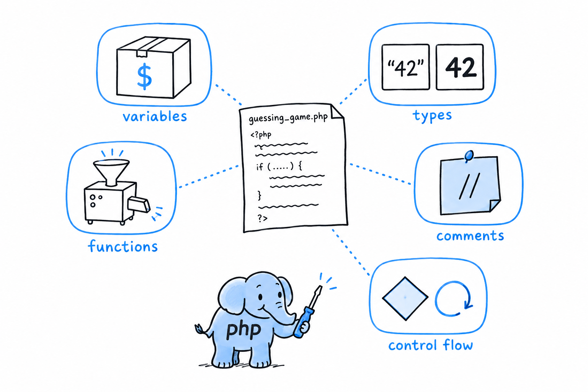

# Common Programming Concepts

Open `guessing_game.php` again. Thirty lines, and you typed every one of them before anyone told you what a variable, a type, or a loop is. The game worked without the names. **You need the names now, because they are how you will think about programs you have not written yet.**

Every programming language is built from the same handful of ideas, and the game contains each of them. A place to keep a value, like `$guess`: a variable. The difference between the text "42" and the number 42: types. A piece of work with a name, like `trim()`: a function. A note left for the humans who read the code: a comment. The parts that decide and repeat, `if` and `while`: control flow. **Five ideas, one section each, every one explained through code you have already run.**

If you have programmed before, nothing here is conceptually new, and you can read fast. Watch for the places where PHP does the familiar thing its own way: variables that appear the moment you assign to them, a type system stricter than its reputation once you ask it to be, and a `match` expression you will miss elsewhere.

If this is your first language, slow down, keep the game open in your editor, and run each example as you meet it. Everything else in the book is these five ideas, arranged in bigger shapes.
