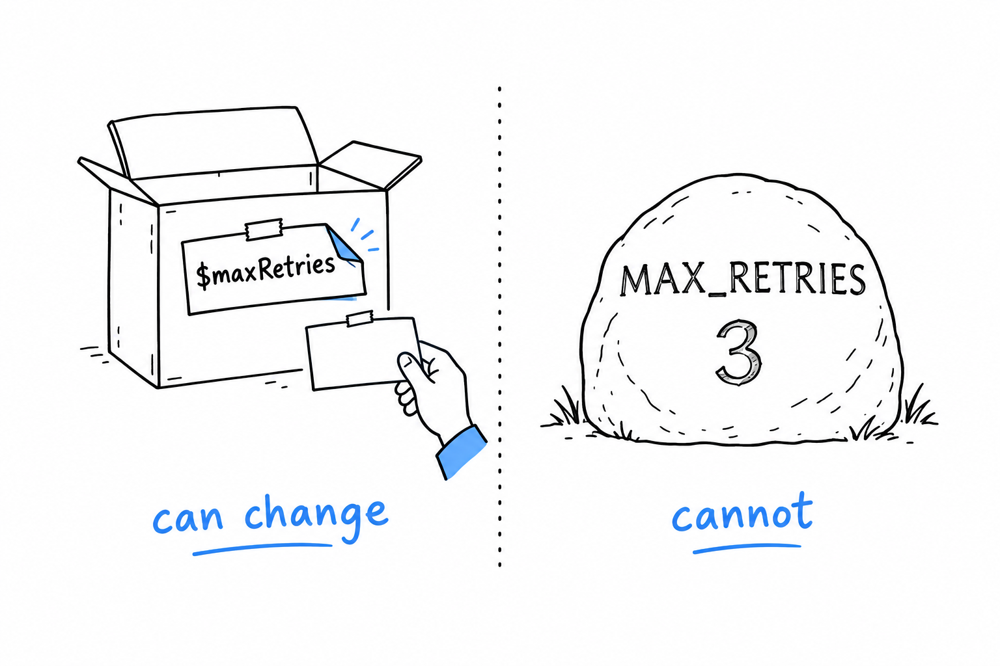

# Variables, Constants, and Mutability

In the guessing game, `$guess` held a different number on every turn of the loop, while `$secretNumber` kept the same one from start to finish. Same syntax, two different jobs. PHP gives you a way to say which of the two you mean.

## Variables

**A PHP variable starts with a dollar sign, and that is nearly all the syntax there is:**

```php
<?php

$greeting = "Hello";
echo $greeting;

$greeting = "Goodbye";
echo $greeting;
```

No `let`, no declaration step to forget. (There is a `var` keyword, a fossil from PHP 4 that only means something inside a class. You will not use it.) You assign, and from that line on the variable exists, exactly as `$guess` did in the game: no announcement, just a box and a value in it.

The second assignment changes what the box holds, and it needs no special permission. **Every PHP variable is mutable by default.** Reassigning is just assignment, again. If you come from a language where mutability is something you opt into, this is the opposite default: PHP treats change as the normal case, and immutability as something you build on purpose, usually with objects.

Try it: in the game, add `$secretNumber = 42;` right below the `random_int()` line. Nothing objects, and you now own a game you win on the first guess.

## Naming

Variable names are case-sensitive, so `$guess` and `$Guess` are two different boxes. A name starts with a letter or an underscore, and by convention it is written in `camelCase`:

```php
<?php

$userName = "damien";
$total_price = 42.50; // valid, but not idiomatic PHP
```

Both lines work. Only the first is what you will see in modern PHP code and in the coding standard most projects follow, PSR-12. **PHP's ecosystem cares more about consistency within a codebase than about any one style being right**, but `camelCase` for variables is about as close to universal as a PHP convention gets.

## Constants

`$secretNumber` never changed during a game, but nothing stopped it: one stray assignment inside the loop, and the game would break without a word. For a value that must not change while the program runs (a configuration setting, a mathematical constant, the base URL of an API), PHP has better than a variable you promise not to touch:

```php
<?php

define('MAX_RETRIES', 3);
echo MAX_RETRIES;

const APP_NAME = 'GuessingGame';
echo APP_NAME;
```



**A constant has no `$`, and that is the point.** Anywhere in a file, you can tell at a glance that `MAX_RETRIES` will not change under you, while `$maxRetries` is fair game for anyone downstream.

Two ways to write one, and both are common in the wild. `define()` is a function call, evaluated while the program runs, and it works anywhere. `const` is a language construct, resolved before the program runs, and (this is the part that trips people up) it is only allowed at the top level of a file or inside a class, never in an `if` block or a function body. Outside a class, prefer `const`: it is slightly faster and reads more like what it is.

> A variable is a box with a label you can peel off. A constant is a name carved in stone.

## Mutability, and what PHP actually does about it

If you have read about languages that make a big deal of ownership or borrowing, you may expect PHP's story to be more complicated than "just assign to it." At this level, it is not. PHP does have its own, much gentler idea of who owns a piece of data, and it shows up once you pass arrays and objects into functions instead of printing strings. That is the subject of [Chapter 4](ch04-00-variables-and-references.md).
