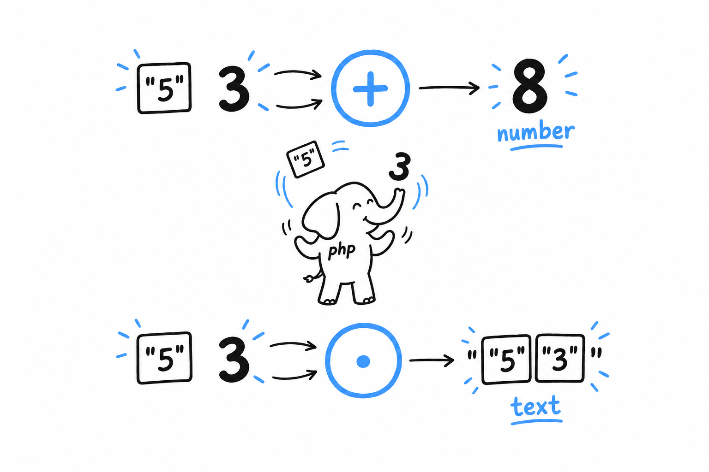
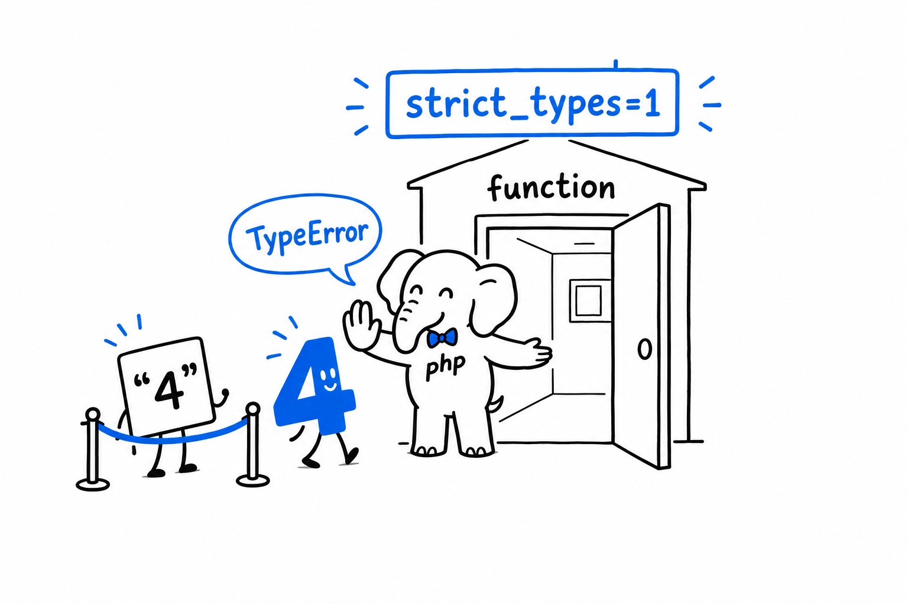

# Data Types

The keyboard gave the game the text "42", and the game needed the number 42. That gap, and the `(int)` you wrote to close it, is what this section is about. **PHP will let you write a whole program without naming a single type. It will also, if you ask, hold you to your types as strictly as any compiled language.** Both are true at once.

## Scalar types

Four types hold a single value each:

```php
<?php

$age = 41;           // int
$price = 19.99;      // float
$name = "Damien";    // string
$isReady = true;     // bool
```

An integer for counting, a float for measuring, a string for text, a boolean for yes or no. The game used three of them without saying so: `$secretNumber` was an int, the raw input a string, and `is_numeric()` answered with a bool.

You can ask PHP what a variable holds with `gettype()`, or, far more useful while debugging, with `var_dump()`:

```php
<?php

var_dump($age);
// int(41)

var_dump($price);
// float(19.99)
```

**`var_dump()` shows the type along with the value, which `echo` never does.** It will become one of your most used tools. Try it: in the game, add `var_dump($input);` right after the line that reads the keyboard, type 42, and read the answer. `string(2) "42"`: two characters of text, not a number.

## Compound types

Two types hold collections of other things.

**Arrays are PHP's do-everything structure**: list, dictionary, stack, queue, all the same underlying type wearing different hats:

```php
<?php

$fruits = ["apple", "banana", "cherry"];   // indexed
$prices = ["apple" => 0.5, "banana" => 0.3]; // associative
```

All of [Chapter 8](ch08-00-common-collections.md) is about arrays, and they deserve it: no PHP program of any size gets by without them.

**Objects** are instances of classes, PHP's way of bundling data with the behavior that operates on it. Objects properly start in [Chapter 5](ch05-00-classes.md); before then, you will only see the odd one in passing.

## Special types

`null` stands for "no value at all": not zero, not an empty string, nothing:

```php
<?php

$middleName = null;
```

You will meet `null` constantly, usually as the answer to "did this function find anything, or not." PHP 8 gave `null` real teeth with enums and the nullsafe operator (`?->`), both in [Chapter 6](ch06-00-enums.md).

## Type juggling, and how to stop worrying about it

Here is the thing PHP is famous for, fairly or not: **when an operator needs a certain type, PHP converts the value on the spot.**

```php
<?php

var_dump("5" + 3);      // int(8)
var_dump("5" . 3);      // string(2) "53"
var_dump(0 == "abc");   // false, as of PHP 8 (this used to be true!)
```



`+` wants numbers, so the string `"5"` becomes a number. `.` (string concatenation) wants strings, so the integer `3` becomes text. This is *type juggling*, and older PHP tutorials tell horror stories about it, mostly because loose comparison with `==` had some genuinely surprising rules before PHP 8 tightened them. It is also what turned `"banana"` into a silent `0` in the game.

Two habits keep juggling from ever biting you.

**Prefer `===` over `==`.** Strict comparison checks the type *and* the value, with no conversion: `0 === "abc"` is simply `false`, no asterisk needed. Reach for loose `==` only when you specifically want the conversion.

**Turn on strict types.** Put this as the very first statement of a file, right after `<?php`:

```php
<?php
declare(strict_types=1);

function double(int $n): int {
    return $n * 2;
}

double("4"); // TypeError: no silent conversion here
```



Without `declare(strict_types=1)`, PHP quietly converts `"4"` to `4` when it reaches a parameter typed `int`. With it, the same call throws a `TypeError`. Modern PHP code almost always turns this on: "PHP guessed what you meant" becomes "PHP told you exactly what went wrong", and the second is a much better bug report to receive.

> Loose comparison and silent conversion are PHP's default. `===` and `strict_types` are how you switch them off.

Type declarations on parameters, on return values and, later, on properties, appear in every example from here on. They are optional in PHP. Treat them as the default, not the exception.
