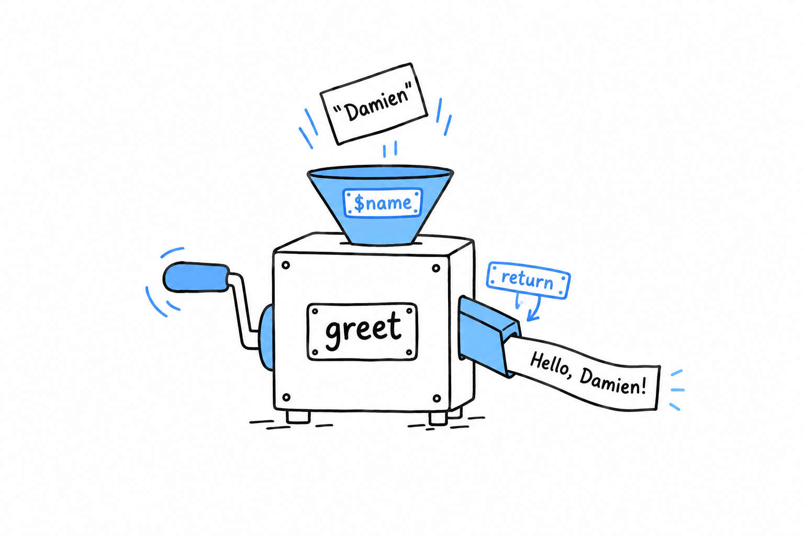

# Functions

You have been calling functions since the first lines of the game. `random_int(1, 100)` picked the secret, `fgets(STDIN)` read a line, `trim()` cleaned it, `is_numeric()` checked it. Each one is a piece of work with a name: you hand it something, it hands something back. (`echo` looks like one, but as [Chapter 1](ch01-02-hello-world.md) noted, it is not.) Time to write your own.

```php
<?php

function greet($name) {
    return "Hello, {$name}!\n";
}

echo greet("Damien");
```

**`function`, a name, parentheses for the parameters, and a body in braces: that is the whole shape.** Call `greet("Damien")`, and inside the body `$name` holds `"Damien"`. Function names are conventionally `camelCase`. They are also case-insensitive when you call them, unlike variables, so `GREET("Damien")` would work. Please do not rely on that.



## Parameters and types

Give each parameter a type, the way you saw in [Data Types](ch03-02-data-types.md), and give the function a return type too:

```php
<?php

function greet(string $name): void {
    echo "Hello, {$name}!\n";
}
```

`: void` says this function hands nothing back: it is called purely for its side effect, printing here. **A function that does return something should say what:**

```php
<?php

function add(int $a, int $b): int {
    return $a + $b;
}

$sum = add(2, 3);
```

Type every parameter and every return value of every function you write, from here on. It costs a few keystrokes and removes a whole category of bugs where a function quietly receives, or returns, something you did not expect. Combined with `declare(strict_types=1)`, it turns PHP from "dynamically typed and a little too forgiving about it" into a language that stops you at the door when you pass the wrong thing.

## Default values

A parameter can have a default, which makes it optional when you call the function:

```php
<?php

function greet(string $name, string $greeting = "Hello"): string {
    return "{$greeting}, {$name}!\n";
}

echo greet("Damien");             // Hello, Damien!
echo greet("Damien", "Bonjour");  // Bonjour, Damien!
```

Parameters with defaults come after parameters without them. PHP reads arguments left to right, so the required ones need to be settled first.

## Named arguments

Argument order stops mattering once you pass arguments by name, and **naming arguments is a real comfort as soon as a function has more than two or three parameters:**

```php
<?php

echo greet(name: "Damien", greeting: "Bonjour");
echo greet(greeting: "Bonjour", name: "Damien"); // order no longer matters
```

It shines with functions that have several optional parameters: you jump straight to the one you want to change, instead of spelling out every default in between to reach it by position.

## `return` leaves at once

**`return` exits the function immediately, with a value.** Nothing after it runs:

```php
<?php

function classify(int $n): string {
    if ($n < 0) {
        return "negative";
    }

    if ($n === 0) {
        return "zero";
    }

    return "positive";
}
```

There is no implicit "the last expression is the result" as in some languages. PHP always wants an explicit `return`. Leave it out, and the function returns `null`, silently. That is usually a bug rather than a choice, which is why declaring `: void` on functions that truly return nothing is worth the habit: PHP, and any static analysis tool reading your code, can then flag a value that slips out by accident.

## Functions as values

One more thing worth knowing early, even though it only comes into its own in [Chapter 15](ch15-00-functional-features.md): **a function is a value too.** You can hold one in a variable and call it from there:

```php
<?php

$operation = 'add';
echo $operation(2, 3); // calls add(2, 3), if add() is defined above
```

And PHP has real anonymous functions, called [closures](ch15-01-closures.md), for when you need to pass behavior around without giving it a name at all:

```php
<?php

$double = function (int $n): int {
    return $n * 2;
};

echo $double(21); // 42
```

File that away. It matters a great deal later, once you start handing small pieces of behavior to array functions and generators.
