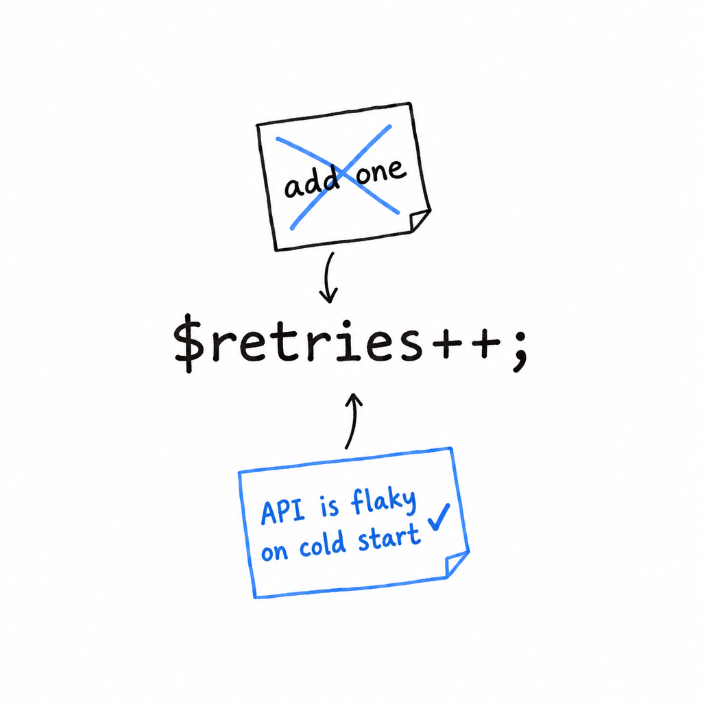

# Comments

The guessing game has no comments, and at thirty lines it needs none. Programs grow, though, and sooner or later a line needs a note next to it: why this check is here, what that number means, which bug this works around. **A comment is text PHP skips entirely and a human reads.** PHP gives you three ways to write one, a leftover of its early days as a templating language.

```php
<?php

// A single-line comment.

# Also a single-line comment, same effect, different heritage
// (this style is borrowed from shell scripts; you'll see it far less often).

/*
 * A multi-line comment,
 * for when one line isn't enough.
 */
```

In practice `//` dominates for everyday notes, and `/* ... */` shows up for the longer, more structured kind, most often as a *docblock* sitting right above a function or a class:

```php
<?php

/**
 * Calculates compound interest.
 *
 * @param float $principal Starting amount
 * @param float $rate Annual interest rate, as a decimal (e.g. 0.05 for 5%)
 * @param int $years Number of years to compound
 * @return float The final amount after compounding
 */
function compoundInterest(float $principal, float $rate, int $years): float {
    return $principal * (1 + $rate) ** $years;
}
```

**The `/**` opener, two asterisks rather than one, marks a docblock.** It is a convention, not a language feature, but your editor, PHPStan and documentation generators all read the `@param` and `@return` tags out of it. Docblocks earn their keep in [Chapter 11](ch11-00-interfaces-and-traits.md), where PHP's type system needs a little help from comments to say things the language cannot express yet.

## What is worth commenting

Less than you would think. A well-named function with well-typed parameters explains itself. A comment repeating what the code already says gives you two places to keep in sync, and PHP only checks one of them.

```php
<?php

// Bad: says what, which the code already says
// Increment the counter by one
$counter++;

// Good: says why, which the code can't say on its own
// Retry once more here: the upstream API is flaky on cold start
$retries++;
```



**Comment the why, not the what.** A comment explaining a workaround, a non-obvious constraint, or a decision that would look wrong without context is worth its weight. A comment translating the code into English, line by line, is one more thing to go stale the next time someone edits the line without touching the note above it.
