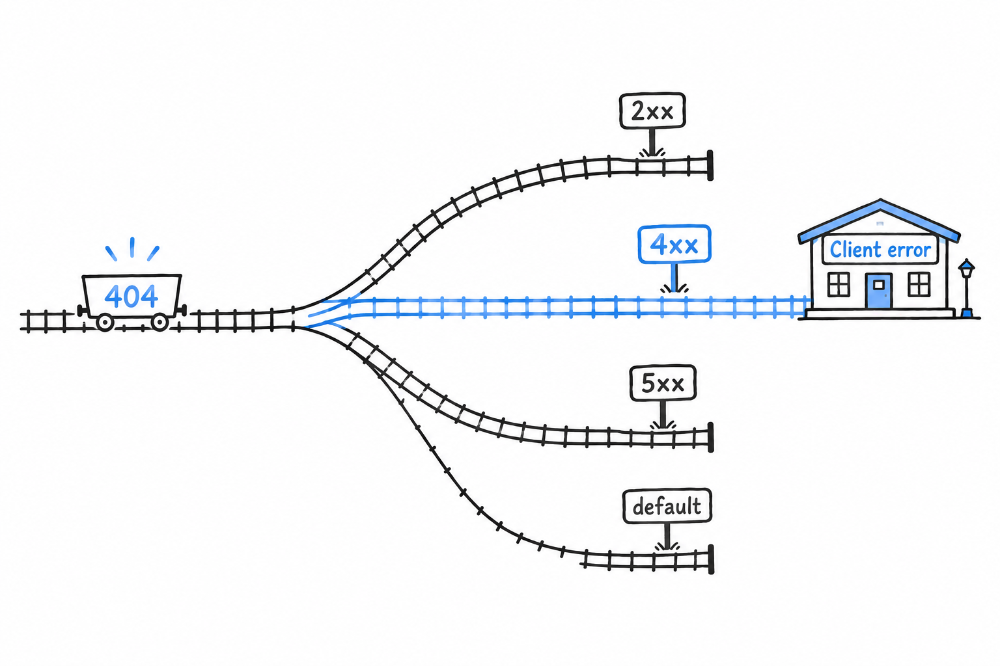
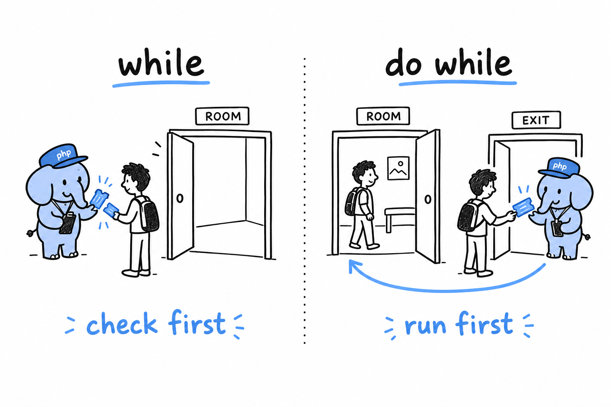

# Control Flow

Strip the guessing game down to its skeleton and two words remain: `if` and `while`. One decides, the other repeats. **Everything a program does beyond running top to bottom comes from those two moves**, and PHP has a few variations on each.

## `if` / `elseif` / `else`

```php
<?php

$temperature = 18;

if ($temperature > 30) {
    echo "Hot.\n";
} elseif ($temperature > 15) {
    echo "Pleasant.\n";
} else {
    echo "Bring a jacket.\n";
}
```

Same shape as the comparison in the game: PHP runs the first block whose condition is true and skips the rest, or falls back to `else`. It is `elseif`, one word. `else if`, two words, works too, but only `elseif` is a single token to PHP, so it is the convention worth adopting.

**The condition does not have to be a boolean, but write it as if it did.** PHP converts whatever you hand it: `0`, `""`, `null` and `[]` all count as false, everything else as true. Leaning on that is exactly the kind of type juggling [Data Types](ch03-02-data-types.md) warned you about. Prefer an explicit comparison whenever the value is not already obviously a boolean.

An `if`/`elseif` chain is at its best when each branch tests something different, the way `$temperature > 30` and `$temperature > 15` do. When you catch yourself writing several branches that all compare the same value against a list of possibilities, that repetition is a signal to reach for the next tool.

## `match`

PHP 8 added `match`, and once you have used it, `switch` starts to feel like a relic:

```php
<?php

$httpStatus = 404;

$message = match (true) {
    $httpStatus >= 200 && $httpStatus < 300 => "Success",
    $httpStatus >= 400 && $httpStatus < 500 => "Client error",
    $httpStatus >= 500 => "Server error",
    default => "Unknown",
};

echo $message; // Client error
```



**`match` is an expression: it produces a value**, which you assign, as above, instead of a statement you branch inside of. Two more things make it a real upgrade over `switch`. Its comparisons are strict, `===`, so no juggling sneaks a wrong branch through. And it has no fallthrough, so there is no `break` to forget. [Chapter 6](ch06-00-enums.md) pairs `match` with enums, and the two turn out to be made for each other.

## Loops

**`while` runs as long as its condition holds, and checks it before each pass:**

```php
<?php

$count = 3;
while ($count > 0) {
    echo "{$count}...\n";
    $count--;
}
echo "Go!\n";
```

The game's `while (true)` was the extreme case: a condition that never turns false, and `break` as the only way out.

**`do...while` checks the condition after each pass instead**, so the body runs at least once:

```php
<?php

do {
    echo "This runs once even if the condition is already false.\n";
} while (false);
```



**`for` is the classic three-part loop**, at home whenever you need a counter:

```php
<?php

for ($i = 0; $i < 5; $i++) {
    echo "{$i}\n";
}
```

Start value, condition, step, all on one line: `$i` starts at 0, the body runs while `$i < 5`, and `$i++` adds one after every pass.

**`foreach` walks a collection directly, no counter to maintain**, and it is the loop you will reach for constantly once arrays arrive in [Chapter 8](ch08-00-common-collections.md):

```php
<?php

$fruits = ["apple", "banana", "cherry"];

foreach ($fruits as $fruit) {
    echo "{$fruit}\n";
}

$prices = ["apple" => 0.5, "banana" => 0.3];

foreach ($prices as $name => $price) {
    echo "{$name}: \${$price}\n";
}
```

The second form, `as $name => $price`, pulls out the key and the value in one go. It appears so often in real PHP code that you may as well commit it to memory right now.

## `break` and `continue`, one more time

You met both in the game: **`break` leaves the loop at once, `continue` skips to the next round.**


```php
<?php

foreach ([1, 2, 3, 4, 5] as $n) {
    if ($n === 3) {
        continue; // skip 3, keep going
    }
    if ($n === 5) {
        break; // stop entirely once we hit 5
    }
    echo "{$n}\n";
}
// prints 1, 2, 4
```

Both accept an optional number: `break 2` leaves two nested loops at once. Reach for it only when it reads clearer than restructuring the loops. Nested break levels are obvious while you write them and baffling a month later.

Try it: rewrite the game's three-way comparison as a `match (true)` that produces the message, then print it. The `break` has to stay outside the `match`, since a `match` produces a value and does nothing else. That small friction is the difference between an expression and a statement, felt in your own fingers.

Branch, repeat, steer. The rest of the book never adds a new kind of move, only bigger shapes made of these.
