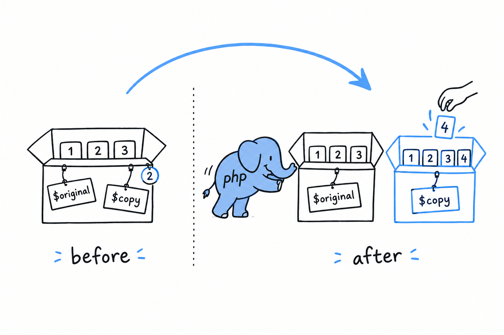

# How PHP Manages Values: Copy-on-Write

Assign an array to a second variable, add something to the second one, and look at the first:

```php
<?php

$original = [1, 2, 3];
$copy = $original;

$copy[] = 4;

var_dump($original); // array(3) { [0]=> int(1) [1]=> int(2) [2]=> int(3) }
var_dump($copy);     // array(4) { [0]=> int(1) [1]=> int(2) [2]=> int(3) [3]=> int(4) }
```

`$original` still has three elements. **Copying an array gives you an independent array**: change the copy all you want, the original does not move. Picture `$copy = $original` as PHP walking through the array and duplicating every element into a fresh box. That picture is the one to keep, and for most day-to-day PHP it is all you need.

> Copy an array, change the copy: the original stays put.

## But it doesn't actually copy on the spot

Here is what really happens, even though it rarely changes how you write code. Duplicating an array the instant it is assigned would be wasteful: plenty of arrays get passed around and never modified at all, so the copy would be work for nothing. **PHP waits, and only copies the array the moment one side tries to change it.** The strategy is called copy-on-write.

The assignment `$copy = $original` makes both names point at the same array data, and PHP keeps a small count of how many variables share it. Reading through either name costs nothing. The first write through one of them (`$copy[] = 4` above) is the moment PHP steps in: it makes a real, separate copy and applies the change to that copy alone.



```php
<?php

$original = ["apple", "banana"];
$copy = $original; // no copying has happened yet, both point at the same data

foreach ($copy as $fruit) {
    echo $fruit . "\n"; // just reading, still sharing
}

$copy[] = "cherry"; // *now* PHP actually duplicates the array
```

None of this is visible from inside your program. No function to call, no delay, nothing that behaves differently depending on whether the copy has "really" happened yet. It is purely an optimization the engine performs for you. The word is still worth knowing, because "copy-on-write" shows up in PHP performance discussions, in RFC text and in the odd profiler output, and it helps to know it is nothing exotic. It is PHP being lazy about a copy it was always going to give you.

## Why this matters for functions

Pass an array into a function, and the function receives what behaves like its own copy:

```php
<?php
declare(strict_types=1);

function addTax(array $prices): array
{
    foreach ($prices as $key => $price) {
        $prices[$key] = round($price * 1.2, 2);
    }
    return $prices;
}

$cart = ["book" => 10.00, "pen" => 2.00];
$withTax = addTax($cart);

var_dump($cart);     // unchanged: book => 10.00, pen => 2.00
var_dump($withTax);  // book => 12.00, pen => 2.40
```

`addTax()` rewrites `$prices` freely, and none of it leaks back to `$cart`. **A function that takes an array cannot reach back and rewrite the caller's data**, unless the caller explicitly allows it. That is usually exactly what you want: you hand data to a function, it hands data back, and what you were holding is still what you were holding. Try it: add `$prices["hat"] = 5.00;` just before the `return` and dump `$cart` again. Still two items.

Sometimes you do want a function to modify the caller's array in place. Copy-on-write cannot give you that. References can, and they are the subject of the [next section](ch04-02-references.md).

One thing to flag before you get there: everything above is about arrays. Assign an object to another variable and you do not get an independent copy, lazy or otherwise. That contrast deserves its own careful treatment, right after the `&`.
