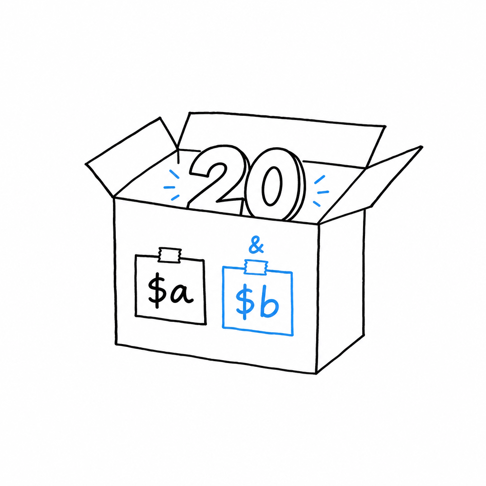
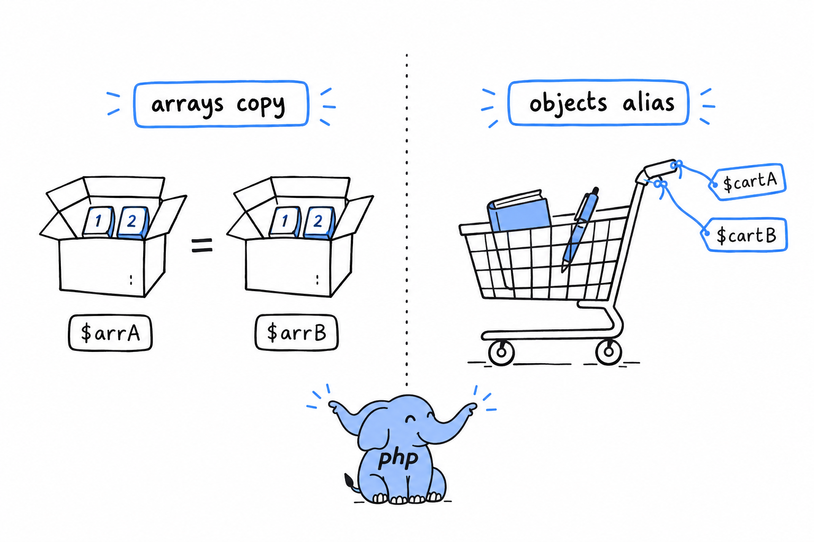

# Passing by Value vs. by Reference

Copy a variable, change the copy, and the original stays put. That is PHP's default, and it has a name: **passing by value**. It is what happens everywhere in PHP unless you ask for something else. This section is about how to ask, and about the one place where PHP gives you something else whether you asked or not: objects.

## Explicit references with `&`

Put `&` in front of a variable when you assign it, and the two names become one:

```php
<?php

$a = 10;
$b = &$a; // $b is now an alias for $a, not a copy of its value

$b = 20;

echo $a; // 20
```

After `$b = &$a`, `$a` and `$b` are not two variables holding equal values. **They are two labels stuck on the same box.** Change the value through either label and you have changed it for both, because there was only ever one box.



> A reference is a second label on the same box.

The same `&` works on a function parameter:

```php
<?php
declare(strict_types=1);

function addTax(array &$prices): void
{
    foreach ($prices as $key => $price) {
        $prices[$key] = round($price * 1.2, 2);
    }
}

$cart = ["book" => 10.00, "pen" => 2.00];
addTax($cart);

var_dump($cart); // book => 12.00, pen => 2.40, modified in place
```

Compare this with the `addTax()` of the [previous section](ch04-01-copy-on-write.md): same body, but the `&` before `$prices` changes everything for the caller. Without it, the function got a value it could mutate without consequence. With it, `$prices` inside the function *is* `$cart` outside: no copy at all, not even a lazy one. **A reference parameter lets a function modify the caller's variable in place.** That is exactly how `sort()` works, a real built-in that rearranges your array through a reference instead of handing you back a new one.

> [!WARNING]
> `&` is easy to overuse. A function whose signature carries it quietly changes its contract from "give me data, get data back" to "let me reach into your variable and change it", and that is a bigger promise than it looks. Reach for it when in-place mutation is the whole point (sorting, filling a buffer) and return a value everywhere else. Code that returns its result can be read and tested on its own. Code sprinkled with `&` parameters sends the reader to every call site to find out what might have changed.

## Arrays copy, objects don't

This is the surprise the whole chapter has been building towards. Read it slowly, because it catches almost everyone the first time.

You know arrays copy. Objects do not. Assign an object to a variable, pass it into a function, store it in an array: PHP never duplicates the object itself. **Every variable that "holds" an object really holds a handle to the one instance living in memory.** Copy the variable all you like, you are copying the handle, not the thing on the other end.

```php
<?php
declare(strict_types=1);

class Cart
{
    public array $items = [];
}

$cartA = new Cart();
$cartA->items[] = "book";

$cartB = $cartA; // NOT a copy, $cartB points at the same Cart instance
$cartB->items[] = "pen";

var_dump($cartA->items); // ["book", "pen"], both items show up here too
var_dump($cartB->items); // ["book", "pen"]
```

If `class` and `new` are new to you, [Chapter 5](ch05-00-classes.md) explains them properly. For now, read `new Cart()` as "make one cart" and `->items` as "its list of items".

`$cartB = $cartA` looks exactly like `$copy = $original` did with arrays. It behaves nothing like it. There is one `Cart` here, and `$cartA` and `$cartB` are two labels on it. Add a pen through either label and the other one sees it immediately, because there is nothing else to see.



This is the most common cause of "why did my function change something it was not supposed to touch" in beginner PHP code, and it runs in the opposite direction from the array confusion. People expect objects to copy like arrays, get burned once, then overcorrect and assume everything aliases like objects. Neither is right.

> Arrays copy, objects alias.

Passing an object into a function never protects the caller's data the way passing an array does. The function receives a handle to the very same instance, and anything it does through that handle is visible the moment it returns, no `&` required:

```php
<?php
declare(strict_types=1);

function addItem(Cart $cart, string $item): void
{
    $cart->items[] = $item; // this mutates the caller's actual Cart
}

$cart = new Cart();
addItem($cart, "notebook");

var_dump($cart->items); // ["notebook"], visible outside the function, no & needed
```

No `&` anywhere in `addItem()`, and none needed. Objects are always "passed by handle". You will hear it called "passed by reference", which is close but not the precise PHP term: inside the function you can still reassign `$cart` to a different object without affecting the caller's variable. Try it: make `$cart = new Cart();` the first line of `addItem()`. The notebook now goes into a cart nobody else holds, and the caller's `$cart->items` stays empty. What you cannot do is change the object a handle points to without the change showing everywhere else that object is held.

## `clone`, the escape hatch

Sometimes you do want a second, independent `Cart`, one that starts with the same items and then goes its own way. That is what `clone` is for:

```php
<?php
declare(strict_types=1);

$cartA = new Cart();
$cartA->items[] = "book";

$cartB = clone $cartA; // a genuine, separate copy
$cartB->items[] = "pen";

var_dump($cartA->items); // ["book"], untouched
var_dump($cartB->items); // ["book", "pen"]
```

**`clone` creates a new object with the same property values, and from then on the two are fully independent**, the behavior you might have expected from plain assignment. One caveat to flag now: `clone` copies one level deep. If one of `Cart`'s properties were itself an object rather than a plain array, the clone and the original would still share that nested object, handle and all, unless you do something about it. PHP gives classes a `__clone()` method for exactly this, and the book gets to it once you have spent more time with classes, starting in [Chapter 5](ch05-00-classes.md).
