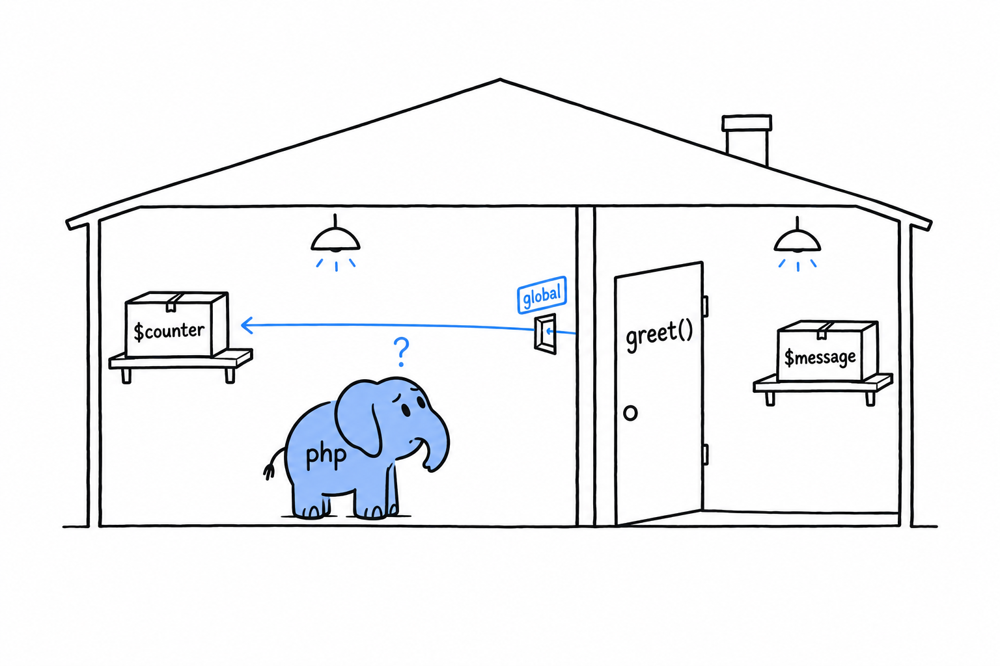
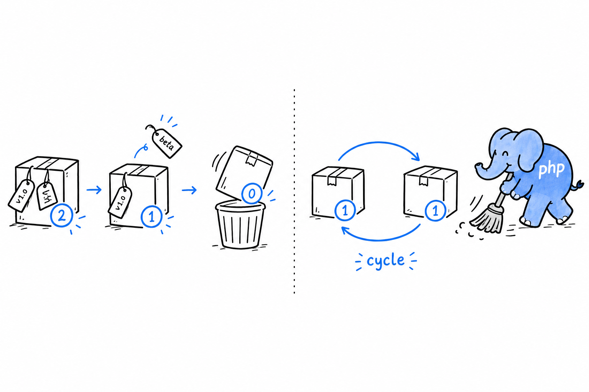

# Variable Scope and Garbage Collection

## Functions have their own scope

A variable created inside a function lives inside that function, and nowhere else:

```php
<?php
declare(strict_types=1);

function greet(): void
{
    $message = "Hello from inside greet()";
    echo $message . "\n";
}

greet();
echo $message ?? "no such variable out here\n";
```

Run it. The second line prints "no such variable out here": `$message` inside `greet()` and any `$message` floating around outside are unrelated, even though they share a name. **Every function gets its own private set of variables, invisible from outside.** This is called local scope, and it is the sane default. Without it, every variable name in every function would compete for one shared space, and calling a function you did not write would be a small act of faith that it had not quietly overwritten one of yours.

Picture each function as a room with its own shelves. A box on a shelf in one room does not exist in the next.



## `global`, and why you'll rarely reach for it

PHP does have a way to let a function read and write a variable from the top-level script: the `global` keyword.

```php
<?php
declare(strict_types=1);

$counter = 0;

function increment(): void
{
    global $counter;
    $counter++;
}

increment();
increment();
echo $counter; // 2
```

It works. **It is also almost never the right tool.** A function that reaches out through `global` to change state living outside its parameters and return value is a function you cannot understand by reading its signature: you have to find every `global $counter` in the codebase to know who changes it, and in what order. Invisible in a five-line example, painful in a five-thousand-line application.

Prefer passing values in as parameters and getting results back as return values, or, once you reach [Chapter 5](ch05-00-classes.md), keeping shared state as a property on an object you pass around deliberately. If you feel the pull of `global`, the function usually wants a parameter instead.

## `static` variables inside functions

There is a better-behaved way for a function to remember something between calls. An ordinary local variable is created fresh and destroyed every time the function runs. **A `static` local variable keeps its value from one call to the next, and only that function can see it.**

```php
<?php
declare(strict_types=1);

function nextId(): int
{
    static $id = 0;
    $id++;
    return $id;
}

echo nextId(); // 1
echo nextId(); // 2
echo nextId(); // 3
```

`$id = 0` runs only the first time `nextId()` is called; every later call picks up where the previous one stopped. Nothing outside `nextId()` can read or reset `$id`. There is no `global`-style leak here, just a function with a private memory of its own. It is a handy pattern for a small counter, a simple cache, or a "have I already done this setup" flag, when a full object would be overkill for one number.

## A brief, honest word about garbage collection

You will hear people mention PHP's "garbage collector", usually next to the words "memory leak" or "long-running script". It helps to know roughly what they mean, even though you will rarely think about it.

Every value PHP creates, every array and every object, carries a small counter: the number of variables currently pointing at it. **When that count drops to zero, PHP frees the memory immediately.** The last variable went out of scope or was reassigned, nobody needs the value anymore, and it is gone. This counter is also what makes copy-on-write work, back in the [first section of this chapter](ch04-01-copy-on-write.md): PHP always knows how many places share a given array.



Counting has one blind spot. Two objects that point at each other form a cycle, and a cycle can be forgotten by the rest of the program while its two members still hold on to each other. Their counts never reach zero. PHP runs a separate cycle collector from time to time, finds these orphaned cycles, and cleans them up anyway.

**You do not manage memory in PHP.** No `malloc`, no `free`, no bookkeeping of who owns what. Values disappear when nothing needs them, and PHP works out "nothing needs them" for you, cycles included. That is not a gap compared to languages that make you think about memory; it is the entire point. Keep the vocabulary in your back pocket for the rare day you debug memory growth in a long-running script, and otherwise let it do its job.
