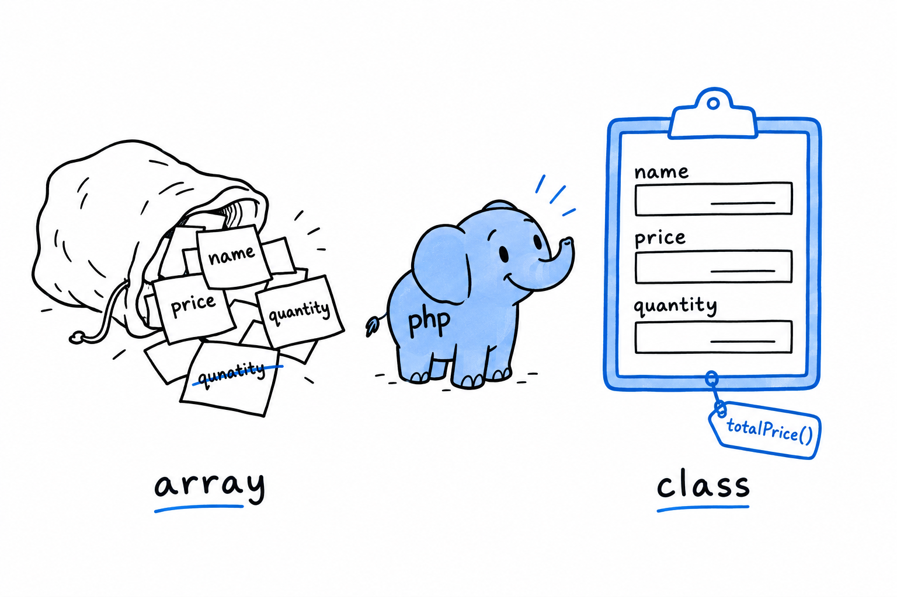

# Using Classes to Structure Related Data

Somewhere in your code sits a `$product` array. Somewhere else, a `calculateTotal($product)` function. The two only work together as long as they agree on which keys the array holds, and nothing in PHP checks that they do.

You have been grouping related values into arrays since [Chapter 3](ch03-00-common-programming-concepts.md): a cart's items, prices keyed by name. It works, right up until it doesn't. **An associative array has no fixed shape.** Nothing stops you from misspelling a key, nothing says which keys are supposed to exist, and nothing ties the operations you perform on the data to the data itself.

**A class gives a piece of data a shape**: named, typed properties that always exist, with the operations that make sense on that data living right beside it, as methods. Picture the difference between a pile of sticky notes and a printed form. The form has fixed fields, every copy has the same ones, and the instructions for filling it in are printed on the form itself.

You have met objects twice already, in passing in [Data Types](ch03-02-data-types.md) and more seriously in [Chapter 4](ch04-00-variables-and-references.md), where you learned the single most important thing about them: unlike arrays, objects are not copied when you assign or pass them around. Every variable holding one holds a handle to the same instance. From here on, objects stop being background scenery. You build them yourself.

The mechanics come first: the `class` keyword, typed properties, visibility, and `new`, which brings an instance into existence. Then one small example, worked end to end, the way a class shows up in real code: not because a book told you to write one, but because the loose-array version of the same problem had become a liability. Methods close the chapter, with `$this` and PHP's modern shorthand for constructors, which trims a surprising amount of the boilerplate older PHP code is full of.

> A bag of arrays held together by convention, or a shape the language itself can hold you to. That is the choice this chapter is about.
