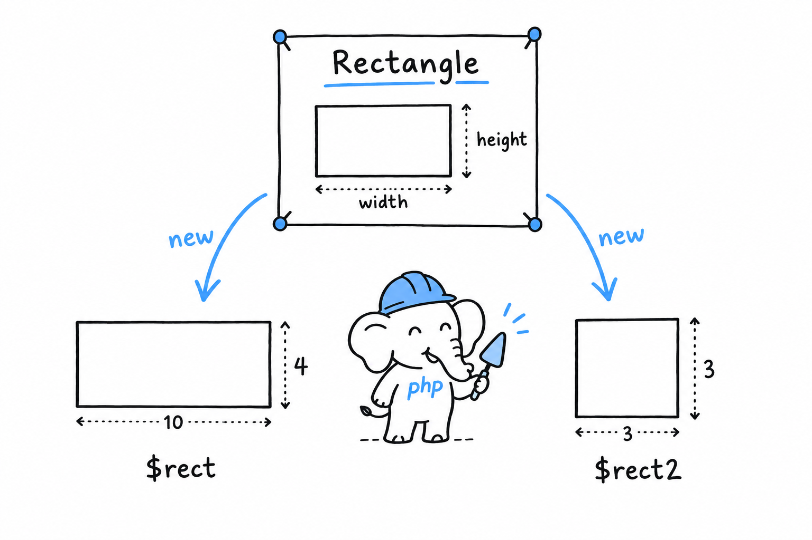
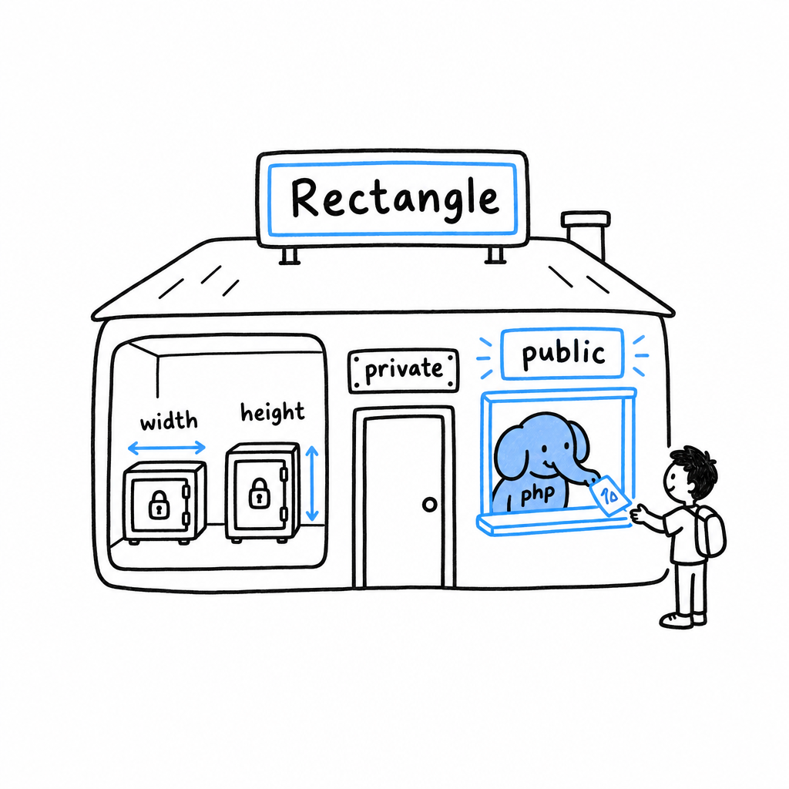

# Defining and Instantiating Classes

A class is a blueprint. It says what data an object of that kind holds and, later on, what it can do. A blueprint builds nothing by itself. **You ask PHP to build an object from it with `new`.**

## Defining a class

```php
<?php
declare(strict_types=1);

class Rectangle
{
    public float $width;
    public float $height;
}
```

`class Rectangle { ... }` declares the blueprint. Inside it, `public float $width;` declares a **typed property**: a named slot every `Rectangle` will have, with a type PHP enforces each time something is assigned to it. It is the same type declaration you have been putting on function parameters since [Chapter 3](ch03-02-data-types.md), applied to a piece of data that lives on an object rather than in a function call.

## Instantiating a class

**`new` builds an actual object from the blueprint. That object is called an instance:**

```php
<?php

$rect = new Rectangle();
$rect->width = 10.0;
$rect->height = 4.0;

echo $rect->width;  // 10
echo $rect->height; // 4
```

`new Rectangle()` hands you a real `Rectangle`, with its own `$width` and `$height`, and `$rect` holds it. **The `->` arrow reaches into an object to read or write one of its properties.** It is the object equivalent of `[]` on an array, except that an object is much pickier about what you may put in it, as you will see shortly.



Build a second `Rectangle`, and you get a genuinely separate object with its own storage:

```php
<?php

$rect2 = new Rectangle();
$rect2->width = 3.0;
$rect2->height = 3.0;

echo $rect->width;  // 10, untouched by $rect2
echo $rect2->width; // 3
```

Pause here, because [Chapter 4](ch04-02-references.md) may have left you wary of objects sharing handles. `$rect` and `$rect2` are not two names for one object. They come from two separate `new` calls, so they are two separate instances. **The "objects alias, they don't copy" rule is about assigning an existing object to another variable, `$a = $b`. Every `new` builds a fresh object.**

> One blueprint, as many objects as you ask for. Each `new` is a new one.

## Constructing with `__construct`

Setting each property by hand after `new` works, but it is easy to forget one, and for a moment a half-built `Rectangle` exists with properties still unset. PHP has a special method for this. **`__construct()` runs automatically the moment an object is created**, so the object is complete from its first breath:

```php
<?php
declare(strict_types=1);

class Rectangle
{
    public float $width;
    public float $height;

    public function __construct(float $width, float $height)
    {
        $this->width = $width;
        $this->height = $height;
    }
}

$rect = new Rectangle(10.0, 4.0);

echo $rect->width;  // 10
echo $rect->height; // 4
```

Whatever you pass to `new Rectangle(...)` goes straight to `__construct()`. Inside it, `$this` is the object being built: `$this->width = $width` takes the incoming parameter and stores it in the object's own `$width` slot. `$this` gets a closer look, along with a much shorter way to write this exact constructor, in [Methods and Constructor Promotion](ch05-03-methods.md).

## Visibility: `public`, `private`, `protected`

Every property and method has a **visibility**, and so far everything has been `public`: reachable from anywhere, including code that has nothing to do with the class. That is often more than you want. **Mark a property `private`, and only code inside the class can touch it:**

```php
<?php
declare(strict_types=1);

class Rectangle
{
    private float $width;
    private float $height;

    public function __construct(float $width, float $height)
    {
        $this->width = $width;
        $this->height = $height;
    }
}

$rect = new Rectangle(10.0, 4.0);
echo $rect->width; // Error: Cannot access private property Rectangle::$width
```



This is a restriction on purpose, not a bug to route around. Once `$width` is private, the only way the outside world can learn or change it is through methods `Rectangle` chooses to offer. `Rectangle` therefore decides what a valid width looks like, instead of trusting every caller to behave. Try it: add `public function width(): float { return $this->width; }` to the class and call `$rect->width()`. The value is readable again, on the class's terms.

`protected` sits in between: hidden from the outside, visible to any class that later extends this one. The distinction matters once inheritance arrives in [Chapter 17](ch17-00-object-oriented-php.md).

> [!TIP]
> Default to `private`. Make a property `public` only when you have a specific reason, and give outside code a method when it genuinely needs access.
