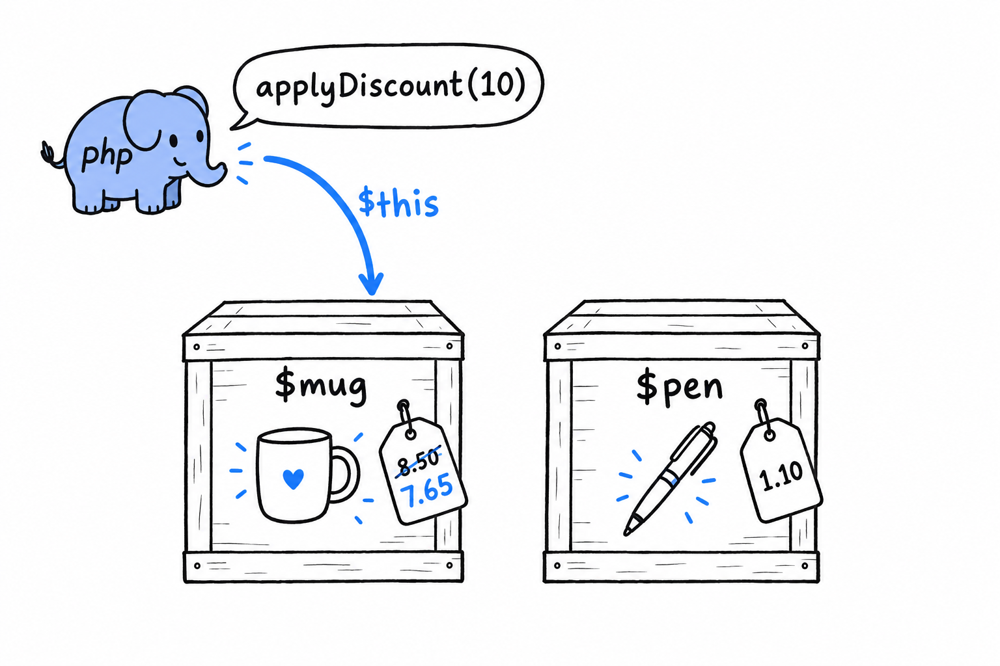

# Methods and Constructor Promotion

**A method is a function that lives inside a class.** You have already written one, `totalPrice()` on `Product`. What sets it apart from an ordinary function fits in a single variable, `$this`, and once that is clear, PHP's shortest way of writing a constructor is one small step away.

## `$this`

**Inside a method, `$this` is the object the method was called on.** It is how a method reaches the data of this particular instance, and not some other instance of the same class:

```php
<?php
declare(strict_types=1);

class Product
{
    public string $name;
    public float $price;
    public int $quantity;

    public function __construct(string $name, float $price, int $quantity)
    {
        $this->name = $name;
        $this->price = $price;
        $this->quantity = $quantity;
    }

    public function totalPrice(): float
    {
        return $this->price * $this->quantity;
    }

    public function applyDiscount(float $percentage): void
    {
        $this->price -= $this->price * ($percentage / 100);
    }
}

$mug = new Product('Coffee mug', 8.50, 3);
$mug->applyDiscount(10);

echo $mug->price; // 7.65
```

`applyDiscount()` does not take the product as a parameter. It does not need to: `$this` already is the product it was called on. Call `$mug->applyDiscount(10)`, and inside the method `$this` is `$mug`. Call the same method on another `Product`, and `$this` is that one instead.



`$this` is implicit, and always available inside any non-static method. It is what keeps an object's methods in step with that same object's data, without you passing the object into every one of its own methods by hand.

> Call a method on an object, and `$this` is that object. Nothing to pass, nothing to declare.

Try it: create a second product, `$pen = new Product('Pen', 1.10, 5);`, call `$mug->applyDiscount(10)`, then print `$pen->price`. The pen is untouched. The discount only reached the object `$this` pointed to.

## The constructor, the long way

Look at `Product`'s constructor again. Three parameters in, three matching assignments, one line each, no logic beyond "put this where it belongs." **The shape is so common in PHP, and so repetitive, that it earned its own shorthand.**

## Constructor property promotion

Since PHP 8, **adding a visibility keyword to a constructor parameter declares the property and assigns it in one stroke:**

```php
<?php
declare(strict_types=1);

class Product
{
    public function __construct(
        public string $name,
        public float $price,
        public int $quantity,
    ) {
    }

    public function totalPrice(): float
    {
        return $this->price * $this->quantity;
    }
}

$mug = new Product('Coffee mug', 8.50, 3);
echo $mug->totalPrice(); // 25.5
```

Set this next to the version at the top of the section. From the outside, the two classes are identical: same properties, same types, same constructor signature. Inside, the promoted version has no separate property declarations, no `$this->name = $name;` three times over, and an empty constructor body. **Writing `public string $name` as a parameter does three jobs at once: it declares the property, types it, and stores the incoming argument in it.**

This is the idiomatic, modern way to write a constructor whose only job is "keep what I was given", and that describes a large share of the constructors you will write in real PHP code. You will see it constantly from here on.

## `readonly` properties, briefly

One more keyword, because it pairs so naturally with promotion. **Mark a promoted property `readonly`, and it can be set once, during construction, and never reassigned:**

```php
<?php
declare(strict_types=1);

class Product
{
    public function __construct(
        public readonly string $name,
        public float $price,
        public int $quantity,
    ) {
    }
}

$mug = new Product('Coffee mug', 8.50, 3);
$mug->name = 'Travel mug'; // Error: Cannot modify readonly property Product::$name
```

A price and a quantity are expected to change; that is the whole point of `applyDiscount()`. A product's name rarely has a good reason to. `readonly` lets you say so in the class definition itself, and PHP enforces it, instead of the rule living in a comment or a convention someone eventually forgets. It comes back later in the book, once enums and value objects enter the picture.
