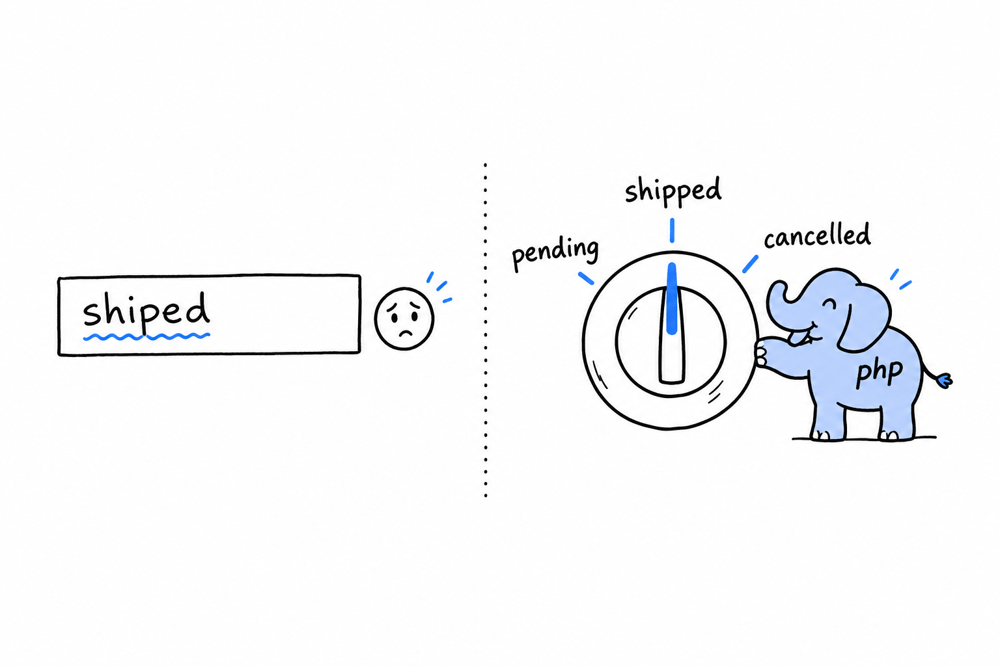

# Enums and Pattern Matching

An order is pending, shipped, or cancelled. Never anything else. A playing card belongs to one of four suits, full stop. A traffic light is red, amber, or green. Programs are full of values like these, and for a long time PHP had no proper way to say so.

Before PHP 8.1 you reached for a string, `'shipped'`, or an integer constant, and hoped. Nothing stopped a colleague from typing `'shiped'` somewhere. Nothing told you, in any one place, what the full list of valid values even was. The rule lived in your head, and heads forget.

**An enum turns that list into a real type, checked by the engine, that can only ever hold one of the cases you declared.** It is the difference between a text field where anyone can type anything and a knob with three positions engraved in the metal.

You met `match` briefly in [Control Flow](ch03-05-control-flow.md), sizing up an HTTP status code, and classes have given shape to your data since [Chapter 5](ch05-00-classes.md). Enums sit right between the two: they look like a small class, and `match` was made to read them. The chapter ends on the nullsafe operator, `?->`, a cousin from the same family. It deals with a set of exactly two possibilities, something or nothing, without a defensive `if` in front of every access.
