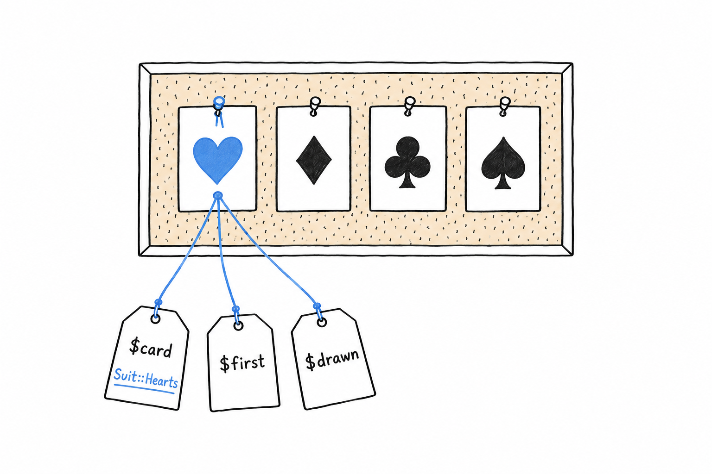
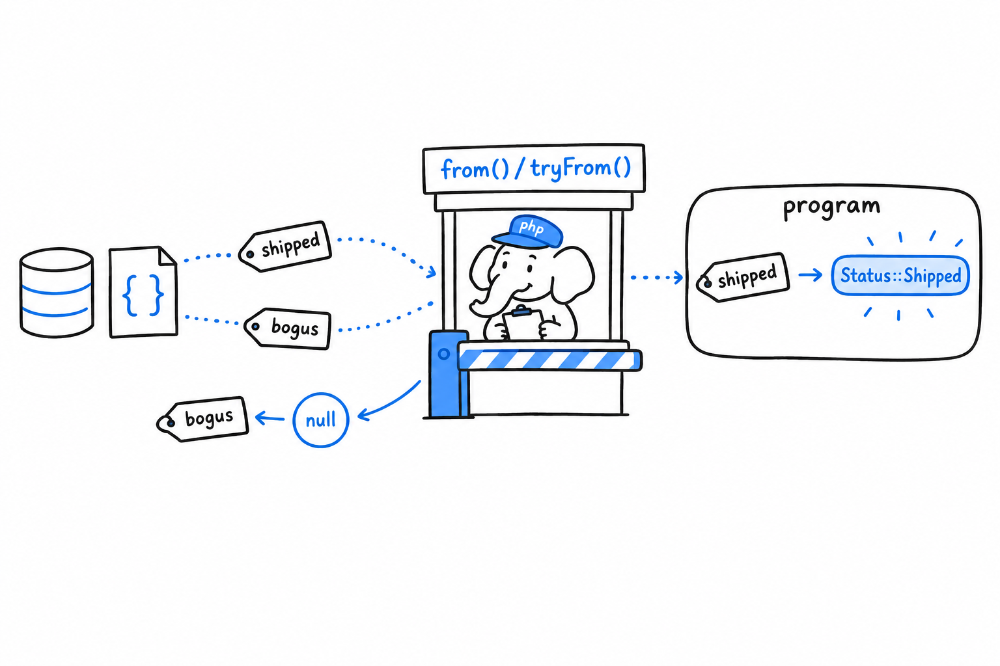

# Defining an Enum

## Pure enums

Four suits, no more, no less. Here they are as an enum:

```php
<?php
declare(strict_types=1);

enum Suit
{
    case Hearts;
    case Diamonds;
    case Clubs;
    case Spades;
}

$card = Suit::Hearts;

var_dump($card);          // enum(Suit::Hearts)
var_dump($card === Suit::Hearts); // true
```

`enum` opens the definition the way `class` does, and each `case` line declares one of the allowed values. **An enum is a type with a fixed, closed list of values, and those values are called cases.** `Suit::Hearts` is written like a class constant: you reach a case through the enum's name.

The `var_dump` line shows something a string never told you. `Suit::Hearts` is a single, unique value. There is exactly one in your whole program, however many variables point at it, which is why the `===` on the next line says `true` without a second thought.



That uniqueness makes the type safe. A parameter typed `Suit` cannot hold anything but one of the four cases, and PHP stops a wrong value at the type level rather than with a bug report three weeks later.

```php
<?php
declare(strict_types=1);

function describe(Suit $suit): string
{
    return "You drew a {$suit->name}.";
}

echo describe(Suit::Spades); // You drew a Spades.
```

Every case carries a built-in `->name` property: the identifier you declared it with, as a string. Handy for logging, but it is only a label. Building program logic on it would be building on the spelling of your own code.

Try it: call `describe('Spades')` with a plain string and read the `TypeError`. That message is the enum doing its job.

## Backed enums

A pure enum's cases are nothing but themselves: `Suit::Hearts` is not secretly a string or a number. Then an order has to be saved in a database column, or sent as JSON to another program, and the outside world does not know what `Status::Shipped` is. It knows `'shipped'`. **A backed enum ties every case to a scalar value of your choice**, a form that can leave your program and come back.

```php
<?php
declare(strict_types=1);

enum Status: string
{
    case Pending = 'pending';
    case Shipped = 'shipped';
    case Cancelled = 'cancelled';
}

$status = Status::Shipped;

echo $status->value; // shipped
```

`: string` after the name says the enum is backed by strings, and from then on every case must declare its value: PHP checks that when it reads the definition. Integers work the same way (`enum Status: int`). Strings are the usual choice, because `'shipped'` explains itself in a database row, where a bare `2` sends you back to the enum to find out what it means.

Going the other way, from a raw value to a case, takes one of two methods:

```php
<?php

$status = Status::from('shipped');   // Status::Shipped
echo $status->name;                  // Shipped

$status = Status::tryFrom('bogus');  // null, no matching case
var_dump($status);
```

`from()` converts a value into the matching case and throws a `ValueError` if nothing matches. `tryFrom()` returns `null` instead. Choosing between them means asking where the value comes from. If an unknown value can only mean a bug in your own code, use `from()` and let it fail loudly. If it arrives from user input or an external API, "not a valid status" is a normal outcome, and `tryFrom()` hands it to you as a `null` to handle.



> `from()` throws on an unknown value. `tryFrom()` returns `null`. Pick by asking who produced the value.

## Enums can have methods

An enum is not only a list of names. It can carry behavior, exactly as a class does:

```php
<?php
declare(strict_types=1);

enum Status: string
{
    case Pending = 'pending';
    case Shipped = 'shipped';
    case Cancelled = 'cancelled';

    public function label(): string
    {
        return match ($this) {
            Status::Pending => 'Awaiting shipment',
            Status::Shipped => 'On its way',
            Status::Cancelled => 'Order cancelled',
        };
    }
}

echo Status::Shipped->label(); // On its way
```

`label()` works like any method from [Chapter 5](ch05-03-methods.md): inside it, `$this` is the case the method was called on. **The mapping from a case to its human-readable label now lives in one place, right next to the cases themselves**, instead of being scattered through the codebase as `if ($status === 'shipped')` checks that slowly drift apart.

The `match` inside `label()` compares `$this` against each case and returns the text beside the one that fits. That is `match` doing what it does best, and the next section takes it apart.
