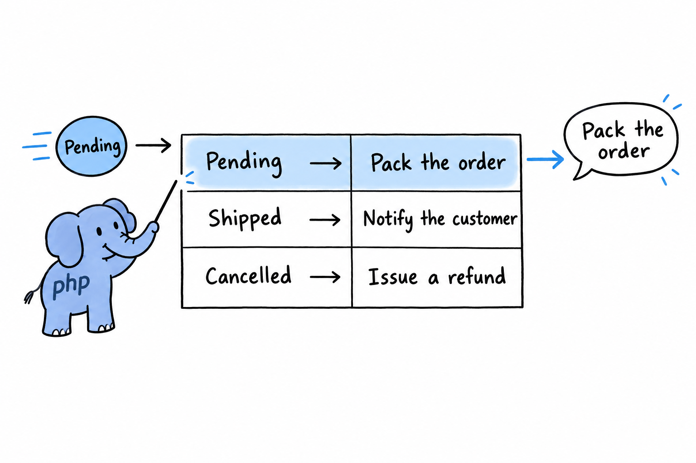
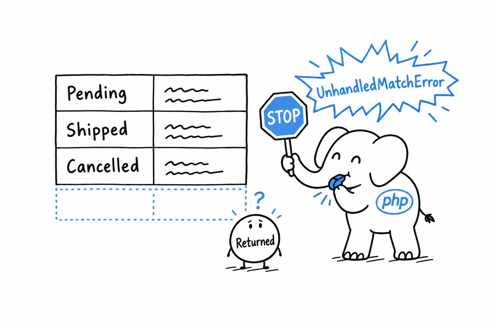

# The `match` Expression

`match` made a brief appearance in [Control Flow](ch03-05-control-flow.md) as `match(true)`, testing one condition after another against an HTTP status code. That was a useful trick, not `match` at its best. **`match` shines when one value is compared against a small, known set of possibilities**, and an enum is exactly that set.

## Matching directly on an enum case

```php
<?php
declare(strict_types=1);

enum Status: string
{
    case Pending = 'pending';
    case Shipped = 'shipped';
    case Cancelled = 'cancelled';
}

function nextAction(Status $status): string
{
    return match ($status) {
        Status::Pending => 'Pack the order',
        Status::Shipped => 'Notify the customer',
        Status::Cancelled => 'Issue a refund',
    };
}

echo nextAction(Status::Pending); // Pack the order
```

No `true`, no comparison operator, no range check. `match ($status)` compares the value in the parentheses with each arm using strict `===` comparison, and returns whatever stands right of the arrow on the first arm that fits. Read from top to bottom, the function is a table: one row per case, one answer per row.



Notice the `return` in front of `match`. **`match` is an expression: it produces a value** you can return or assign, where `switch` and `if` only run code. That is why the whole function body fits in a single statement.

## Multiple conditions per arm

An arm can list several values, separated by commas, and any one of them is enough:

```php
<?php
declare(strict_types=1);

function isFinal(Status $status): bool
{
    return match ($status) {
        Status::Shipped, Status::Cancelled => true,
        Status::Pending => false,
    };
}

var_dump(isFinal(Status::Shipped));   // true
var_dump(isFinal(Status::Cancelled)); // true
var_dump(isFinal(Status::Pending));   // false
```

`Status::Shipped, Status::Cancelled => true` reads as "either of these, same answer". It beats writing the arm twice, and it beats an `||` tucked inside a `match(true)`.

## Exhaustiveness is enforced

Here is what makes `match` more than a tidier `switch`. **Every possible value has to be handled, by name or through a `default` arm. If none fits, `match` throws.** Suppose the shop starts accepting returns:

```php
<?php
declare(strict_types=1);

enum Status: string
{
    case Pending = 'pending';
    case Shipped = 'shipped';
    case Cancelled = 'cancelled';
    case Returned = 'returned'; // added later
}

function nextAction(Status $status): string
{
    return match ($status) {
        Status::Pending => 'Pack the order',
        Status::Shipped => 'Notify the customer',
        Status::Cancelled => 'Issue a refund',
        // forgot to add a Returned arm
    };
}

nextAction(Status::Returned); // UnhandledMatchError: Unhandled match case Status::Returned
```

The enum grew, the `match` did not, and the first time a returned order reaches `nextAction()` PHP raises an `UnhandledMatchError` on that exact line.



That looks harsh, and it is the feature. Add a case to an enum months from now, forget one of the `match` expressions that read it, and PHP names the place that needs updating. A `switch` with no matching branch does nothing and moves on. An `if` chain quietly runs its `else` for a value nobody planned. A `match` refuses.

Try it: add a `Status::Returned => 'Restock the item'` arm and run the file again.

When most cases really do share one fallback, add a `default` arm, as `switch` has always had. It catches everything not named above it, and tells the reader you chose to treat the rest alike rather than forgot.

> A `match` without `default` is a promise to handle every case. PHP holds you to it.
