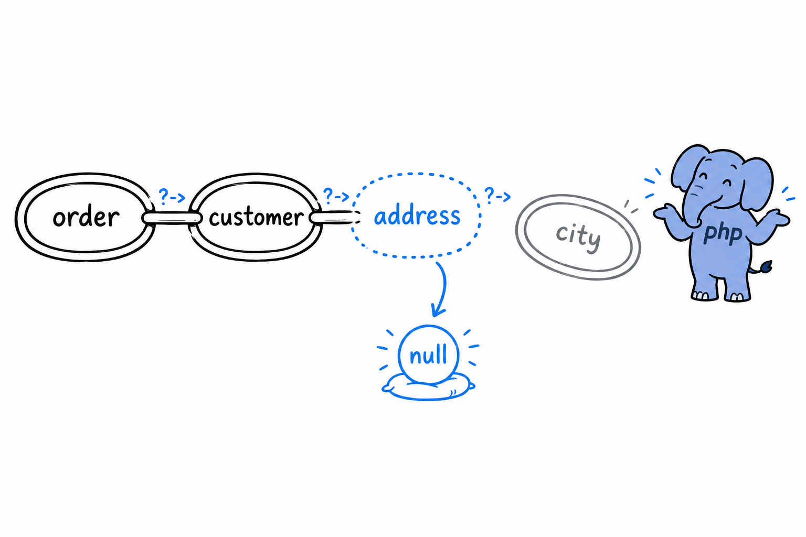
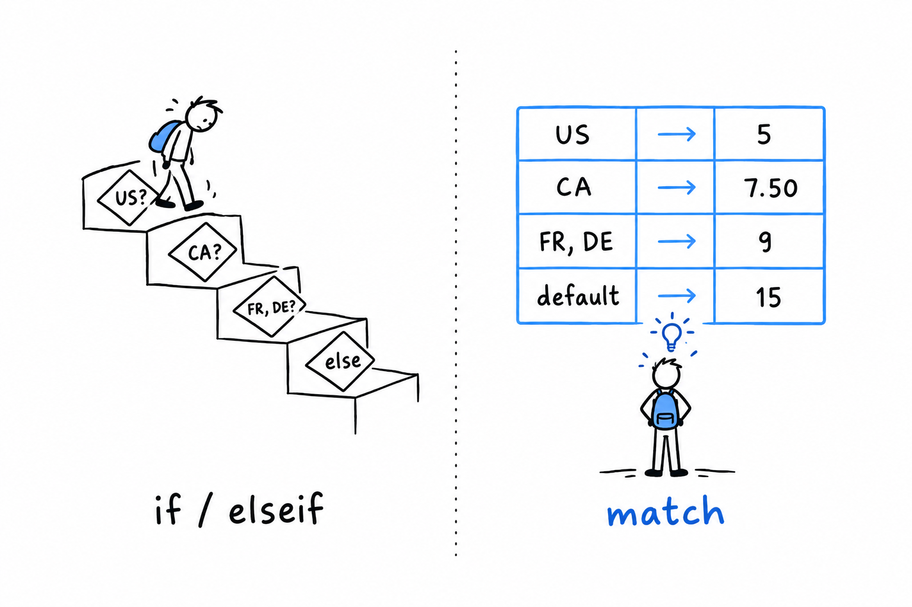

# Concise Control Flow with `match` and `?->`

Some values are not one of three or four cases. They are one of two: something, or nothing at all. That is the last fixed set this chapter deals with, and it earns a piece of syntax of its own.

## The nullsafe operator

`null` means "no value here", as [Data Types](ch03-02-data-types.md) put it, and `->` reaches into an object for a property or a method, as in [Chapter 5](ch05-01-defining-classes.md). Put the two together and you get a question every program eventually asks: what happens when you use `->` on something that might be `null`?

```php
<?php
declare(strict_types=1);

class Address
{
    public function __construct(
        public string $city,
    ) {
    }
}

class Customer
{
    public function __construct(
        public string $name,
        public ?Address $address = null,
    ) {
    }
}

$customer = new Customer('Ada');

echo $customer->address->city; // Error: Attempt to read property "city" on null
```

Ada has no address on file, so `$customer->address` is `null`, and reaching one step further with `->city` fails on the spot: there is no property to read on nothing. The classic fix is a guard before the access:

```php
<?php

$city = null;
if ($customer->address !== null) {
    $city = $customer->address->city;
}

echo $city ?? 'No address on file';
```

It works, and it does not scale. Chain a few more levels, `$order->customer->address->city` say, and you either nest one guard per link, or write one long condition that checks three things at once and names none of them.

**The nullsafe operator, `?->`, does the guard for you:**

```php
<?php
declare(strict_types=1);

$city = $customer->address?->city;

echo $city ?? 'No address on file';
```

`?->` looks at what stands on its left before going any further. If it is `null`, the whole expression becomes `null` right there, with no error and no exception, ready for `??` or whatever else you do with a missing value. If it is not `null`, `?->` behaves exactly like `->`. In a longer chain, `$order?->customer?->address?->city` stops at the first `null` it meets and gives `null` for the entire expression, without trying the accesses after it.



> `?->` stops at the first `null` and hands it back. Everything after it is skipped.

> [!WARNING]
> `?->` is for values that may legitimately be absent: an optional address, a related record that may not exist yet. It is not a way to avoid deciding whether `null` belongs there at all. Sprinkled everywhere out of habit, it hides a design that never settled what is optional. Where absence is not normal, keep the plain `->` and let the error tell you something is wrong.

## `match` as the clean alternative to a long `if`/`elseif` chain

Enums are where `match` looks best, but it does not need them. **`match` is PHP's answer to any `if`/`elseif` chain that checks one value against several known possibilities.** Here is such a chain:

```php
<?php
declare(strict_types=1);

function shippingCost(string $countryCode): float
{
    if ($countryCode === 'US') {
        return 5.00;
    } elseif ($countryCode === 'CA') {
        return 7.50;
    } elseif ($countryCode === 'FR' || $countryCode === 'DE') {
        return 9.00;
    } else {
        return 15.00;
    }
}
```

The same function as a `match`:

```php
<?php
declare(strict_types=1);

function shippingCost(string $countryCode): float
{
    return match ($countryCode) {
        'US' => 5.00,
        'CA' => 7.50,
        'FR', 'DE' => 9.00,
        default => 15.00,
    };
}
```

Shorter, yes. More important, every branch is visibly an alternative to every other one, at a glance, where the `elseif` version has to be read in order to be sure nothing slips between two steps.



That gives you a rule of thumb to carry through the rest of the book. Reach for `if`/`elseif` when the conditions are genuinely different kinds of checks: a range here, a combination of two flags there. Reach for `match` the moment you notice the question is "which one of these known values is it?" Enums make that question obvious. It comes up everywhere else too.
