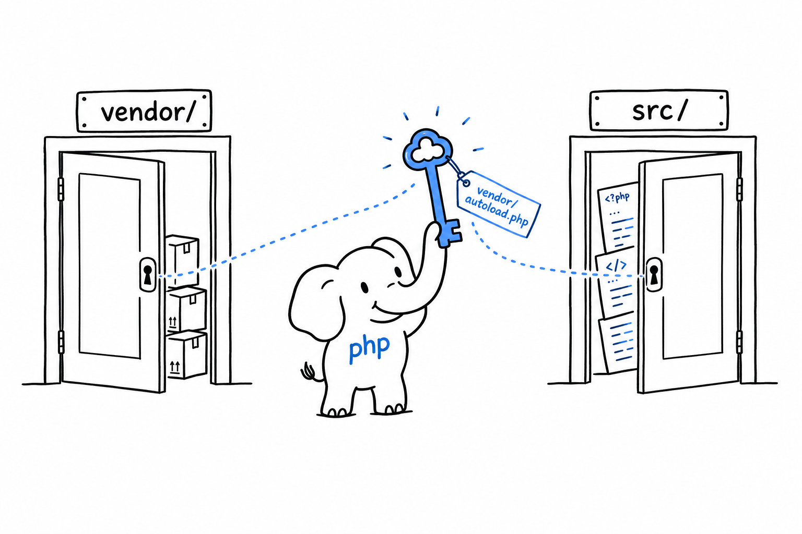

# Namespaces, Packages, and Composer

Every example so far has fit in one file. That stops now. After [Chapter 5](ch05-00-classes.md) and [Chapter 6](ch06-00-enums.md) you have classes and enums, and a project made of a dozen of them does not belong in a single script. You need to spread code across files, and you need those files to stay out of each other's way.

Naming is the trap. The day you install a package with Composer, PHP's package manager, you share your project with code you did not write and cannot rename. If that package defines a class called `Product`, and you have a `Product` too, PHP has no way to tell them apart. **A namespace is a prefix on a name, and that prefix is what keeps `App\Models\Product` and `Vendor\Package\Product` from colliding.** Two different names, nothing to guess.

Composer comes first, because it is the reason the rest exists. Then you give your own classes a namespace, import them with `use` so you can keep writing short names, and lay out a `src/` folder that mirrors those namespaces, the way real PHP projects are laid out. PSR-4 ties the knot: a convention that lets Composer find any class from its name alone.

That last piece is the reward. The line `require 'vendor/autoload.php'` already finds and loads every package you install. By the end of the chapter it will find *your own* classes too. Add a file, use the class, and it is simply there. No list of `require` lines to maintain at the top of every file.

