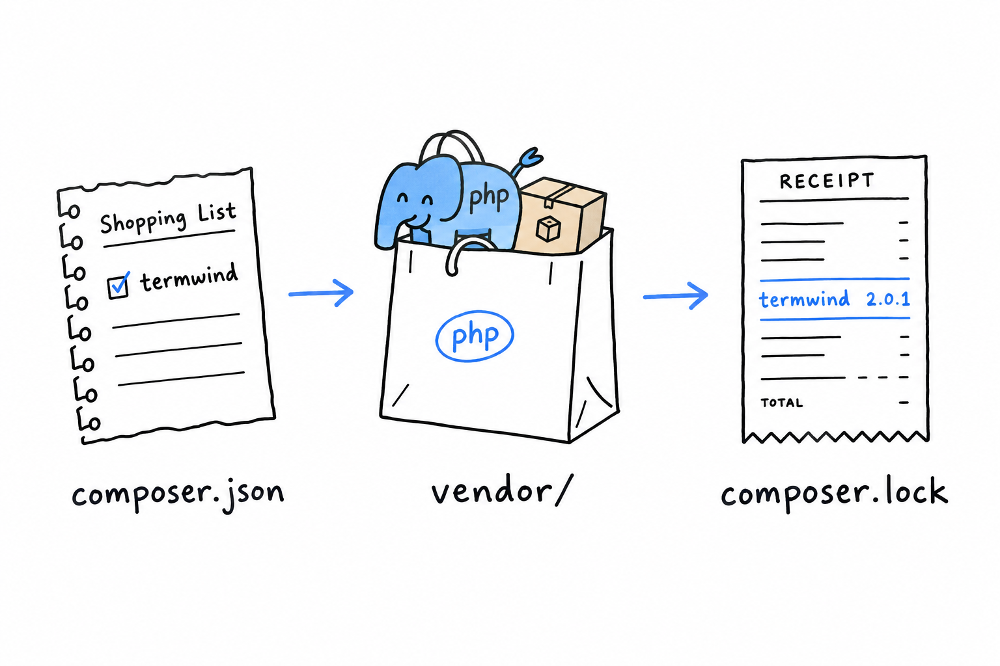

# Hello, Composer!

`hello.php` has no dependencies, so it needs no help managing them. Real projects do, almost from day one: a testing library here, an HTTP client there. **[Composer](https://getcomposer.org/) is how a PHP project pulls in someone else's code without copy-pasting it into your own.** If you have used `npm`, `pip` or `cargo`, you already know the job. If not, you will by the end of this page.

## Installing Composer

On macOS or Linux, the quickest path is usually your package manager:

```console
$ brew install composer
```

Everywhere else, or for the canonical method, the [official download page](https://getcomposer.org/download/) has a short install script. Either way, check that it answers:

```console
$ composer --version
Composer version 2.7.6 2024-...
```

## Starting a project

Inside an empty directory, run:

```console
$ composer init
```

Composer asks a handful of questions: package name, description, author, license. Press Enter through most of them, nothing here is permanent. What matters is the file it leaves behind, `composer.json`:

```json
{
    "name": "you/hello-composer",
    "require": {}
}
```

**`composer.json` is your project's shopping list.** It names what the project needs, and it goes into version control. What Composer brings back from the shop does not, as you are about to see.

## Requiring your first package

Let's add something real. [`nunomaduro/termwind`](https://github.com/nunomaduro/termwind) is a small library for styling terminal output. Nothing essential, just enough to watch the mechanism work:

```console
$ composer require nunomaduro/termwind
```

Two things appear. A `vendor/` directory holds the downloaded code. A `composer.lock` file records the *exact* version that was installed, down to the last commit, so that your teammates and your production server install the very same thing. **`composer.json` says what you are willing to accept; `composer.lock` says what you actually got.** Commit the lock file too. `vendor/` stays out of version control, since anyone can rebuild it from the lock file with `composer install`.



Now use it:

```php
<?php

require 'vendor/autoload.php';

use function Termwind\render;

render('<div class="p-1 bg-green-400">Hello, Composer!</div>');
```

Run the file. A green banner appears in your terminal, drawn by code you installed thirty seconds ago and never read.

The middle line is the one that matters. `require 'vendor/autoload.php'` pulls in a file Composer generated: an autoloader, a bit of PHP that knows how to find and load any class from any package you installed, the moment your code first mentions it. **Include that one file, once, at the top of your entry point, and every package you add from here on just works.** The `use function` line, which lets you call `render()` by its short name, gets its own explanation later in this chapter.

So far the autoloader has had one job: loading Termwind. The rest of this chapter gives it a second one. The same line, unchanged, will find your own classes too, once they are spread across files the way PHP projects expect.
