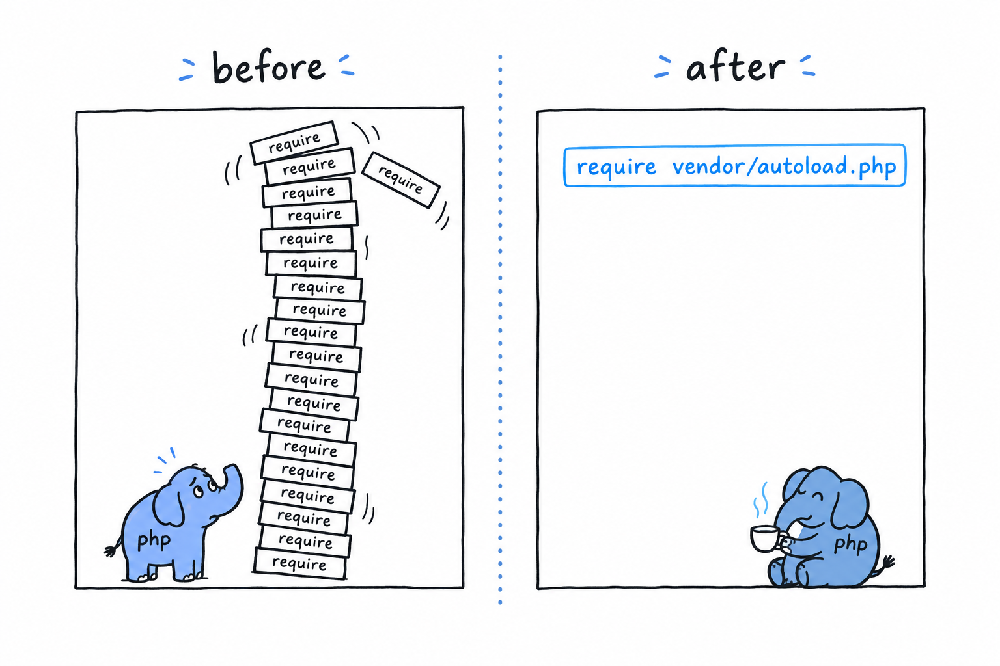

# Packages and Autoloading

`composer require` puts a package in `vendor/`, and `require 'vendor/autoload.php'` makes every class in it available. You have watched it work. What you have not seen is *how* the second half works, and the answer explains why the rest of this chapter exists.

## The problem autoloading solves

Picture PHP without it. A `Cart` class in one file, a `Product` class in another, and a script that needs both:

```php
<?php

require 'Product.php';
require 'Cart.php';

$product = new Product('Keyboard', 49.00);
$cart = new Cart();
$cart->add($product);
```

Two classes, two `require` lines, kept in sync by hand. Manageable. Now picture forty classes across a dozen packages you did not write, each depending on others in an order you would have to work out yourself. **Loading files by hand does not scale past a handful of classes**, and it breaks the day you rename one. Nobody does it anymore.



## `spl_autoload_register()`

PHP has a built-in hook for exactly this. **`spl_autoload_register()` hands PHP a function to call the first time it meets a class name it does not know.** Instead of failing on the spot, PHP gives your function a chance to go find the file and load it:

```php
<?php

spl_autoload_register(function (string $className): void {
    $file = __DIR__ . '/' . $className . '.php';

    if (file_exists($file)) {
        require $file;
    }
});

$cart = new Cart(); // Cart.php is loaded automatically, on first use
```

`new Cart()` runs, PHP has never heard of `Cart`, so it calls your function with the string `'Cart'`. The function builds a path, finds `Cart.php` and requires it. The class now exists, and `new` goes ahead as if nothing had happened. Try it: put a `Cart` class in `Cart.php` next to this script, run it, then rename the file and run it again.


Plenty of projects wrote their own version of this before Composer existed. It works, until a package you depend on ships its own hand-rolled autoloader with slightly different rules, and you are back to coordinating by hand.

## What Composer actually generates

Every `composer install` or `composer require` regenerates the files in `vendor/composer/`. One of them, `autoload_psr4.php`, is a plain PHP array mapping namespace prefixes to directories. `vendor/autoload.php` builds one autoloader from that map and registers it with `spl_autoload_register()`. From then on, every class from every installed package resolves on its own.

It works because packages do not dump their files into a shared pile. **Each package declares, in its own `composer.json`, which namespace prefix lives in which directory.** Here is what that declaration looks like (you will write one for your own project in [PSR-4](ch07-06-psr4.md)):

```json
{
    "autoload": {
        "psr-4": {
            "App\\": "src/"
        }
    }
}
```

> A namespace is a promise about where the file is. PSR-4 is the rule that turns the promise into a path. Composer's autoloader just applies the rule, fast.

## Why this needs namespaces at all

The whole scheme rests on one condition: **class names must stay unique across every package installed in your project.** A `Product` from your own code and a `Product` from some e-commerce package would be indistinguishable. PHP would not know which `Product.php` to load, and neither would you, reading the code six months from now.

Namespaces remove the collision by making `Product` short for something more precise: `App\Models\Product` on one side, `Vendor\Ecommerce\Product` on the other. Two names, two files, nothing to guess. That is the next section.
