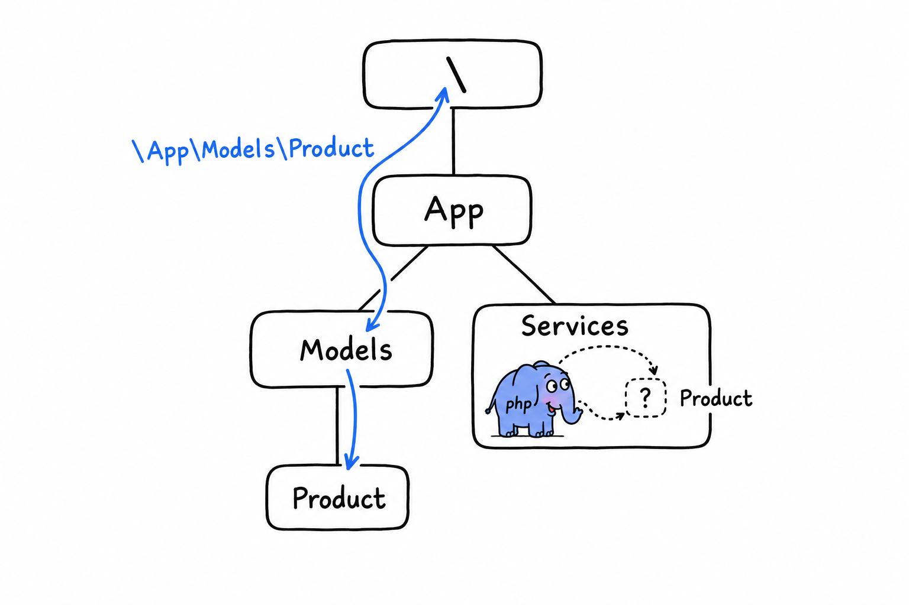

# Controlling Scope and Visibility with Namespaces

**A namespace is a prefix.** That is the whole concept, and it is worth saying before the syntax makes it look bigger than it is. `App\Models\Product` is the name `Product`, living inside `App\Models`, the same way `/home/damien/notes.txt` is `notes.txt`, living inside `/home/damien`. The class itself does not change. What changes is how you, and PHP, point at it without ambiguity.

## Declaring a namespace

The `namespace` line is the first statement in a file. Only a comment or `declare(strict_types=1)` may come before it:

```php
<?php

declare(strict_types=1);

namespace App\Models;

class Product
{
    public function __construct(
        public readonly string $name,
        public readonly float $price,
    ) {
    }
}
```

Everything declared in this file now lives under `App\Models`: the `Product` class, and any class, interface or function you add below it. Its full name is `App\Models\Product`. Inside this file, and inside any other file that also opens with `namespace App\Models;`, plain `Product` still works, because **PHP resolves a bare name against the current namespace first.**

## Why bother

Here is the situation namespaces were built for. Your project uses a library that ships a `Collection` class; plenty do, it is the natural name for "a bunch of things with helper methods". You want a `Collection` of your own as well, for a stamp-collecting app, say. Without namespaces, PHP would meet two classes fighting for one name and refuse to load the second. A fatal error, and not a subtle one.

With namespaces, there is no fight:

```php
<?php

namespace App\Models;

class Collection
{
    // your Collection, entirely unrelated to anyone else's
}
```

```php
<?php

// Illuminate\Support\Collection, from a package you installed
namespace Illuminate\Support;

class Collection
{
    // their Collection
}
```


Same short name, two different classes, no collision: `App\Models\Collection` and `Illuminate\Support\Collection` are simply two identifiers. **Namespaces exist because your project will contain code from people you have never met, and none of you agreed on names in advance.** Tidy code organization is a pleasant side effect. Avoiding the collision is the reason.

## Fully qualified names

You can always name a class by its full path, whatever namespace you are in. Write it out completely, with a leading backslash, and you have a *fully qualified name*:

```php
<?php

namespace App\Services;

function makeProduct(): \App\Models\Product
{
    return new \App\Models\Product('Keyboard', 49.00);
}
```

The backslash is the point. Inside `App\Services`, a bare `Product` resolves relative to the current namespace: PHP looks for `App\Services\Product`, which does not exist. **A leading `\` says "start from the very top", the global namespace.**



You need the same trick for PHP's own built-in classes once your file has a namespace:

```php
<?php

namespace App\Services;

function now(): \DateTimeImmutable
{
    return new \DateTimeImmutable();
}
```

`DateTimeImmutable` has no namespace. It lives at the top, next to `Exception`, `ArrayObject` and every other built-in class, and from inside `App\Services` the only way to reach it is the leading backslash. Or the `use` keyword, which imports the name once and spares you the backslash everywhere else. That is next.

## A note on functions and constants

Namespaces cover functions and constants too. `namespace App\Helpers;` followed by `function slugify(string $s): string { ... }` gives you `App\Helpers\slugify()`. You will meet this less often than you might expect, for one reason: **for a bare function or constant name, PHP falls back to the global namespace when no namespaced version exists.** That is why `strlen()` and `array_map()` keep working inside a namespaced file without a second thought. Classes get no such fallback. Get the namespace of a class wrong and PHP simply will not find it.
