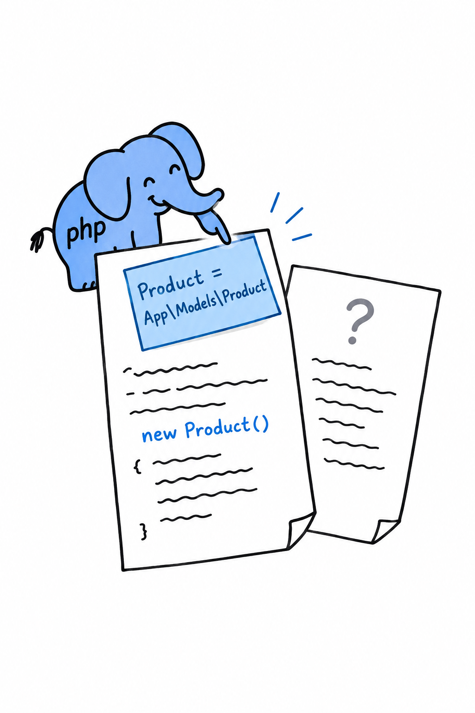

# Referring to Code with the `use` Keyword

Writing `\App\Models\Product` every time you need a `Product` gets old fast, and it buries your logic under file paths. **The `use` keyword imports a name once, at the top of a file, and the short name works for the rest of that file.**

## Basic imports

```php
<?php

declare(strict_types=1);

namespace App\Services;

use App\Models\Product;

function makeProduct(string $name, float $price): Product
{
    return new Product($name, $price);
}
```

One `use` line, and `Product` means `App\Models\Product` until the end of the file. No backslash, no full path, no ambiguity. `use` statements sit directly under the `namespace` declaration, before anything else.



Think of it as a sticky note on the first page: "when I say Product, I mean App\Models\Product". The note is glued to this file only. **Importing a class in one file has no effect on any other file**, so every file that needs `Product` repeats the same `use` line. That repetition is normal, not a smell.

## Aliasing with `as`

Sometimes the short name is taken. Two packages both export a `Collection`, or a library picked a name that reads badly in your code. `use ... as` renames the import, for this file only:

```php
<?php

declare(strict_types=1);

namespace App\Services;

use App\Models\Product;
use App\Models\Product as ProductModel;
use Vendor\Ecommerce\Product as ExternalProduct;

function convert(ExternalProduct $external): ProductModel
{
    return new ProductModel($external->title, $external->cost);
}
```

Outside this file, `App\Models\Product` and `Vendor\Ecommerce\Product` keep their names. You have simply given yourself two distinct local labels, in the one place that has to talk about both at once.

## Importing several names at once

When a file leans on one namespace, group the imports instead of repeating the prefix:

```php
<?php

declare(strict_types=1);

namespace App\Services;

use App\Models\{Product, Category, Warehouse};
```

It means exactly the same as three separate `use` lines. Some teams like the compactness, others find one import per line easier to read in a diff. Pick one and stick to it within a project.

## Importing functions and constants

`use` is not only for classes. A namespaced helper function or constant (rarer than a namespaced class, as the previous section said, but it happens) is imported with `use function` and `use const`:

```php
<?php

declare(strict_types=1);

namespace App\Services;

use function App\Helpers\slugify;
use const App\Helpers\DEFAULT_LOCALE;

$slug = slugify('Hello, Composer!');
```

You met this form at the start of the chapter, in [Hello, Composer!](ch07-01-hello-composer.md): `use function Termwind\render;`. It probably looked like a small piece of magic then. It is the same mechanism as everything on this page, an import scoped to one file, so that you can write a short name instead of a long one.

## What you're actually buying

A `use` statement is bookkeeping, not behavior. Nothing about a class, function or constant changes. What you get is code that reads the way you think: `new Product(...)` instead of `new \App\Models\Product(...)`, with one line at the top doing all the disambiguation. Together with `namespace`, that is everything you need to write code that collides with nobody else's. What is left is spreading it across files and folders in a way that makes sense, and that is where we are headed.
