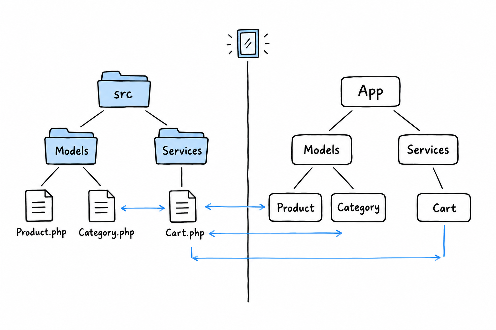

# Organizing a Multi-File Project

You can declare a namespace and import from one. What is still missing is the link between namespaces and the filesystem: so far, nothing tells PHP that `App\Models\Product` lives in any particular file. You could put it anywhere. You should not, and the layout on this page is what makes "anywhere" stop being tempting.

## One class, one file

**One class, interface, trait or enum per file, and the file is named after it, exactly, including case.** `Product` lives in `Product.php`. Not `product.php`, not `models.php` with three classes crammed together. The language does not enforce this. The ecosystem follows it so closely that breaking it will confuse the next person who opens your project.

It feels restrictive after scripts where everything lived in one file. It pays for itself as soon as a project has more than a handful of classes: you find any class from its name alone, without grepping.

## A folder that mirrors the namespace

The second half of the convention: **the folder tree mirrors the namespace tree.** A small project might look like this:

```console
$ find src -type f
src/Models/Product.php
src/Models/Category.php
src/Services/Cart.php
src/Services/PricingCalculator.php
```



And the namespace inside each file matches its path under `src/`:

```php
<?php

declare(strict_types=1);

namespace App\Models;

class Product
{
    public function __construct(
        public readonly string $name,
        public readonly float $price,
    ) {
    }
}
```

```php
<?php

declare(strict_types=1);

namespace App\Models;

class Category
{
    public function __construct(
        public readonly string $name,
    ) {
    }
}
```

```php
<?php

declare(strict_types=1);

namespace App\Services;

use App\Models\Product;

class Cart
{
    /** @var Product[] */
    private array $items = [];

    public function add(Product $product): void
    {
        $this->items[] = $product;
    }

    public function total(): float
    {
        return array_sum(array_map(
            fn (Product $product) => $product->price,
            $this->items,
        ));
    }
}
```

`App\Models\Product` sits at `src/Models/Product.php`. `App\Services\Cart` sits at `src/Services/Cart.php`. Notice that the `App` prefix has no folder called `App`: it stands for `src/` as a whole. That is one mapping, declared once, and it is the subject of the next section.

## Putting it together from an entry point

With that layout in place, an entry-point script (say `public/index.php`, or a one-off command you run with `php run.php`) imports what it needs and gets on with it:

```php
<?php

declare(strict_types=1);

require __DIR__ . '/vendor/autoload.php';

use App\Models\Product;
use App\Services\Cart;

$cart = new Cart();
$cart->add(new Product('Keyboard', 49.00));
$cart->add(new Product('Mouse', 25.00));

echo $cart->total() . "\n";
```

Not one `require` for `Product.php` or `Cart.php` in sight, only `vendor/autoload.php`, the line from [Hello, Composer!](ch07-01-hello-composer.md). That is no coincidence, and it is not magic either. It works because of one small block of configuration connecting the `App\` prefix to the `src/` folder. That block is PSR-4, and once it is in place this script prints `74`.
