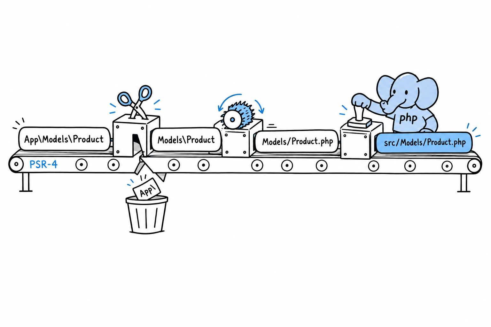

# Separating Classes into Different Files (PSR-4)

Everything in this chapter has been heading toward one small block of JSON. Your classes have namespaces, your files import them with `use`, `src/` mirrors the namespace tree, and still nothing has told Composer that any of this is connected. **PSR-4 is the published rule that maps a namespace to a directory on disk.** It comes from the PHP-FIG, the group that coordinates conventions like this one across the ecosystem.

## The rule, precisely

PSR-4 works on prefixes. You tell Composer: "any class whose name starts with this prefix lives under this directory, and the rest of the name is the rest of the path." In `composer.json`:

```json
{
    "name": "you/your-project",
    "autoload": {
        "psr-4": {
            "App\\": "src/"
        }
    }
}
```



With that mapping, `App\Models\Product` resolves in three moves. Strip the `App\` prefix: `Models\Product`. Turn the backslashes into slashes and add `.php`: `Models/Product.php`. Put the base directory in front: `src/Models/Product.php`. That is the entire algorithm. No configuration per class, no list of files to maintain, one rule applied every time.

> [!WARNING]
> Note the double backslash in `"App\\"`. This is a JSON string, so a literal backslash must be escaped. Easy to forget, and Composer will tell you plainly (an autoload path that does not resolve) if you do.

## Wiring it up

If you ran `composer init` in [Hello, Composer!](ch07-01-hello-composer.md), add the `autoload` block to your existing `composer.json` by hand. Then tell Composer to act on it:

```console
$ composer dump-autoload
Generating autoload files
Generated autoload files
```

This regenerates the files in `vendor/composer/`, including the PSR-4 map you peeked at in [Packages and Autoloading](ch07-02-packages-and-autoloading.md). From now on, `require 'vendor/autoload.php'` finds your own `App\` classes exactly the way it already found Termwind.

Try it: run the entry point from the previous section. It prints `74`. Then add a new class under `src/`, use it from the same script, and run again. Nothing else to do.

## When to run it again

The PSR-4 autoloader resolves paths by rule, not from a fixed list, so in most setups a new class in the right place is found immediately. Still, **running `composer dump-autoload` after adding classes is a habit worth having.** Some deployment setups build an optimized class map (`composer dump-autoload --optimize`, or automatically with `composer install --no-dev` on a production server) that trades the on-the-fly rule for speed, and that map only knows the classes that existed when it was generated. If you add `src/Models/Discount.php` and PHP suddenly cannot find `App\Models\Discount`, `composer dump-autoload` is the first thing to try. It costs nothing.

## Checking your work

Composer also notices when files and namespaces drift apart: a typo in a `namespace` line, a class saved in the wrong folder:

```console
$ composer dump-autoload
Generating autoload files
Warning: Ambiguous class resolution, "App\Models\Product" was found in
both "src/Models/Product.php" and "src/Models/product.php", the first
will be used.
Generated autoload files
```

That is the whole system, and the best part is how little of it you think about day to day. Namespace the class, put the file where the namespace says, and the autoloader (the one line you wrote in [Hello, Composer!](ch07-01-hello-composer.md) and have not touched since) finds it. From here on, every multi-file example in this book assumes exactly this setup: a `src/` folder, an `App\` namespace, and one `require` that never needs another one added after it.
