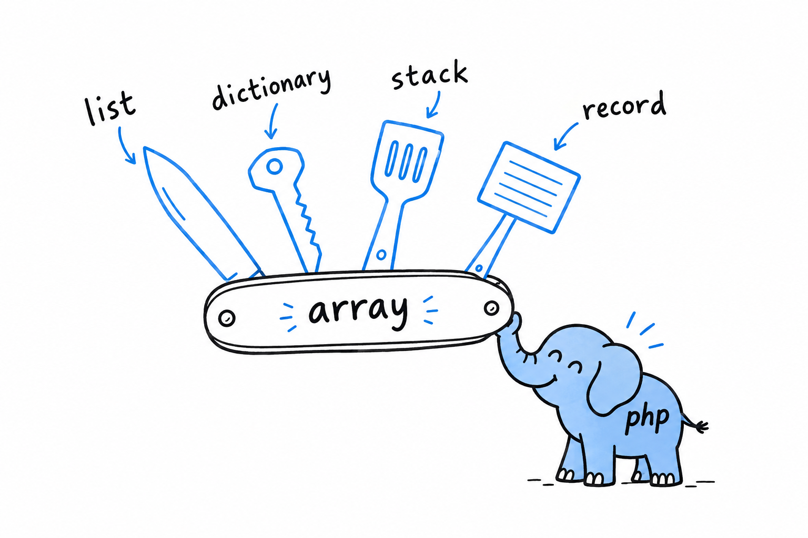

# Common Collections

A shopping list, a phone book, a stack of index cards, a row from a database. In most languages those are four different types. In PHP they are all one thing: an array.

You have been using arrays since [Chapter 3](ch03-02-data-types.md), a `$fruits = ["apple", "banana"]` here, a `foreach` there, enough to keep an example moving. That was on credit. **Arrays are the structure PHP programs are built out of**, and they deserve to be understood properly, once, rather than picked up by osmosis.

The reason one structure can do so much is the key to the whole chapter. **A PHP array is always an ordered map**: keys, each pointing at a value, kept in the order you added them. Use 0, 1, 2 as keys and it looks like a list. Use words and it looks like a dictionary. Underneath, nothing changed. Hold on to that fact and a lot of otherwise surprising behavior (why order is preserved, why `array_filter()` leaves gaps in the keys, why `count()` is instant) turns obvious.

> A list and a dictionary are the same PHP array wearing different keys.

The chapter also stops on strings, and that is not a change of subject. Strings and arrays live side by side in everyday PHP: you split one into the other and glue arrays of strings back together all day long. And the moment a string holds anything beyond plain English (an accented name, a currency symbol, an emoji), you meet UTF-8, which PHP handles well, but only when asked correctly.

[Indexed arrays](ch08-01-indexed-arrays.md) come first, since you already have a feel for lists. Then [strings](ch08-02-strings.md), with an honest look at bytes versus characters, the distinction that trips up nearly everyone once. Then [associative arrays](ch08-03-associative-arrays.md), where keys you choose yourself turn the same structure into a small, flexible record.
