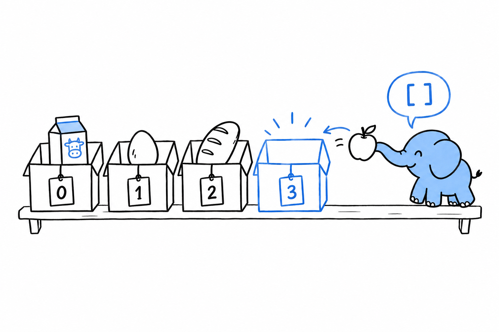
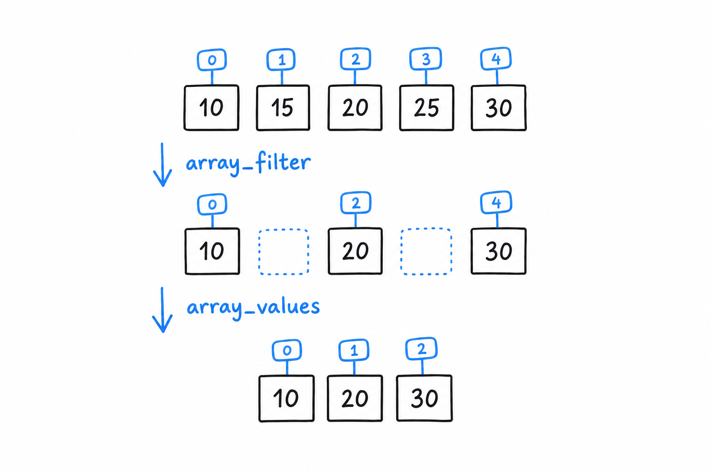

# Storing Lists of Values with Indexed Arrays

Three fruits, in a fixed order, each one reachable by its position. That is an indexed array, what most languages simply call an array or a list, and you build one with square brackets:

```php
<?php

declare(strict_types=1);

$fruits = ['apple', 'banana', 'cherry'];

echo $fruits[0] . "\n"; // apple
echo $fruits[2] . "\n"; // cherry
echo count($fruits) . "\n"; // 3
```

**Positions start at 0, not 1.** `$fruits[0]` is the first element and `$fruits[2]` the third and last.

`count()` gives you the number of elements, and you will call it constantly. It is an instant lookup, not a walk through the array, so never hesitate to put it in a loop condition.

## Appending

You rarely build an array fully formed. More often you start empty and grow it, and PHP's way of saying "add this to the end" is a pair of empty square brackets:

```php
<?php

declare(strict_types=1);

$shoppingList = [];

$shoppingList[] = 'milk';
$shoppingList[] = 'eggs';
$shoppingList[] = 'bread';

print_r($shoppingList);
// Array
// (
//     [0] => milk
//     [1] => eggs
//     [2] => bread
// )
```

`$shoppingList[] = 'milk'` looks like indexing into nothing. Read it as its own idiom: **"give this the next free position and put it there."** PHP keeps track of that next position; you never have to.



Try it: print `count($shoppingList)` after each line. 1, 2, 3.

## The mental model: arrays are ordered maps

Here is the fact that makes the rest of this chapter click into place. **There is no separate list type in PHP.** `['apple', 'banana', 'cherry']` is shorthand for `[0 => 'apple', 1 => 'banana', 2 => 'cherry']`: an indexed array is an array whose keys happen to be 0, 1, 2. Underneath, every PHP array is the same structure, a map from keys to values that remembers insertion order.

This explains behavior that otherwise looks like a quirk. Filter an indexed array, and the survivors keep their original keys:

```php
<?php

declare(strict_types=1);

$numbers = [10, 15, 20, 25, 30];

$even = array_filter($numbers, fn (int $n) => $n % 2 === 0);

print_r($even);
// Array
// (
//     [0] => 10
//     [2] => 20
//     [4] => 30
// )
```



Keys `1` and `3` are gone, not renumbered. `array_filter()` removed two entries from a map, and a map has no reason to stay contiguous. **If you need a clean `0, 1, 2` sequence afterwards, `array_values()` renumbers it:**

```php
<?php

$reindexed = array_values($even); // [10, 20, 30]
```

> An indexed array is a map whose keys happen to be 0, 1, 2. Remove an entry, and the others do not move.

## Functions you'll reach for constantly

A handful of functions cover most of what you do with lists day to day:

```php
<?php

declare(strict_types=1);

$scores = [88, 92, 74, 95, 60];

array_push($scores, 100);        // append (same as $scores[] = 100, but explicit)
$last = array_pop($scores);      // removes and returns the last element (100)

$passing = array_filter($scores, fn (int $s) => $s >= 60);
$grades = array_map(fn (int $s) => $s >= 90 ? 'A' : 'B', $passing);

sort($scores); // sorts in place, re-indexes from 0

$hasTopScore = in_array(95, $scores, strict: true);

echo implode(', ', $grades) . "\n";
```

`array_map()` transforms every element and returns an array of the same length. `array_filter()` keeps the elements that pass a test and, as you just saw, keeps their keys too. `sort()` is different: it changes the array in place and renumbers it from 0, which matters if you were relying on the old keys.

`in_array()` searches for a value. **Pass `strict: true`** so it compares with `===` instead of PHP's loose default, for the same reason `===` earned its own callout in [Data Types](ch03-02-data-types.md). Make it a habit.

`array_push()` and `$scores[] = ...` do the same job for a single value. `array_push()` can take several values at once, and "push" reads well when you think of the array as a stack. Pick whichever reads better at the call site.
