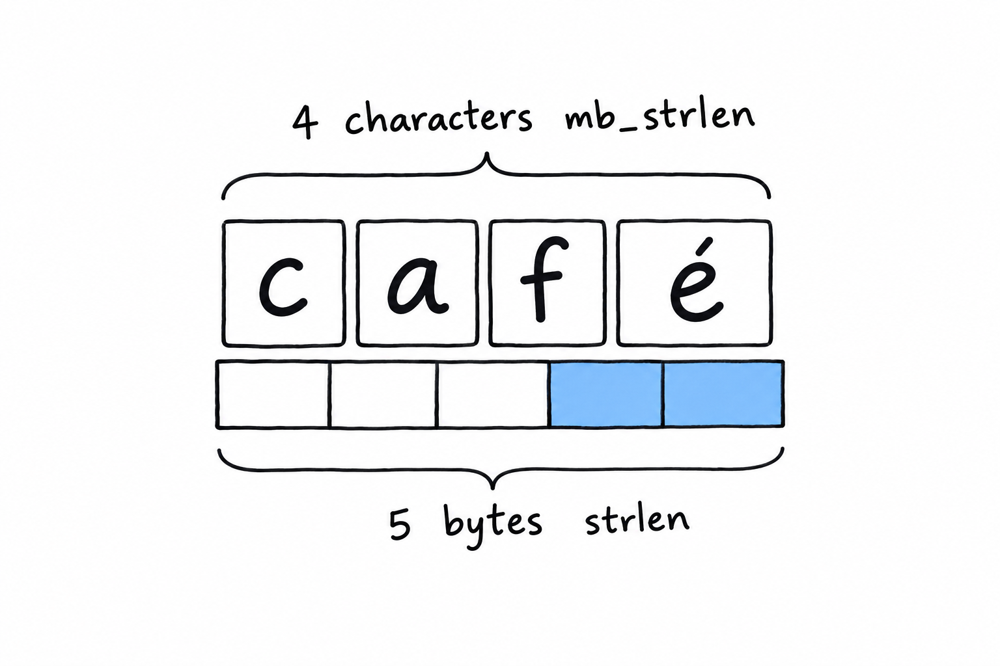
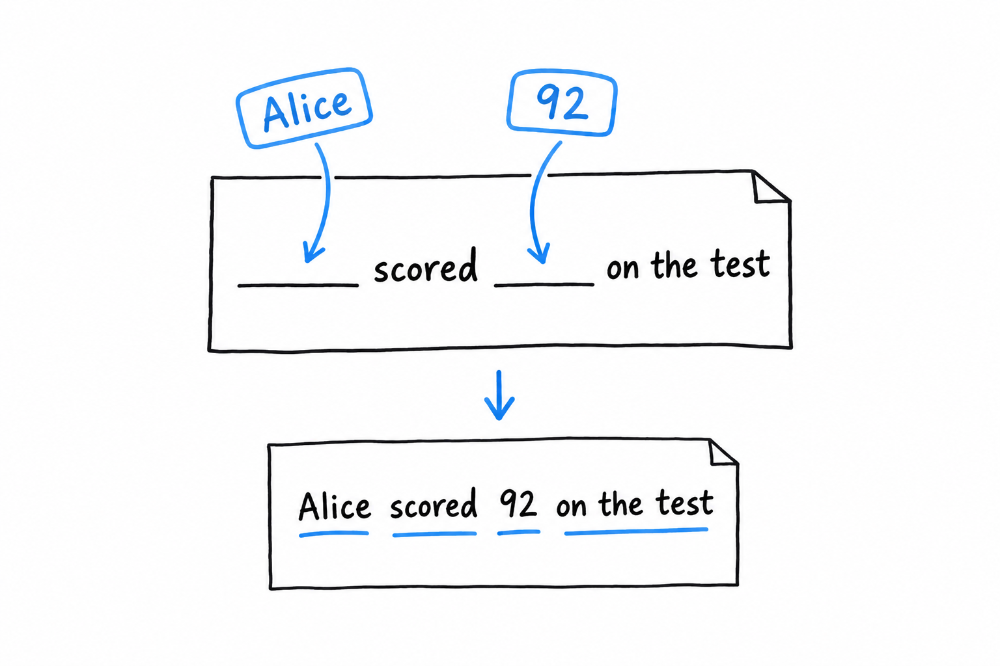

# Storing UTF-8 Encoded Text with Strings

Ask PHP how long the word `café` is, and it answers five.

You met strings in [Hello, World!](ch01-02-hello-world.md) and used interpolation in the [guessing game](ch02-00-guessing-game-tutorial.md) without much ceremony. What we skipped, reasonably, is the part that eventually bites everyone who works with PHP strings. **A PHP string is not made of characters. It is made of bytes.** Most of the time the difference is invisible, right up until it isn't.

## Quotes, briefly revisited

You will use both kinds constantly, so here is the rule once more. Single quotes are as literal as PHP gets: no interpolation, no escape sequences beyond `\'` and `\\`. Double quotes replace variables with their values and understand sequences like `\n` and `\t`:

```php
<?php

declare(strict_types=1);

$name = 'Damien';

echo 'Hello, $name\n';   // Hello, $name\n  (literal, no processing)
echo "Hello, $name\n";   // Hello, Damien  (interpolated, newline applied)
```

**Reach for single quotes when there is nothing to interpolate.** It is marginally faster, since PHP does not scan the text for `$` or `\`, but the real benefit is for the next reader: single quotes say "nothing clever happening here."

## Bytes versus characters

Here is the fact that matters. **PHP's classic string functions (`strlen()`, `strtoupper()`, `substr()` and their relatives) work on bytes, full stop.** That was a fine assumption in an ASCII world, where one byte is one character. It falls apart the moment your text isn't ASCII, and in UTF-8, which is what essentially all modern PHP produces, that moment comes fast:

```php
<?php

declare(strict_types=1);

$name = 'café';

echo strlen($name) . "\n";     // 5, not 4!
echo mb_strlen($name) . "\n";  // 4, correct
```



`café` has four characters, but UTF-8 stores the é in two bytes, so `strlen()`, which counts bytes, says five. It isn't wrong, exactly. It answers a question you didn't mean to ask. `mb_strlen()` (`mb` stands for multibyte) understands UTF-8 and counts characters, which is what you meant.

Try it: replace `café` with a single emoji. `strlen()` says four, `mb_strlen()` says one.

The practical rule fits in a sentence. **If a string could ever contain something a user typed (a name, a comment, a search term), use the `mb_` variant.** `strlen()` is still right for genuinely byte-oriented work: the size of a file's contents, or a string you built yourself out of known ASCII. When in doubt, `mb_strlen()` costs you nothing, and it saves you from a bug that only shows up for some of your users, usually the ones with accented names. That is the embarrassing kind.

> [!WARNING]
> `strlen()` counts bytes. `mb_strlen()` counts characters. For anything a human typed, you want characters.

## Everyday string functions

A handful of functions cover the bulk of real string work:

```php
<?php

declare(strict_types=1);

$message = 'PHP is not dead, it just smells funny.';

if (str_contains($message, 'not dead')) {
    echo "Reassuring.\n";
}

$corrected = str_replace('not dead', 'thriving', $message);
echo $corrected . "\n";

$excerpt = substr($message, 0, 12);
echo $excerpt . "...\n"; // PHP is not d...

$formatted = sprintf('%s scored %d%% on the test.', 'Alice', 92);
echo $formatted . "\n"; // Alice scored 92% on the test.
```

`str_contains()` (PHP 8.0 and later) asks whether one string appears inside another and returns a plain boolean. It replaced the old `strpos($haystack, $needle) !== false` idiom you will still meet in older code, with its special-case `false` waiting to trip you. `str_replace()` swaps every occurrence of a substring. `substr()` cuts out a portion by start position and length, and like `strlen()` it has an `mb_substr()` twin that counts characters, under the same rule as above.

**`sprintf()` builds a string from a template and a list of values.** Past one or two values, it reads far better than a chain of concatenations, and it gives you control that interpolation doesn't: `%d%%` above forces `92` to be treated as an integer, then prints a literal `%`. `printf()` is the same thing minus the "return a string" part: it prints directly.



## Interpolation, one more time

You know the basics from [Chapter 2](ch02-00-guessing-game-tutorial.md). The full form is worth having on hand. **`{$expr}` inside double quotes accepts more than a bare variable**: array access, property access, method calls, anything that resolves to a value:

```php
<?php

declare(strict_types=1);

$user = ['name' => 'Alice', 'age' => 30];

echo "{$user['name']} is {$user['age']} years old.\n";
```

Without the braces, `"$user['name']"` doesn't do what you'd expect: PHP would stop parsing the variable name at `$user` and print the rest literally. The braces remove the ambiguity, so make them your default the moment an interpolation is more than a single bare `$variable`.
