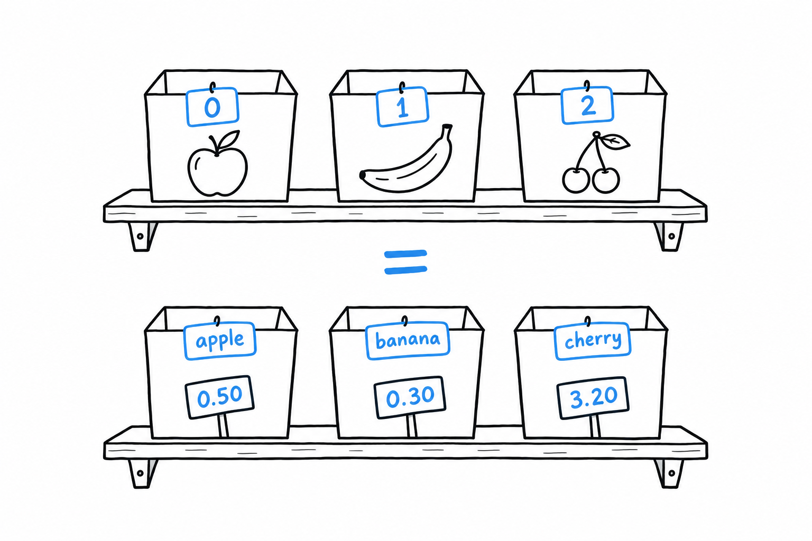
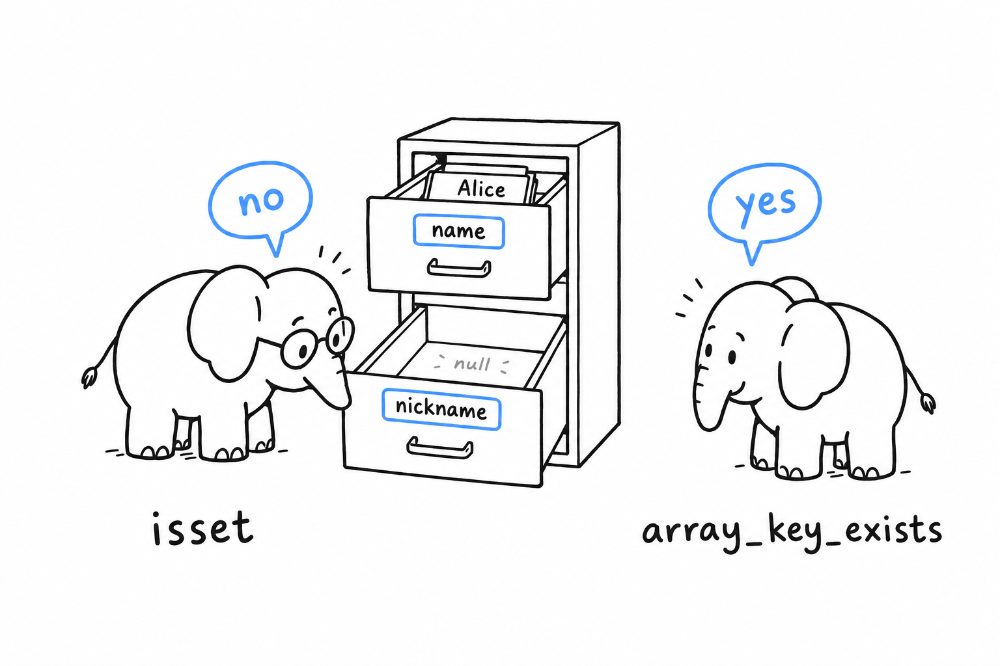
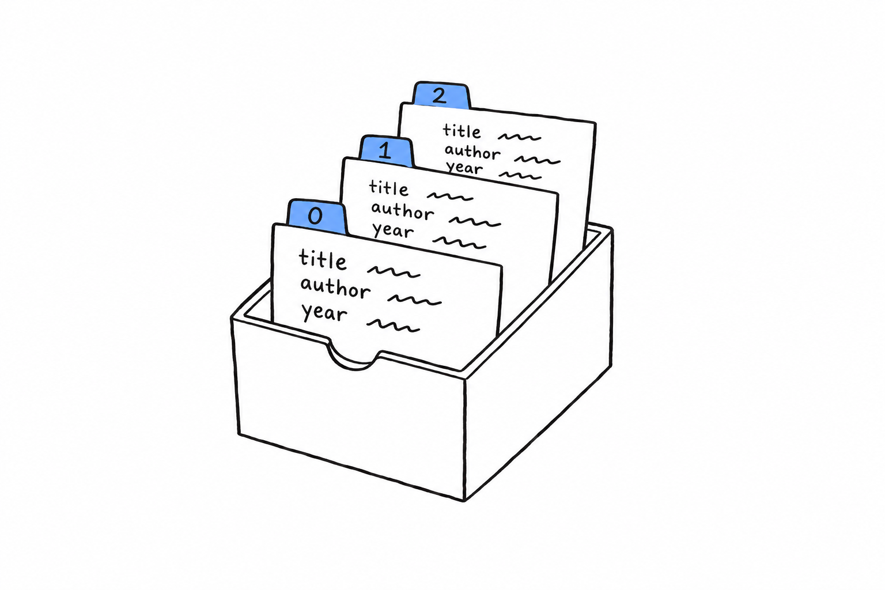

# Storing Keys with Associated Values in Associative Arrays

Take the row of boxes from the previous section and replace the numbered tags with words. That is an associative array, and that is the whole difference.

**An associative array is an array where you choose the keys yourself**, usually strings, instead of letting PHP hand out 0, 1, 2. Same structure, PHP's ordered map, different labels:

```php
<?php

declare(strict_types=1);

$prices = [
    'apple' => 0.50,
    'banana' => 0.30,
    'cherry' => 3.20,
];

echo $prices['banana'] . "\n"; // 0.3
$prices['date'] = 4.10; // add a new key
```



Keys can be strings or integers, and PHP happily mixes both in one array. They must be unique, though: assign to a key that already exists and you overwrite its value rather than adding a second entry.

## `isset()` versus `array_key_exists()`, and the gotcha between them

Both functions answer a version of "is this key there," and they are not interchangeable. The difference has caused real bugs, so understand it once rather than half-remembering it.

```php
<?php

declare(strict_types=1);

$user = [
    'name' => 'Alice',
    'nickname' => null,
];

var_dump(isset($user['name']));               // true
var_dump(isset($user['nickname']));           // false, surprising!
var_dump(array_key_exists('nickname', $user)); // true
```

Picture the array as a row of labeled drawers. **`isset()` opens the drawer and asks whether there is something inside.** The `nickname` drawer exists, but it holds `null`, and to `isset()` that is the same as no drawer at all. **`array_key_exists()` only reads the labels.** It doesn't care what is inside, only whether the drawer was ever put there.



This matters whenever `null` is a meaningful value rather than an absence: a user record where "no nickname" is deliberately stored as `null`, say. Reach for `isset()` in the common case (does this exist and hold something usable), and `array_key_exists()` when you need to tell "never set" from "set to `null`." Mixing them up costs you an hour the first time and never again. Trust me on this one.

## Iterating with `foreach`

You saw `foreach` in [Control Flow](ch03-05-control-flow.md), mostly on indexed arrays. On an associative array, the key-value form is where it earns its keep:

```php
<?php

declare(strict_types=1);

$prices = [
    'apple' => 0.50,
    'banana' => 0.30,
    'cherry' => 3.20,
];

foreach ($prices as $fruit => $price) {
    echo "{$fruit}: \${$price}\n";
}
// apple: $0.5
// banana: $0.3
// cherry: $3.2
```

**Iteration order is insertion order, always.** That is another direct consequence of arrays being ordered maps rather than truly unordered hash tables. You never have to sort an associative array just to get a predictable order; it already has one.

## Nesting: arrays of associative arrays

The shape you will meet constantly in real code is a list of records: an indexed array where each element is itself an associative array, standing in for one row of data:

```php
<?php

declare(strict_types=1);

$books = [
    ['title' => 'The Pragmatic Programmer', 'author' => 'Hunt & Thomas', 'year' => 1999],
    ['title' => 'Refactoring', 'author' => 'Martin Fowler', 'year' => 2018],
    ['title' => 'Clean Code', 'author' => 'Robert C. Martin', 'year' => 2008],
];

foreach ($books as $book) {
    echo "{$book['title']} ({$book['year']}): {$book['author']}\n";
}

$recent = array_filter($books, fn (array $book) => $book['year'] >= 2008);
$titles = array_map(fn (array $book) => $book['title'], $books);

echo implode(', ', $titles) . "\n";
```



Picture a box of index cards. Each card has the same three lines (title, author, year), and the box keeps them in order. **Indexed array outside, associative array inside**: this is exactly what comes back from a database query, from a JSON response decoded with `json_decode($json, true)`, or from a CSV file read row by row.

It looks almost too simple to name. Name it anyway. By the time you reach [Chapter 14](ch14-00-a-cli-project.md) and beyond, this pattern is how you will hold most real-world data before it becomes anything more structured, like the objects of [Chapter 5](ch05-00-classes.md).
