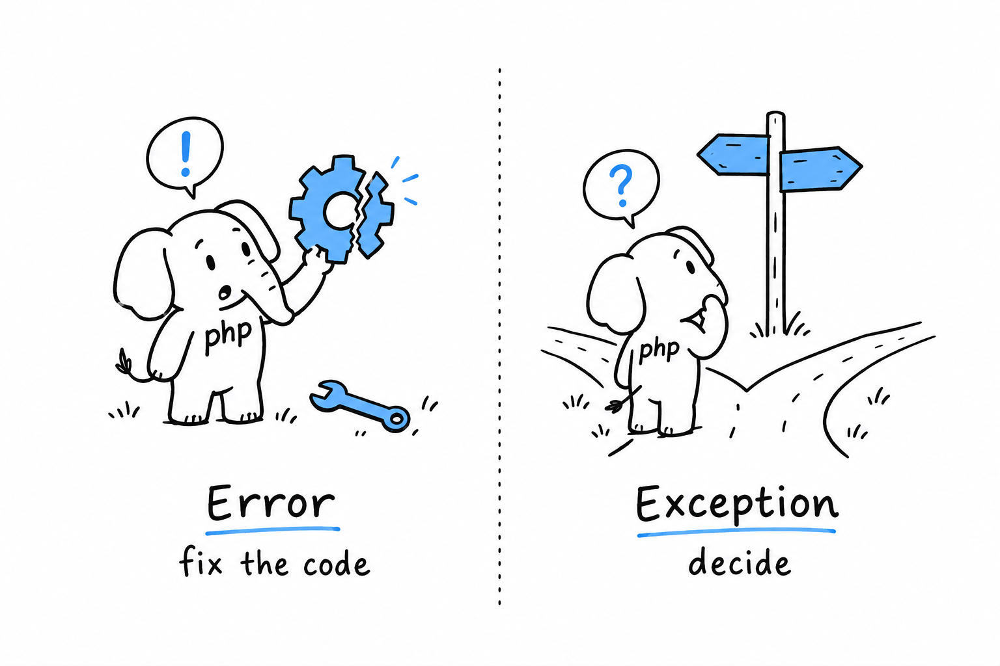

# Error Handling

A file is missing. A network call times out. Someone passes a string to a function that asked for a number, and somewhere a division finds a zero in its denominator. **No program avoids trouble; what sets languages apart is what happens the moment it strikes, and how much say you have in the answer.** PHP's answer has changed a lot over the years, and the modern one is a good deal better than its reputation.

Older PHP, and there is plenty of it still running, failed quietly. A warning went to a log nobody read, a function returned `false` and left you guessing why, and the script limped on with half-built data because nothing had stopped it. PHP 7 and 8 changed that. Most failures now produce a real object you can catch and inspect, and the language draws a sharp line between two kinds of trouble.

On one side, **something is broken**: a method called on `null`, a type that does not match, a division by zero. PHP raises an `Error`, and the only sensible response is to fix the code. On the other side, **something needs a decision**: a config file that is not there, an age that came in negative, an API that refused the request. PHP, or your own code, raises an exception, and someone higher up the call stack gets to decide what happens next.

> An `Error` says "this is broken, fix it". An exception says "here is a problem, decide".

That line runs through the whole chapter. [Fatal errors and `Error`](ch09-01-fatal-errors.md) covers the first kind, and why you should mostly leave it alone. [Exceptions](ch09-02-exceptions.md) covers the second: `try`, `catch`, `finally`, throwing your own, and the built-in hierarchy where most of your day-to-day error handling lives. [To Throw or Not to Throw](ch09-03-to-throw-or-not-to-throw.md) is about judgment: when to throw, when to return `null` and let the caller decide, and when the right answer is to let the program stop.

None of this stays theoretical. The command line tool of [Chapter 14](ch14-00-a-cli-project.md) leans on every pattern here, including a custom exception you will write here and meet again there. The syntax takes an afternoon. The instinct for where "handle it" ends and "let it fail" begins takes longer, and this chapter is where it starts.
