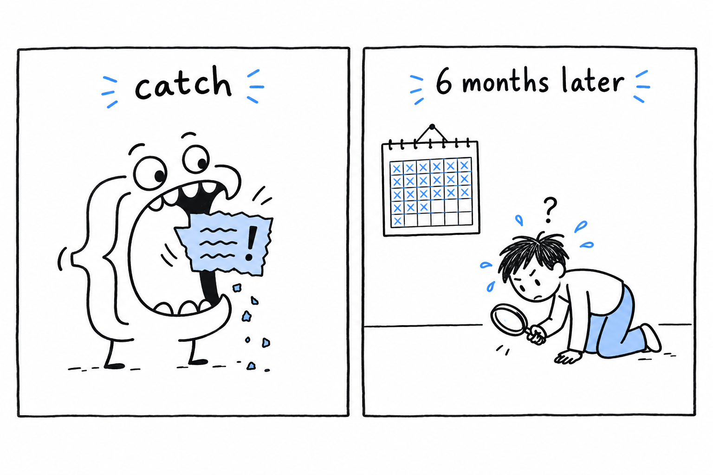

# Unrecoverable Errors: Fatal Errors and `Error`

Some problems have nothing to do with bad luck. No file went missing, no user typed nonsense: your code is wrong. You called a method that does not exist. You passed a string to a function that demanded an integer, with strict types on. You divided by zero. **There is nothing sensible a program can do about a bug except stop and let you fix it.**

PHP represents this family with the `Error` class and its subclasses. Three you will meet constantly:

```php
<?php

declare(strict_types=1);

function half(int $n): int
{
    return $n / 0; // DivisionByZeroError
}

function double(int $n): int
{
    return $n * 2;
}

double("four"); // TypeError: strict_types is on, no silent conversion

$user = null;
$user->getName(); // Error: Call to a member function getName() on null
```

`DivisionByZeroError`, `TypeError` and the plain `Error` you get from calling a method on `null` all do the same job: they tell you, as precisely as they can, that the program reached a state it had no business being in. Run the file. It stops at `double("four")`, the first wrong thing it actually executes. Comment that line out, run again, and the call on `null` takes its turn; call `half(3)` and the division does. This is exactly what `declare(strict_types=1)`, which you met in [Data Types](ch03-02-data-types.md), is for: making a wrong call fail loudly, on the spot, instead of letting it slide.

## Why this used to be worse

Code written before PHP 7 is full of `null` checks and `is_int()` guards scattered through function bodies, and there was a reason for them. Back then, most of these situations threw nothing you could catch. Calling a method on `null` was a fatal error that halted the script, full stop; no `try` in the world could step in. A type mismatch might silently convert the value, or print a warning to a log nobody watched, and carry on with garbage.

PHP 7 introduced `Error` to fix this, and PHP 8 sharpened it further. **Nearly everything in this family is now a real object implementing `Throwable`, the same interface `Exception` implements.** So you *can* write `catch (Error $e)` and keep the program running. You very often should not.

## Catchable doesn't mean "should catch"

The question is not whether PHP can hand you the problem as an object. Since PHP 8, it almost always can. The question is whether catching it fixes anything. Compare:

```php
<?php

declare(strict_types=1);

// Reasonable: the input is genuinely unpredictable, and there's a sensible fallback.
try {
    $config = json_decode($configJson, associative: true, flags: JSON_THROW_ON_ERROR);
} catch (\JsonException $e) {
    $config = [];
}

// Unreasonable: papering over a bug instead of fixing it.
try {
    $total = $order->getTotal(); // $order might be null due to a bug upstream
} catch (\Error $e) {
    $total = 0; // now every bug in this code path just... returns zero, silently
}
```

The first `try` handles a situation that really can happen: JSON from the outside world is sometimes malformed, and falling back to an empty config is a defensible choice. The second `try` catches the symptom of a bug and hides it behind a plausible number. Six months later, someone is wondering why totals are occasionally zero, with no exception, no log line, no clue, because the `catch` block ate the only evidence.



> [!WARNING]
> A broad `catch (\Error $e)` is not a safety net. It is a shredder for the stack trace you will need later.

**Catch `Error` and its subclasses only with a good reason and a narrow, specific type.** If your own code produces a `TypeError`, the fix is to correct the call, not to wrap it in `try`. [To Throw or Not to Throw](ch09-03-to-throw-or-not-to-throw.md) draws this line more precisely. For now, read `Error` as PHP telling you something is broken, and exceptions, next, as PHP telling you something needs a decision.
