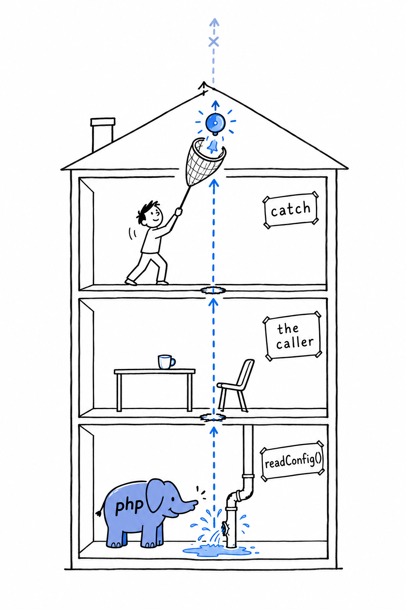
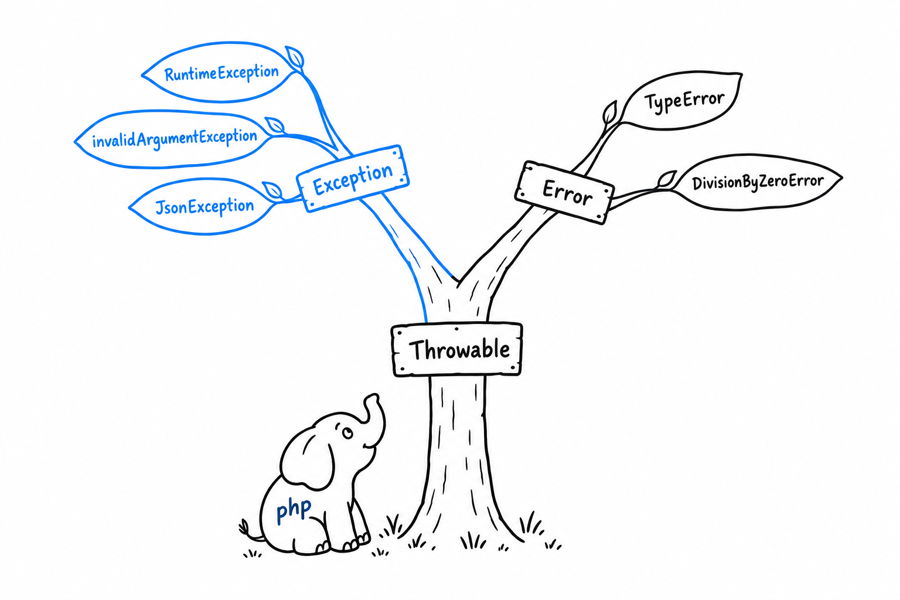

# Recoverable Errors with Exceptions

The previous section was about bugs. This one is about trouble your code should expect: a file that might not exist, an age that might be negative, an API that might refuse the request. None of it means the program is broken. It means a decision is needed, and the function that spots the problem is rarely the one equipped to make it. **An exception is how a function says "here is a problem, and here is what I know about it" to whoever, higher up the call stack, can deal with it.**

## `try`, `catch`, `finally`

The shape is the same as in most languages that have exceptions:

```php
<?php

declare(strict_types=1);

function readConfig(string $path): array
{
    if (!file_exists($path)) {
        throw new \RuntimeException("Config file not found: {$path}");
    }

    return json_decode(file_get_contents($path), associative: true);
}

try {
    $config = readConfig('config.json');
    echo "Loaded " . count($config) . " settings.\n";
} catch (\RuntimeException $e) {
    echo "Couldn't load config: {$e->getMessage()}\n";
    $config = [];
} finally {
    echo "Config load attempt finished.\n";
}
```

Run it with no `config.json` next to the file. `readConfig()` reaches the `throw`, and normal execution stops right there: nothing after the `throw` runs, and neither does the `echo "Loaded..."` line back in the caller. **Control jumps to the nearest enclosing `catch` whose type matches, skipping everything in between, however many function calls deep that turns out to be.**



Think of a leak on the ground floor of a building. Nobody there can fix it, so the alarm climbs, floor by floor, and every floor it crosses drops what it was doing, until someone with a net catches it. If nobody does, the alarm reaches the roof, and PHP stops the program, printing the message and the path the exception took.

`finally` runs whatever happened: exception caught, exception not caught, or no exception at all. That makes it the place for cleanup that must happen no matter what, like closing a file or releasing a lock.

> [!TIP]
> Try it: create a `config.json` containing `{"debug": true}` and run again. The `catch` block is skipped this time, and `finally` still prints its line.

## `Exception` versus `Error`, and `Throwable`

PHP's exception hierarchy has two parallel branches growing from the same interface, `Throwable`.



`Exception` and its subclasses (`InvalidArgumentException`, `RuntimeException`, `JsonException`) are for conditions a well-written program can anticipate and recover from. `Error` and its subclasses (`TypeError`, `DivisionByZeroError`) are the bugs of the previous section.

The split is what lets a `catch` be precise. **`catch (\Exception $e)` catches exceptions and lets an `Error` fly past; `catch (\Throwable $e)` catches both.** Reach for `\Throwable` only at the very edge of an application, in a top-level handler that logs whatever nobody else handled before the process exits. Never use it as a routine catch type in ordinary code: catching it casually is how bugs turn into "handled" cases that never get fixed.

## Catching several types at once

A single `catch` can list several types separated by `|`, when you want to handle them the same way:

```php
<?php

declare(strict_types=1);

try {
    $result = $client->send($request);
} catch (ConnectionException|TimeoutException $e) {
    echo "Network problem, retrying: {$e->getMessage()}\n";
    $result = retry($request);
}
```

If the handling differs between the two, write two `catch` blocks. The `|` is for when the response really is identical, not a shortcut to avoid a second block.

## Writing your own exception

`RuntimeException` and `InvalidArgumentException` cover a lot of ground, but naming your own exceptions is one of the most common things you will do in real PHP. **A specific exception type tells the caller exactly what went wrong, and lets them catch that and nothing else**, instead of guessing from a message string:

```php
<?php

declare(strict_types=1);

class InvalidAgeException extends \Exception
{
    public function __construct(
        public readonly int $age,
    ) {
        parent::__construct("Invalid age: {$age}. Must be between 0 and 150.");
    }
}

function registerUser(string $name, int $age): void
{
    if ($age < 0 || $age > 150) {
        throw new InvalidAgeException($age);
    }

    echo "Registered {$name}, age {$age}.\n";
}

try {
    registerUser('Alice', -5);
} catch (InvalidAgeException $e) {
    echo "Registration failed: {$e->getMessage()}\n";
    echo "Offending value was: {$e->age}\n";
}
```

Extending `\Exception` brings the whole standard machinery for free: `getMessage()`, `getCode()`, `getPrevious()`, and a stack trace through `getTraceAsString()`. The call to `parent::__construct()` is what wires your message into that machinery; skip it and `getMessage()` comes back empty. Beyond that, the class is yours. `InvalidAgeException` keeps the offending `$age` in a readonly property, so the `catch` block gets structured data to work with, not just a string to parse.

This small pattern, a specific exception carrying the context that caused it, comes back in [Chapter 14](ch14-00-a-cli-project.md). It is worth being comfortable with it now, because the harder question is not how to throw. It is when.
