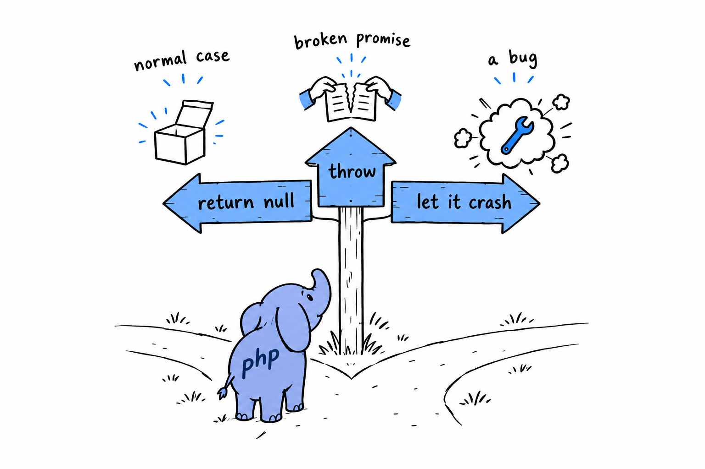

# To Throw or Not to Throw

The syntax of `try` and `catch` is the easy part. The hard part, the one that separates readable code from a maze of defensive checks, is deciding when a function should throw, when it should return `null` or `false` or an empty array, and when it is fine to let the whole thing come crashing down. No compiler will decide for you. It is judgment, the kind you build from having been burned both ways. Here is how I have come to think about it.

## Not found is not exceptional

The most common mistake I see is throwing for something that is not exceptional at all, just a normal outcome the caller needs to handle. Looking up a user by an ID that does not exist is not a crisis. It happens all day, as routinely as any other branch in your code:

```php
<?php

declare(strict_types=1);

function findUserById(array $users, int $id): ?array
{
    foreach ($users as $user) {
        if ($user['id'] === $id) {
            return $user;
        }
    }

    return null; // not found, a completely normal outcome, not an error
}

$user = findUserById($users, 42);

if ($user === null) {
    echo "No such user.\n";
} else {
    echo "Found: {$user['name']}\n";
}
```

**Returning `null` tells the caller exactly what to expect, and lets them decide what "not found" means where they stand**: show a 404, create a default, ask again. The `?array` return type puts the possibility in the signature, where everyone can see it. Throwing a `UserNotFoundException` instead would force every caller into a `try` for something that happens constantly and is not wrong in any sense.

> Save exceptions for things that are actually exceptions.

## Throw when the caller has a precondition to meet

The flip side: throw when something the caller was supposed to guarantee before calling, a precondition, did not hold, and no reasonable default exists. That is the `InvalidAgeException` of the previous section. A negative age is not a normal outcome to branch on, it is a broken promise. The function cannot guess what you meant, so it says so, loudly and specifically:

```php
<?php

declare(strict_types=1);

function withdraw(float $balance, float $amount): float
{
    if ($amount > $balance) {
        throw new \RuntimeException(
            "Cannot withdraw {$amount}: balance is only {$balance}."
        );
    }

    return $balance - $amount;
}
```

Silently clamping the withdrawal to the balance, or quietly returning `0`, would hide a bug (or worse, a real financial error) behind a plausible-looking number, exactly the failure of the `catch (\Error $e)` example two sections back. Throwing forces whoever calls `withdraw()` to face the situation instead of letting it slip past.

## Let it crash when it's a bug, not a case

Sometimes the right answer is neither `null` nor a `catch`. It is letting the program stop. If your own code calls a function with the wrong type, or reaches a `match` arm that should be impossible, that is not a situation to design around. It is a bug to fix, and pretending otherwise only buries the evidence:

```php
<?php

declare(strict_types=1);

enum Status
{
    case Draft;
    case Published;
    case Archived;
}

function statusLabel(Status $status): string
{
    return match ($status) {
        Status::Draft => 'Draft',
        Status::Published => 'Published',
        Status::Archived => 'Archived',
    };
}
```

**A `match` with no `default` arm throws `UnhandledMatchError` when nothing fits**, and `UnhandledMatchError` is an `Error`, not an `Exception`. With an `enum`, every case is covered today, so the only way this can fire is that someone adds a fourth `Status` later and forgets this function. Try it: add `case Deleted;` to the enum and call `statusLabel(Status::Deleted)`. That is exactly the failure you want loud and immediate, at the line of the bug, not swallowed three files away. Do not wrap it in a `try` "just in case". Let it fail, let the stack trace point at the missing arm, and go fix `statusLabel()`.

## A rough decision order

When you are not sure which of the three to reach for, ask the questions in this order.



1. **Is "not found" or "empty" a normal, expected outcome here?** Return `null`, `false` or an empty array, and give the function a return type that shows the possibility (`?array`, not `array`).
2. **Did the caller break a precondition, with no sensible default to fall back to?** Throw a specific exception: a built-in one if it fits (`InvalidArgumentException`, `RuntimeException`), a small custom class if the caller needs structured context back, as with `InvalidAgeException`.
3. **Is this impossible unless the code itself is wrong?** Do not defend against it at all. Let PHP's `Error` machinery do its job, or use `assert()` during development. A loud failure at the site of the bug is far cheaper than a quiet one three layers of `catch` away.

None of this applies mechanically. Plenty of real code sits in the gray zone between "expected" and "precondition violated", and reasonable developers land in different places. But asking the question out loud, function by function, beats defaulting to whichever of `throw` and `return null` you happened to type first. You will make this exact call in nearly every function you write from here on, starting with several in the command line tool of [Chapter 14](ch14-00-a-cli-project.md).
