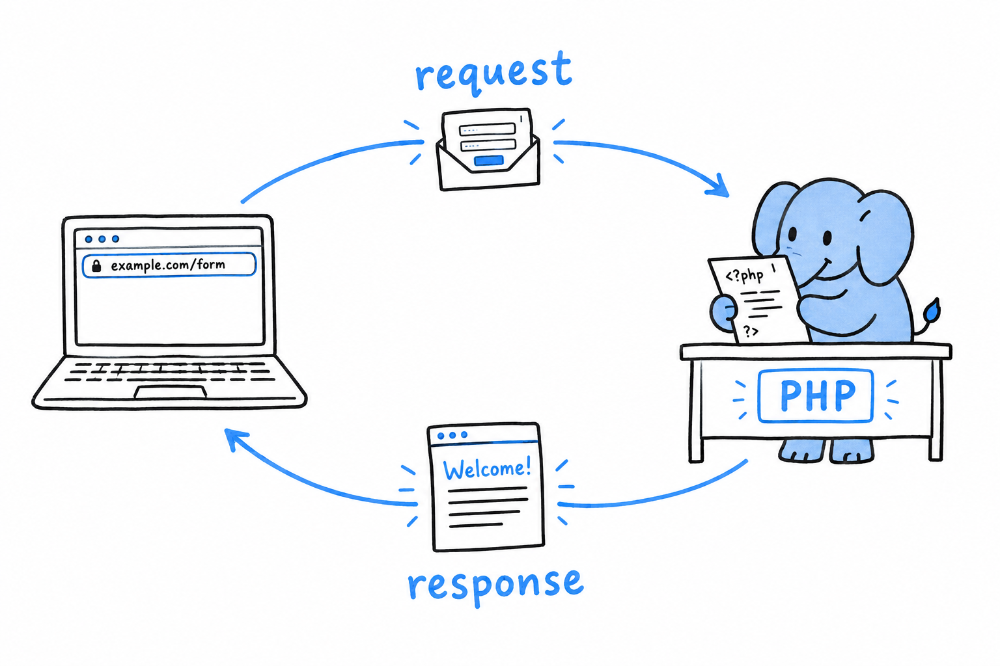

# Web Development Basics

Open a browser, type an address, press Enter. Somewhere, a PHP script wakes up, reads what your browser asked for, builds a page, and sends it back. Every program in this book so far ran in a terminal, where you typed something and the answer appeared on the next line. **On the web, the thing you type is an HTTP request, and the answer is an HTML page.** The language is the same. Only the way in and the way out change.

This chapter builds a guestbook: a page with a form for a name and a message, a script that reads what was submitted, checks it, stores it, and lists everything anyone has written so far. Three sections, three layers. First, getting the submitted data into your script at all, through the arrays PHP fills in for you before your code runs. Then, making sure what you send back cannot be used by one visitor to attack another. Last, keeping messages around between requests, in a real database, instead of losing them the moment the response is sent.

None of it will look impressive, and that is deliberate. No JavaScript framework, no CSS framework, no build step: one HTML `<form>`, a few lines of inline styling, PHP doing the rest, served by `php -S`, the built-in development server the book's final project uses as well. **The lesson is what PHP does with a request, not how to configure a bundler.**

Everything here comes back in the final project: reading `$_SERVER`, escaping output before it reaches HTML, storing data safely. It is the ordinary substance of PHP on the web, and it deserves to be seen on its own, in the smallest form that could possibly matter, before a router and a class hierarchy grow around it.
