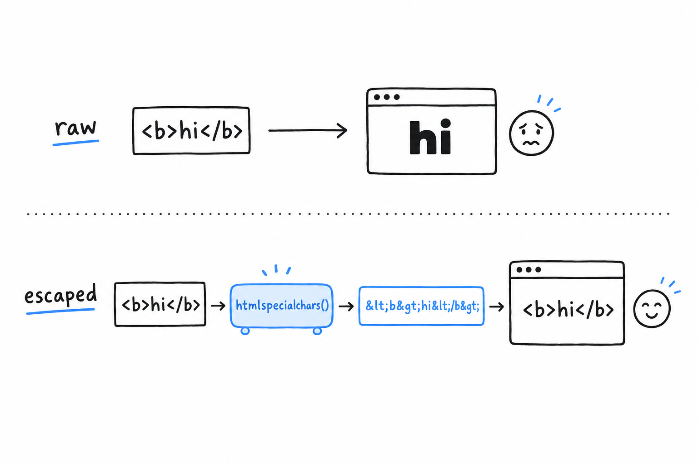

# Validating Input and Preventing Cross-Site Scripting

Submit `<script>alert('hello from your own guestbook')</script>` as a message. The browser runs it. A guestbook that prints `$_POST` values straight into HTML lets any visitor put any markup on the page, and markup includes scripts. **That is cross-site scripting, XSS for short: an attacker gets their own JavaScript to run in your page, in your visitors' browsers, with your site's trust behind it.** A guestbook that stores messages and shows them to everyone is the textbook place for it, which makes it the right place to learn to stop it.

## Escaping output

The fix is not to ban angle brackets. It is to make sure any user-supplied text that ends up inside HTML is *escaped* first, so the browser shows it as text instead of reading it as markup. PHP's tool for this is `htmlspecialchars()`. It converts the few characters an HTML parser cares about (`<`, `>`, `&`, and quotes) into their entity equivalents (`&lt;`, `&gt;`, `&amp;`, and so on), which the browser displays as the original characters without acting on them:

```php
<?php if ($submitted) { ?>
    <p>Thanks, <?= htmlspecialchars($name) ?>. You wrote: <?= htmlspecialchars($message) ?></p>
<?php } ?>
```

hi</b> printed raw is rendered by the browser as bold text, while the same text passed through htmlspecialchars() becomes &lt;b&gt;hi&lt;/b&gt; and is displayed as the literal characters" width="600">

Submit the `<script>` message again. The page now shows the literal text `<script>alert('hello from your own guestbook')</script>`, and nothing runs. Since PHP 8.1, `htmlspecialchars()` escapes quotes as well as angle brackets by default, which is what you want almost every time.

The rule is short. **Any value that came from outside your script, printed anywhere inside HTML, goes through `htmlspecialchars()` first.** No exception for values that are "probably" safe: a name field looks harmless right up until someone tests it with a `<script>` tag.

> Escape on the way out. Every value, every time.

## Validating before you trust the data at all

Escaping protects the output. Validation is a separate question: is this input even acceptable? A name of two thousand characters, or a message made of nothing but spaces, is not dangerous, just wrong, and the script should say so before doing anything with it. Expand the form handling to check for problems and collect them:

```php
<?php

$name = '';
$message = '';
$submitted = false;
$errors = [];

if ($_SERVER['REQUEST_METHOD'] === 'POST') {
    $name = trim($_POST['name'] ?? '');
    $message = trim($_POST['message'] ?? '');
    $submitted = true;

    if ($name === '') {
        $errors[] = 'Name cannot be empty.';
    } elseif (mb_strlen($name) > 60) {
        $errors[] = 'Name is too long.';
    }

    if ($message === '') {
        $errors[] = 'Message cannot be empty.';
    } elseif (mb_strlen($message) > 500) {
        $errors[] = 'Message is too long.';
    }
}
?>
```

`trim()` strips whitespace from both ends, so a message made only of spaces does not slip past the empty check. `mb_strlen()` rather than `strlen()` counts characters instead of bytes, which matters the moment a name contains anything outside plain ASCII, the same UTF-8 concern [Chapter 8](ch08-02-strings.md) covered for strings in general. And errors accumulate in an array instead of stopping at the first one, so a visitor sees every problem at once rather than discovering them one submission at a time.


Show the errors, and put the submitted values back into the form (escaped, as always), so nobody retypes a long message because their name was too short:

```php
<?php if ($errors) { ?>
    <ul>
        <?php foreach ($errors as $error) { ?>
            <li><?= htmlspecialchars($error) ?></li>
        <?php } ?>
    </ul>
<?php } elseif ($submitted) { ?>
    <p>Thanks, <?= htmlspecialchars($name) ?>. You wrote: <?= htmlspecialchars($message) ?></p>
<?php } ?>

<form method="post">
    <p><label>Name: <input type="text" name="name" value="<?= htmlspecialchars($name) ?>"></label></p>
    <p><label>Message: <textarea name="message"><?= htmlspecialchars($message) ?></textarea></label></p>
    <p><button type="submit">Sign the guestbook</button></p>
</form>
```

Look at `value="<?= htmlspecialchars($name) ?>"` inside the `<input>` tag. **Escaping matters inside an HTML attribute just as much as in the page body**: an unescaped `"` in the value would let a visitor close the attribute early and write their own.

## A related risk worth naming

XSS is a visitor's browser running an attacker's script inside your page. Its cousin is **CSRF**, cross-site request forgery: another site tricks a visitor's browser into submitting a form to *your* site on their behalf, using whatever session they are already logged into. The usual defence, a hidden token generated per form and checked on submission, is more than this small guestbook needs. Keep the name in mind for the day you build something where a forged submission would actually cost something.

The guestbook now behaves for a single request: it validates what comes in and escapes what goes out. What it still cannot do is remember. Reload the page and every message is gone, because nothing was ever stored. That is next.
