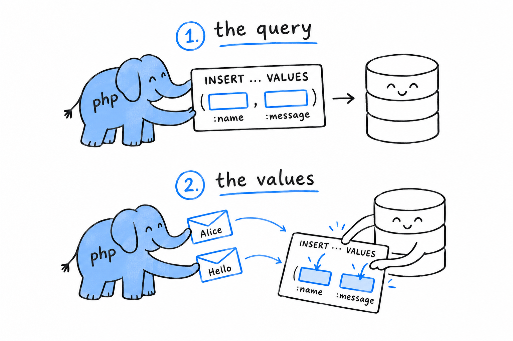

# Talking to a Database with PDO

Sign the guestbook, reload the page, and your message is gone. That is not a bug. PHP, in its classic and still most common form, gives every request a fresh start: it runs the script from the top and throws everything away once the response is sent, variables included. Nothing survives from one request to the next unless it was deliberately saved somewhere, and so far, nothing was. **For a message to outlive the request that submitted it, it has to live somewhere PHP can read it back later: a database.** ([Chapter 18](ch18-01-request-model.md) covers this shared-nothing request model properly, including why it means PHP rarely needs threads.)


## PDO and SQLite

PHP talks to databases through several extensions. **PDO, the PHP Data Objects extension, is the one to reach for first**: it gives you one interface for many database engines, so the same code works whether the data sits in MySQL, PostgreSQL, or, as here, SQLite. SQLite stores a whole database in one ordinary file. No server process to install, nothing to configure, which keeps the technology around this chapter as plain as the PHP inside it.

Open a connection near the top of `guestbook.php`:

```php
<?php

$pdo = new PDO('sqlite:' . __DIR__ . '/guestbook.db');
$pdo->setAttribute(PDO::ATTR_ERRMODE, PDO::ERRMODE_EXCEPTION);

$pdo->exec('
    CREATE TABLE IF NOT EXISTS entries (
        id INTEGER PRIMARY KEY AUTOINCREMENT,
        name TEXT NOT NULL,
        message TEXT NOT NULL,
        created_at TEXT NOT NULL
    )
');
```

The string `'sqlite:' . __DIR__ . '/guestbook.db'` is a DSN, a data source name: which driver to use, and where the database lives. The file is created the first time this runs, if it does not exist yet. `CREATE TABLE IF NOT EXISTS` is safe to leave in the script and run on every single request, since it does nothing once the table is there.

The second line deserves a habit. **Set `PDO::ATTR_ERRMODE` to `PDO::ERRMODE_EXCEPTION` every time you open a connection.** Without it, PDO can fail an operation silently and hand you back `false`, exactly the kind of quiet failure [Chapter 9](ch09-00-error-handling.md) warned against. With it, a bad query throws a `PDOException`, catchable like any other.

## The wrong way to build a query

Before writing the insert, look at the version to avoid:

```php
// Don't do this.
$pdo->exec("INSERT INTO entries (name, message, created_at) VALUES ('$name', '$message', '" . date('c') . "')");
```

Read the query the way the database will. If `$message` contains a single quote followed by SQL of the attacker's choosing, that quote closes the string early and the rest becomes part of what actually runs. **That is SQL injection**, the same family of bug as the XSS from the previous section, aimed at your database instead of a visitor's browser. Building a query by gluing untrusted text into a string is never safe, however carefully the string looks assembled.

## Prepared statements

PDO's answer is the **prepared statement**. The query goes to the database first, with placeholders where the values will go, and the values travel separately afterwards. **The database never reads a value as part of the query's syntax**, so there is no string to break out of, and injection is closed off entirely:



```php
if ($submitted && !$errors) {
    $statement = $pdo->prepare(
        'INSERT INTO entries (name, message, created_at) VALUES (:name, :message, :created_at)'
    );
    $statement->execute([
        'name' => $name,
        'message' => $message,
        'created_at' => date('c'),
    ]);
}
```

`:name`, `:message`, and `:created_at` are named placeholders. `prepare()` sends the shape of the query once; `execute()` runs it with one set of values, given as an associative array with one key per placeholder. PDO handles the quoting for whatever database sits underneath, which is exactly the part that is easy to get wrong by hand.

> The query is the sentence. The values are filled in afterwards, and can never change the sentence.

## Listing what's been said so far

Reading the entries back uses the same `prepare()` and `execute()` shape, or, for a query with no values to insert, the simpler `query()`:

```php
$entries = $pdo->query('SELECT name, message, created_at FROM entries ORDER BY id DESC')
    ->fetchAll(PDO::FETCH_ASSOC);
```

`fetchAll(PDO::FETCH_ASSOC)` returns every row as an associative array keyed by column name, all of them in one plain array: the same shape of data [Chapter 8](ch08-03-associative-arrays.md) showed you how to work with. Loop over it in the HTML, escaping each value exactly as before:

```php
<h2>Previous entries</h2>
<ul>
    <?php foreach ($entries as $entry) { ?>
        <li>
            <strong><?= htmlspecialchars($entry['name']) ?></strong>:
            <?= htmlspecialchars($entry['message']) ?>
            <em>(<?= htmlspecialchars($entry['created_at']) ?>)</em>
        </li>
    <?php } ?>
</ul>
```

Escaping still applies, for the same reason as before. These values came from a visitor, by way of the database, and the database neither knows nor cares whether they are safe to print as HTML. **Storing a value safely and displaying it safely are two separate jobs**, and skipping either one reopens the hole the previous section closed.

## What you've built

Reload the guestbook, sign it a few times, then stop `php -S` and start it again. The entries are still there. They never lived in memory; they live in `guestbook.db`, on disk, independent of any one request. That is the whole shape of a real, if tiny, web application: accept input through superglobals, validate it, escape it on the way out, store it through prepared statements. The book's final project builds something larger on the same foundation, with more routes, controller classes and a proper view layer, and nothing about the underlying ideas changes. You have already done the part that matters.
