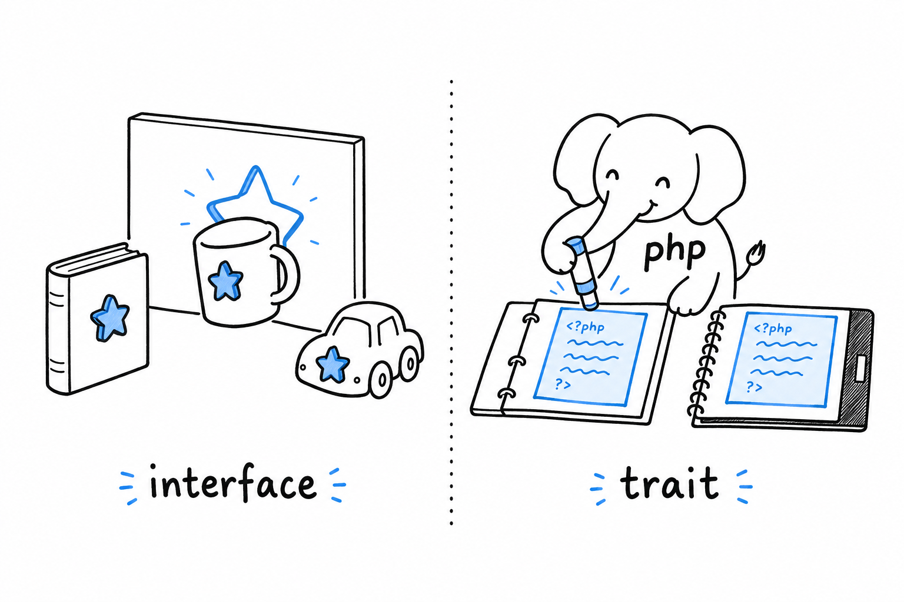

# Interfaces, Traits, and Generic-Style Code

One class is easy. The trouble starts with the second.

Two classes that have nothing to do with each other still need to agree on things. Your invoice line and your shipping fee both have to print a summary. Your payment processor and your report generator both want to write a line in a log. **How do unrelated classes agree to work together, and how do you share a method between them without retyping it five times?** PHP answers with two tools, and they solve opposite halves of the question.

An interface is a contract. It says "any class claiming this name promises to have these methods", and nothing at all about how those methods are written. A trait is the reverse: a real chunk of implementation, copied into whichever classes ask for it, with no promise about what those classes are or how they relate. **One is a shape you agree to fit. The other is a piece of code you borrow.** Beginners mix them up, and so do plenty of experienced developers arriving from other languages, which is why the difference gets stated this bluntly, this early.

There is a third subject in this chapter, and it calls for some honesty. PHP has no generics. You cannot write `Collection<Product>` and have the language refuse to let a `Banana` in. What PHP has instead is a well-worn convention, docblocks read by a static analysis tool, that buys you most of the same safety. The check is done by a separate program you run before you ship, not by PHP itself.

Interfaces come first, because you will reach for them far more often than for the other two.
