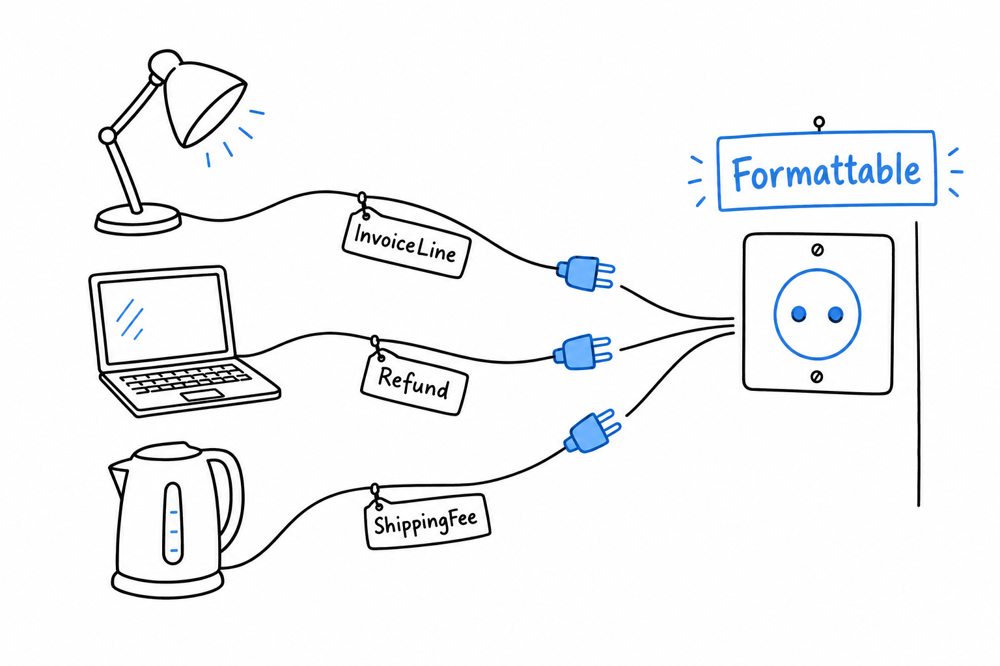

# Defining Shared Behavior with Interfaces

Suppose you need to print a human-readable summary of an object: an invoice line, a product, a log entry, whatever it happens to be that week. You could give every class a `describe()` method and hope everyone remembers the name. Or you could make it a rule that PHP itself checks. **That is what an interface is for.**

```php
<?php

interface Formattable
{
    public function format(): string;
}
```

An interface looks like a class with all the bodies removed. `format(): string` is a *signature*, not an implementation: no braces, no logic, just a promise. **Any class that says it implements `Formattable` must have a public `format()` method returning a string**, and PHP holds it to that promise. Leave the method out, or return the wrong type, and the code will not run.

## Implementing it

A class opts in with `implements`:

```php
<?php

readonly class Product
{
    public function __construct(
        public string $name,
        public float $price,
    ) {
    }
}

readonly class InvoiceLine implements Formattable
{
    public function __construct(
        private Product $product,
        private int $quantity,
    ) {
    }

    public function format(): string
    {
        $total = $this->product->price * $this->quantity;
        return sprintf('%dx %s, $%.2f', $this->quantity, $this->product->name, $total);
    }
}
```

`InvoiceLine implements Formattable` is a claim PHP verifies for you. If `format()` were missing, or declared to return an `int`, you would get a fatal error the moment PHP loaded the class, not three calls deep in production. Try it: rename `format()` to `describe()` and run the file.

A class can implement more than one interface, separated by commas. That is one of the ways PHP makes up for classes having a single parent.

## Why bother: programming against the interface

Here is the part that pays for itself. Write a function that type-hints the interface, not the concrete class:

```php
<?php

function printSummary(Formattable $item): void
{
    echo $item->format() . "\n";
}

printSummary(new InvoiceLine(new Product('Keyboard', 49.90), 2));
```

`printSummary()` does not know it received an `InvoiceLine`, and does not care. It knows it received *something* that can `format()`. Add a `Refund` class tomorrow, or a `Discount`, or a `ShippingFee`, implement `Formattable` on it, and `printSummary()` needs no change at all. **It already works, because it was never written against a specific class in the first place.**



A wall socket does not care whether you plug in a lamp or a laptop, only that the plug has the right shape. `Formattable` is the shape, and `printSummary()` is the socket.

Tests raise the stakes. Had `printSummary()` type-hinted `InvoiceLine` directly, testing it on its own would mean building a real `InvoiceLine` with a real `Product` behind it. With `Formattable`, a test can hand it any object that honors the contract, including a deliberately fake one built for the occasion, with no `Product` in sight. [Chapter 12](ch12-00-testing.md) puts that to direct use.

> Type-hint the contract, not the class. The function then works with every class that signs it, including the ones you have not written yet.

## `instanceof`

Occasionally you need to ask, at runtime, whether an object satisfies an interface:

```php
<?php

if ($item instanceof Formattable) {
    echo $item->format() . "\n";
}
```

Reach for this rarely. A pile of `instanceof` checks before a method call usually means the method belongs on an interface you should be type-hinting against, not that you need more `instanceof`.

## A note on naming

PHP has no special syntax to mark an interface as "just" a contract rather than something more structural. `Formattable`, `Countable`, `Stringable`, `ArrayAccess` are all ordinary interfaces, some built into the language, some yours. Convention favors an adjective ending in *-able* for a single-capability contract (`Formattable`, `Comparable`, `Sortable`). PHP does not require it, but the next reader will thank you. Several of PHP's own built-in interfaces show up in [Chapter 20](ch20-00-advanced-features.md).
