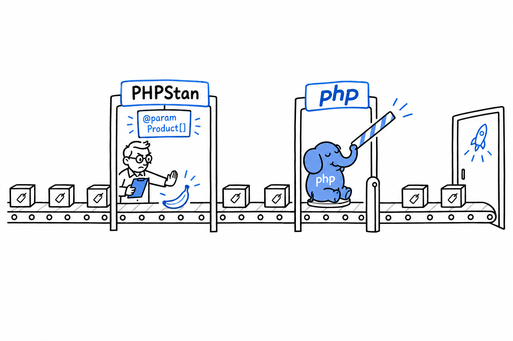

# Generic-Style Code with Docblocks and Static Analysis

PHP does not have generics. Plenty of documentation dances around that sentence, so here it is plainly. In a language that has them (Java's `List<String>`, TypeScript's `Array<Product>`), the compiler refuses to let the wrong type into a typed container. **PHP's type system stops at the array boundary.** You can type-hint a parameter as `array`, but "an array of what" is not a question the language will ever answer at runtime.

```php
<?php

function totalPrice(array $products): float
{
    $total = 0.0;
    foreach ($products as $product) {
        $total += $product->price;
    }
    return $total;
}
```

Nothing stops you from calling `totalPrice([1, 2, 3])` or `totalPrice(['not', 'products'])`. PHP runs the loop happily and blows up on `$product->price` the moment it meets something without a `price` property. At runtime, in production if you are unlucky, instead of the moment you wrote the bug. Try it: add `totalPrice([1, 2, 3]);` at the bottom of the file and read what PHP says.

## The workaround: docblocks that static analysis tools understand

The PHP ecosystem's answer is not a language feature. It is a convention. **You write what the array contains in a docblock comment, and a separate tool, run before you ship, checks that promise against how the code is actually used.**

```php
<?php

/**
 * @param Product[] $products
 */
function totalPrice(array $products): float
{
    $total = 0.0;
    foreach ($products as $product) {
        $total += $product->price;
    }
    return $total;
}
```

`@param Product[] $products` means nothing to the PHP interpreter. It is a comment, and `php totalPrice.php` runs identically with or without it. It means a great deal to [PHPStan](https://phpstan.org/) or [Psalm](https://psalm.dev/), the two dominant static analysis tools in the PHP world. Run one of them on this file and it traces every call site. If another function passes an array containing an `int`, or a `Refund` where a `Product` was promised, the analyzer flags it. Same category of error a generics-aware compiler would catch, caught by a separate program instead of the language.



Two checkpoints stand on the road to production. The analyzer reads your docblock and stops anything that does not match; `php` itself waves everything through without looking. Only the first checkpoint ever refuses a banana, and it only exists if you set it up.

> A docblock is a promise. PHP ignores it. The analyzer holds you to it.

## `@template`: closer to real generics

For genuinely generic structures, say a collection class that could hold any single type consistently, both tools understand a richer annotation, modeled on how generics read in other languages:

```php
<?php

/**
 * @template T
 */
final class TypedCollection
{
    /** @var T[] */
    private array $items = [];

    /**
     * @param T $item
     */
    public function add(mixed $item): void
    {
        $this->items[] = $item;
    }

    /**
     * @return T[]
     */
    public function all(): array
    {
        return $this->items;
    }
}
```

Used with a matching `@var` annotation at the call site:

```php
<?php

/** @var TypedCollection<Product> $products */
$products = new TypedCollection();
$products->add(new Product('Keyboard', 49.90));
```

PHPStan tracks `T` as `Product` for the rest of that variable's life, and complains the moment you `add()` anything else. Look at the real signature: `mixed`. That is what PHP sees and permits at runtime, anything at all. **The `@template T` annotation is the layer above, understood only by the analyzer, that narrows `mixed` down to one specific type for as long as static analysis is watching.**

## Where this leaves you

Nothing to apologize for. This is how PHP's type system works today, and the ecosystem has settled comfortably around it. Real projects run PHPStan or Psalm as a required step in CI, often at a strict level, and treat a docblock mismatch like a compiler error: it fails the build. The runtime stays permissive by design, a habit as old as the language, but nothing forces you to *ship* code that only the runtime has checked. Annotate every `array` parameter whose contents matter, install one of the two tools, and you get most of what a generics-checking language gives you, one step earlier instead of inside `php` itself.
