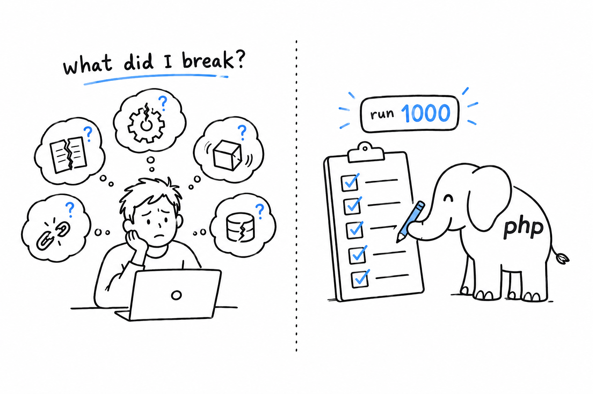

# Writing Automated Tests

So far, you have checked every program in this book the same way: run it, look at the output, nod. That works for a guessing game. It stops working the day your project has thirty functions and you change one line, because the question is no longer "does this line work?" but "what else did I just break?", and that answer does not fit in anyone's head.

**An automated test is a check you write once and the computer runs for you, every time, without getting tired and without forgetting.** You describe what a piece of code should do, and PHP tells you whether it still does it. A thousand runs later, it is as attentive as on the first.

Think of the smoke detector in your kitchen. You do not sniff the air every minute; you install something that does, and it only speaks up when there is a problem. Tests play that role for your code. Silence means everything still works.

PHP has one clear default for the job: [PHPUnit](https://phpunit.de/). It has been the standard for close to two decades, nearly every library and framework in the PHP world uses it internally, and it is a Composer package, installed the way you learned in [Chapter 7](ch07-01-hello-composer.md).

A first test takes ten lines, and you will write yours in a few minutes. Choosing which tests to run, and keeping order once they multiply, takes a little more thought, and that is what the rest of the chapter is for. By the end, testing will not be a step bolted onto finished code; it will be part of how you write it. That is the habit [Chapter 14](ch14-00-a-cli-project.md) leans on when it builds a small project test-first.

> A test is a question you ask your code once. The computer keeps asking it for you.
