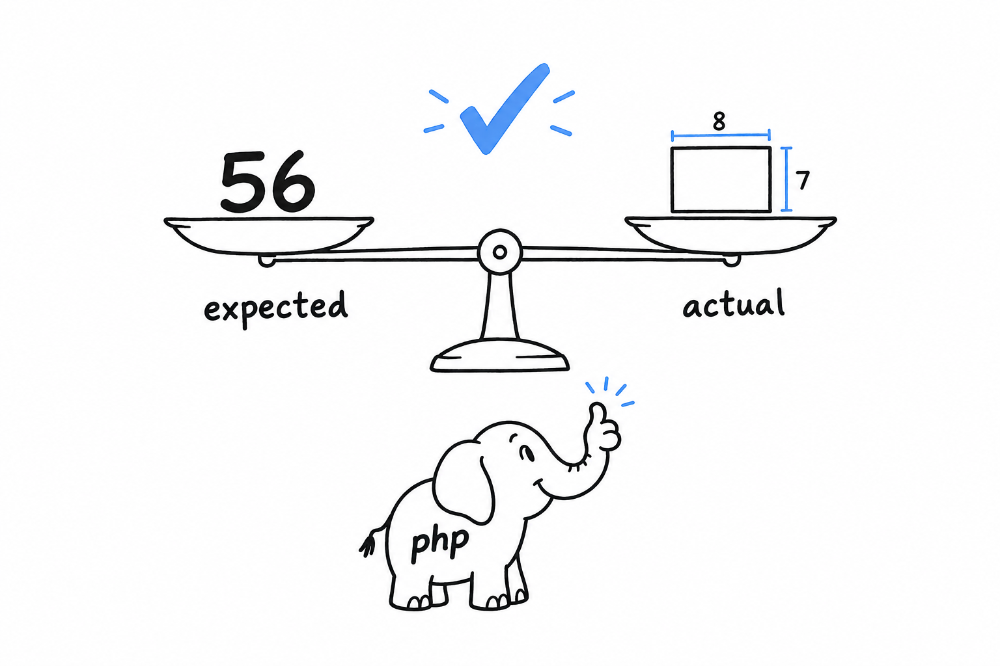
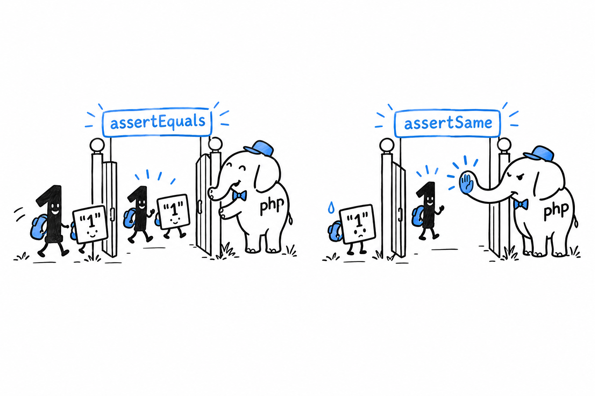

# How to Write Tests with PHPUnit

Start a fresh project, as in [Chapter 7](ch07-01-hello-composer.md):

```console
$ composer init --no-interaction
$ composer require --dev phpunit/phpunit
```

The `--dev` flag matters. **PHPUnit is a tool you use while building the project, not something the project needs to run.** Composer keeps development-only dependencies apart for that reason: they never ship.

## The code under test

Here is a small class worth testing, the kind you have been writing since [Chapter 5](ch05-00-classes.md):

```php
<?php
// src/Rectangle.php

declare(strict_types=1);

final class Rectangle
{
    public function __construct(
        private readonly float $width,
        private readonly float $height,
    ) {
    }

    public function area(): float
    {
        return $this->width * $this->height;
    }

    public function isSquare(): bool
    {
        return $this->width === $this->height;
    }
}
```

Nothing new: a readonly class, two properties, two methods. The question a test answers is simple. Does it actually do what it claims?

## Your first test

**A test is a class that extends PHPUnit's `TestCase`, with methods whose names start with `test`.** Each method sets up a situation, then makes a claim about the result:

```php
<?php
// tests/RectangleTest.php

declare(strict_types=1);

use PHPUnit\Framework\TestCase;

final class RectangleTest extends TestCase
{
    public function testAreaOfARectangle(): void
    {
        $rectangle = new Rectangle(8.0, 7.0);

        $this->assertEquals(56.0, $rectangle->area());
    }
}
```

Read the method as a sentence: build a rectangle 8 by 7, then claim its area is 56. **`assertEquals(expected, actual)` is the claim.** If the two values differ, the test fails and PHPUnit shows you both sides. Run it:

```console
$ vendor/bin/phpunit tests
PHPUnit 10.5.0 by Sebastian Bergmann and contributors.

.                                                                   1 / 1 (100%)

Time: 00:00.012, Memory: 6.00 MB

OK (1 test, 1 assertion)
```

One dot per passing test. That is the whole feedback loop for the rest of this chapter: change the code, run the tests, count the dots.

Try it: change `56.0` to `57.0` and run again. The dot becomes an `F`, and PHPUnit tells you which claim broke, with the value it expected and the value it got.



> A test is a claim about your code. PHPUnit checks whether the claim still holds.

## `#[Test]` as an alternative to the `test` prefix

PHP 8 attributes ([Chapter 20](ch20-00-advanced-features.md) covers them properly) give PHPUnit a second way to mark a method as a test, with no naming constraint:

```php
<?php

use PHPUnit\Framework\Attributes\Test;
use PHPUnit\Framework\TestCase;

final class RectangleTest extends TestCase
{
    #[Test]
    public function itCalculatesArea(): void
    {
        $rectangle = new Rectangle(8.0, 7.0);

        $this->assertEquals(56.0, $rectangle->area());
    }
}
```

Either style is fine; pick one per project and stick to it. This book keeps the `test` prefix: no `use` statement, and the intent is clear from the name alone.

## More assertions: `assertTrue`, and `assertEquals` vs. `assertSame`

```php
<?php

final class RectangleTest extends TestCase
{
    public function testASquareIsDetected(): void
    {
        $square = new Rectangle(5.0, 5.0);

        $this->assertTrue($square->isSquare());
    }

    public function testEqualsVsSame(): void
    {
        $this->assertEquals(1, "1");   // passes, loose comparison, like ==
        $this->assertSame(1, "1");     // fails, strict comparison, like ===
    }
}
```

`assertTrue()` does what it says. The second method is the interesting one, because one of its two lines fails.

**`assertEquals()` compares like `==`, and `assertSame()` compares like `===`.** This is the exact distinction from [Chapter 3](ch03-02-data-types.md), wearing an assertion-shaped hat. For `assertEquals()`, `1` and `"1"` are equal enough. `assertSame()` refuses: it checks the type and the value together.



Default to `assertSame()`. It catches a whole family of bugs, a function returning a string where you expected an integer, that `assertEquals()` lets through without a word. Reach for `assertEquals()` only when the loose comparison is really what you mean to test.

A failing assertion tells you exactly what went wrong:

```console
$ vendor/bin/phpunit tests
1) RectangleTest::testEqualsVsSame
Failed asserting that 1 is identical to '1'.
```

That message does real work: "not identical" rather than "unequal" points straight at the type mismatch. Read failure messages closely; PHPUnit is more specific than it looks.
