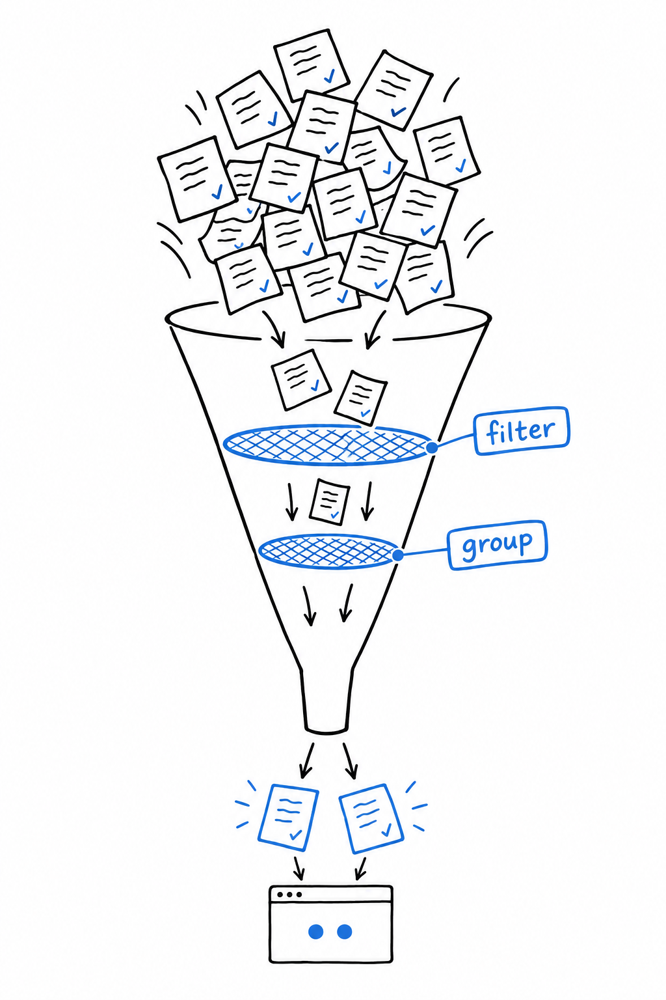

# Controlling How Tests Are Run

`vendor/bin/phpunit tests` runs everything, every time. With five tests, fine. With five hundred, waiting for the whole suite each time you save a file gets old, and most of the output is noise about code you did not touch. **PHPUnit lets you run a slice of the suite, and a config file makes the whole thing repeatable.**

## Filtering by name

**`--filter` runs only the tests whose name matches a pattern:**

```console
$ vendor/bin/phpunit --filter testAreaOfARectangle tests
```

The pattern is a regular expression matched against the method name, so `--filter Area` catches `testAreaOfARectangle` and anything else with "Area" in it. That is the mode you want while heads-down on one feature: run the two or three tests that matter, and leave the rest for later.



## Grouping tests

For a coarser cut than one test at a time, tag tests with a group, using either the older docblock annotation or the modern attribute:

```php
<?php

use PHPUnit\Framework\Attributes\Group;
use PHPUnit\Framework\TestCase;

final class RectangleTest extends TestCase
{
    #[Group('geometry')]
    public function testAreaOfARectangle(): void
    {
        $rectangle = new Rectangle(8.0, 7.0);

        $this->assertSame(56.0, $rectangle->area());
    }
}
```

Then run just that group:

```console
$ vendor/bin/phpunit --group geometry tests
```

The everyday use is speed. **Mark slow tests (database, filesystem, network) with `#[Group('slow')]` and keep them out of your inner loop with `--exclude-group slow`.** The full run waits for CI, where a few extra seconds cost nobody anything.

## `phpunit.xml`

Typing `tests` and remembering your favorite flags on every run gets old too. A `phpunit.xml` file at the project root fixes that, and PHPUnit reads it without being asked:

```xml
<?xml version="1.0" encoding="UTF-8"?>
<phpunit bootstrap="vendor/autoload.php"
         colors="true">
    <testsuites>
        <testsuite name="default">
            <directory>tests</directory>
        </testsuite>
    </testsuites>
</phpunit>
```

Two things live in it. **`bootstrap` names the file PHPUnit loads before anything else**, almost always Composer's autoloader, so your tests can mention `Rectangle` without a manual `require`. **`testsuites` defines what "the suite" even means**: here, everything under `tests/`. With the file in place, the command shrinks to its shortest form:

```console
$ vendor/bin/phpunit
```

`--filter` and `--group` still layer on top whenever you want a narrower run. If you would rather answer a few questions than write XML by hand, `vendor/bin/phpunit --generate-configuration` produces a starting version. Either way, commit the file. It is project configuration, not a personal preference: everyone on the team, and the CI pipeline, should run the same suite the same way.

> The suite is defined once, in `phpunit.xml`. The flags narrow it down for the moment.
