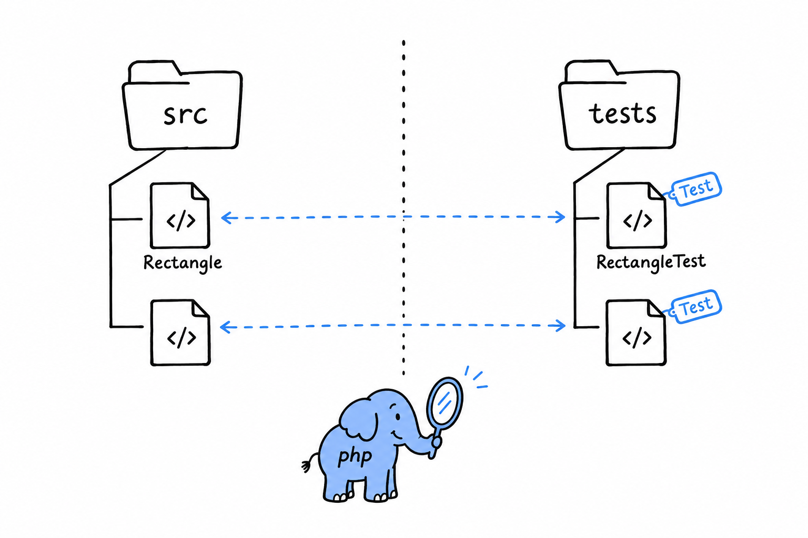

# Test Organization

Where tests live changes nothing for PHPUnit and everything for the person looking for them, including you in six months. **PHP's convention fits in one sentence: a `tests/` directory that mirrors `src/`, one test class per class, named after the class plus `Test`.**

```text
src/
    Rectangle.php
    GrepOptions.php
tests/
    RectangleTest.php
    GrepOptionsTest.php
```



`src/Rectangle.php` gets `tests/RectangleTest.php`. `src/Http/Client.php` would get `tests/Http/ClientTest.php`, with the folders lined up on both sides. Nothing enforces this: PHPUnit runs whatever `phpunit.xml` points at, named however you like. But nearly every PHP project follows the convention, and breaking it without a good reason only makes your code harder for the next person to find their way around. Composer's PSR-4 autoloading, from [Chapter 7](ch07-00-namespaces-and-composer.md), usually maps a `Tests\` namespace onto `tests/` the same way it maps your application namespace onto `src/`.

## Unit tests vs. integration tests

**A unit test exercises one class or function alone, with nothing outside it involved**: no database, no filesystem, no network. `RectangleTest` is one. It builds a `Rectangle` and checks its methods, nothing more. Unit tests are fast. Thousands of them run in a few seconds, which is exactly what lets you run the whole suite constantly without it slowing you down.

**An integration test checks that several pieces work together**: your code talking to a real database, a real file on disk, a real HTTP call to another service. It catches a family of bugs a unit test structurally cannot see, when two pieces are each correct on their own and wrong about each other. The price is speed, often by orders of magnitude, and a tendency to fail for reasons that have nothing to do with your code: a slow disk, a network blip.


```php
<?php

use PHPUnit\Framework\TestCase;

final class FindMatchingLinesIntegrationTest extends TestCase
{
    public function testFindsLinesInARealFile(): void
    {
        $path = tempnam(sys_get_temp_dir(), 'lines');
        file_put_contents($path, "apple\nbanana\ncherry\n");

        $lines = findMatchingLines($path, 'banana');

        $this->assertSame(['banana'], $lines);

        unlink($path);
    }
}
```

Nothing exotic here. It is still a `TestCase`, still full of assertions. What makes it an integration test is that it touches the real filesystem, creating an actual temporary file and cleaning it up, instead of faking one. The difference is in what the test touches, not in its syntax.

## A practical split

Most projects keep both kinds in the same `tests/` tree and separate them by directory (`tests/Unit/` and `tests/Integration/`) or by group (the `#[Group('integration')]` attribute from the previous section). The fast unit suite then runs constantly while you work, and the slower integration suite waits for a commit or for CI. Neither replaces the other. Unit tests tell you a piece works on its own; integration tests tell you the pieces still work once they talk to each other, which is the only way your program ever runs.
