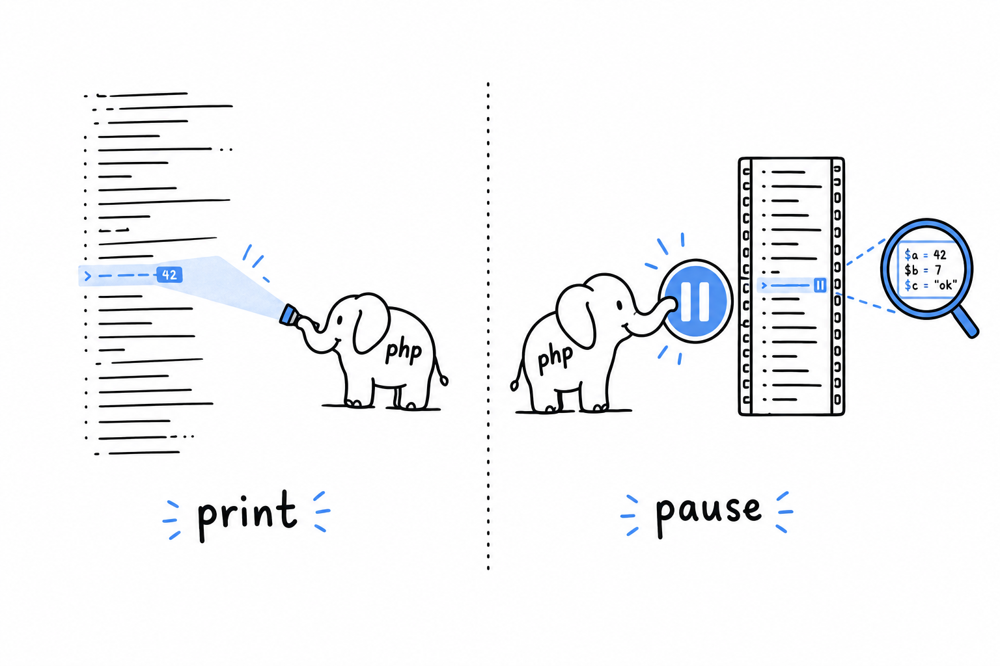

# Debugging PHP

Sooner or later, one of your programs will run without a single error and still give the wrong answer. No exception, no warning, just a total that is off by one or a page that greets the wrong person. Reading the code again rarely helps, because the code says exactly what you meant. **Debugging is finding out what the program actually does, as opposed to what you meant it to do.** It is a skill in its own right, worth learning on purpose.

Every program in this book so far was small enough to read from top to bottom and spot the bug by eye. The guessing game and the guestbook are already past that point.

There are two ways to look inside a running program, and you will want both.

The first is **print debugging**, the oldest trick in the book. You put something in the middle of your code that shows you a value, rerun the program, and read the output. It is a flashlight: you see the one spot you point it at. It needs nothing but PHP itself, and `var_dump()` and `print_r()` are the tools for it.

The second is **step debugging**. You pause the program at an exact line, look at every variable as it stood at that instant, and move forward one line at a time. A pause button rather than a flashlight: no more guessing where to look. It takes a tool, **Xdebug**, and a few minutes of setup, which pay for themselves the first time a bug gives you no obvious value to print.

Neither replaces the error handling from [Chapter 9](ch09-00-error-handling.md). A well-placed exception tells you *that* something went wrong. Debugging is how you find out *why*, especially when nothing threw at all and the program just quietly produced the wrong answer. The command line tool of [Chapter 14](ch14-00-a-cli-project.md) is exactly the kind of multi-file program where both tools earn their keep.
