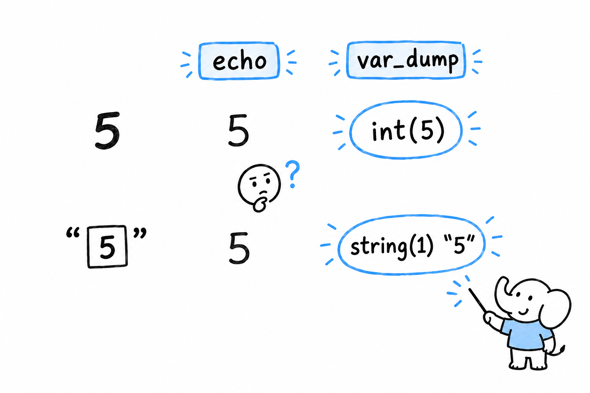

# Print Debugging with `var_dump()` and `print_r()`

`echo $count` prints `5`. Is `$count` the number five, or the text `"5"`? `echo` will never tell you, and that difference is often the entire bug.

You met `var_dump()` briefly in [Chapter 3](ch03-02-data-types.md): it shows a value's type along with the value itself. `var_dump($count)` prints `int(5)` or `string(1) "5"`, and now you know. **That is what turns it from an inspection tool into a debugging tool: a bug is very often a value with the wrong *type*, not the wrong contents.**



## `var_dump()` on structured data

`var_dump()` is not limited to a single value. Hand it an array or an object and it walks through the whole thing, showing you its shape:

```php
<?php

$user = [
    'name' => 'Alice',
    'age' => '32',
    'active' => true,
    'roles' => ['admin', 'editor'],
];

var_dump($user);
```

```console
array(4) {
  ["name"]=>
  string(5) "Alice"
  ["age"]=>
  string(2) "32"
  ["active"]=>
  bool(true)
  ["roles"]=>
  array(2) {
    [0]=>
    string(5) "admin"
    [1]=>
    string(6) "editor"
  }
}
```

Look at `"age"`: it came back as `string(2) "32"`, not `int(32)`. If this array came from a form (the kind of data [Chapter 10](ch10-01-forms-and-superglobals.md) reads out of `$_POST`), that is expected, because everything in `$_POST` arrives as text. Code further down that assumes `$user['age']` is already an integer is a bug waiting to happen. **`var_dump()` catches in seconds what a quiet wrong answer three functions later would take an hour to trace back.**

Try it: change `'32'` to `32` in the array and run the script again. The `"age"` line becomes `int(32)`.

`var_dump($name, $age, $roles)` dumps all three in turn, shorter than three separate calls.

## `print_r()`: easier to read, less precise

`print_r()` shows the same structure without the types, in a format that is much easier to scan when the array is large:

```php
<?php

print_r($user);
```

```console
Array
(
    [name] => Alice
    [age] => 32
    [active] => 1
    [roles] => Array
        (
            [0] => admin
            [1] => editor
        )

)
```

Notice what got lost. `true` became `1`, and nothing says whether `32` is a number or text. That is the trade: **reach for `print_r()` to see the shape of something quickly, and for `var_dump()` the moment a value's exact type is in question**, which it usually is once you are hunting a bug.

`print_r()` has one more trick. Pass `true` as a second argument and it *returns* the formatted text instead of printing it, which lets you send a snapshot to a log rather than to the screen:

```php
<?php

$snapshot = print_r($user, true);
error_log("user state: {$snapshot}");
```

A third function, `var_export()`, sits between the two. It shows about what `print_r()` shows, but formats it as valid PHP source: `var_export($user)` prints something you could paste straight back into a script as an array literal. Handy for capturing a real value as a test fixture.

## The limits of printing things

All three functions share the same weakness. **You have to suspect *where* the problem is before you know where to put the call**, and every time you want to look somewhere new, you edit the file and rerun the program. Point the flashlight, look, move it, look again.

For a script the size of anything in this book so far, that works. It stops working once a bug depends on the exact sequence of several function calls, or only shows up on the fifth turn of a loop, or lives inside a library you would rather not edit. At that point printing things stops being surgical and becomes trial and error. Xdebug is the tool for that moment: it lets you pause a running script and look around, instead of guessing in advance where to point the light.
