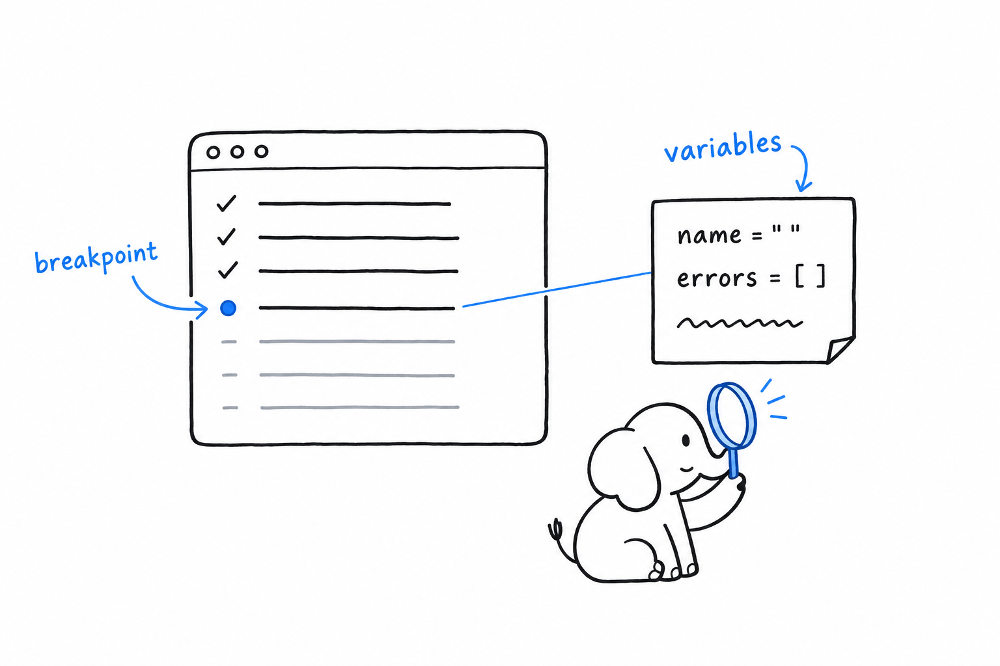
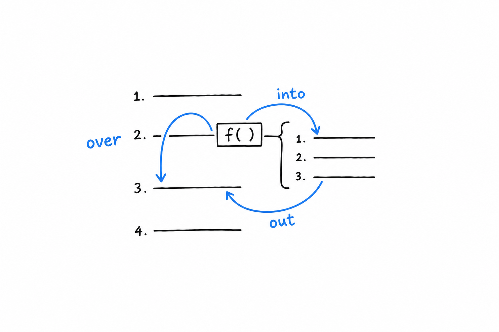

# Step Debugging with Xdebug

Imagine pressing pause on your program at the exact line you are curious about, then reading every variable as it stood at that instant. That is what Xdebug gives you.

Xdebug is not a separate program, and not a function you call the way you call `var_dump()`. **It is a PHP extension: once installed, it changes how PHP itself behaves.** That means a little more setup than the previous section needed, in exchange for the one thing print debugging cannot do: looking at everything in scope without having guessed in advance what to print.

## Installing it

Xdebug is not bundled with PHP, so it needs installing separately. The generic way is through PECL:

```console
$ pecl install xdebug
```

Most package managers offer it too (`apt install php-xdebug` on Debian and Ubuntu, `brew install php` followed by `pecl install xdebug` on macOS with Homebrew's PHP). Whichever route you take, it then needs to be switched on in `php.ini` with a line resembling:

```ini
zend_extension=xdebug
```

Confirm it loaded:

```console
$ php -v
PHP 8.3.0 (cli) (built: ...)
    with Xdebug v3.3.0, Copyright (c) 2002-2024, by Derick Rethans
```

If Xdebug's name shows up there, it is active.

## `xdebug.mode`: turning on what you need

Xdebug does several unrelated jobs, and a single setting, `xdebug.mode`, says which ones are switched on. It takes a comma-separated list in `php.ini`:

```ini
xdebug.mode=develop,debug
```

`develop` is worth leaving on all the time. It needs no other tooling and quietly improves output you already produce: `var_dump()` prints with color and tells you the file and line it was called from, and an uncaught exception comes with a full stack trace, arguments included, instead of PHP's terser default. **`debug` is the mode this section is about: it lets an external tool pause execution and inspect it.**

## Connecting an editor

Step debugging needs two ends talking to each other. On one end, PHP runs your script. On the other, an editor listens for PHP to say "I have paused, come and look." PhpStorm and VS Code (with the "PHP Debug" extension) both do this out of the box, over a protocol called DBGp, on port 9003 by default.

The setup has the same shape in either editor. You tell it to start listening for Xdebug connections. You click in the margin next to a line of code, and a red dot appears: a **breakpoint**, which means "pause here." Then you run the script, from the terminal with `php your_script.php` or by reloading a page served by `php -S`, with `xdebug.mode` including `debug`. **Execution stops the moment it reaches that line, before running it, and the editor shows every variable in scope at that exact point.**



From there you have three ways to move. Step **over** a line runs it and stops at the next one. Step **into** a function call follows execution inside the function instead of running it as a block. Step **out** finishes the current function and stops back in its caller. Variables update in the panel as you go.



## Trying it on the guestbook

The validation code from [Chapter 10](ch10-02-validation-and-xss.md) is a good place to practice: small enough to hold in your head, with a real branch worth watching.

```php
if ($name === '') {
    $errors[] = 'Name cannot be empty.';
} elseif (mb_strlen($name) > 60) {
    $errors[] = 'Name is too long.';
}
```

Set a breakpoint on the `if ($name === '')` line. Start the built-in server with `xdebug.mode=debug` set, start listening in your editor, and submit the guestbook form with the name field left blank. Execution pauses right there. The variables pane shows `$name` as an empty string and `$errors` as an empty array, exactly as they stood at that instant, before a single line of the `if` block has run. Step over it, and watch `$errors` gain its first entry.

> No `var_dump()` had to be written, moved, or removed to see any of that. That is the entire value of step debugging.

## Profiling, briefly

`xdebug.mode=profile` turns on a third capability. Instead of pausing execution, Xdebug records how long each function call took and writes the result to a "cachegrind" file (`xdebug.output_dir` says where). Tools like QCachegrind, or the profiler built into PhpStorm, read that file and show you exactly where a slow request spent its time: which function, called how many times, for what share of the total. Chasing slowness is a different job from chasing a wrong answer, closer to what [Chapter 15](ch15-04-performance.md) discusses about loops and generators, but it is the same extension, and worth knowing about.

## Choosing between the two tools

Honestly, reach for `var_dump()` and `print_r()` first. They need no setup, and for most bugs, especially early on, printing the value and looking at it finds the problem in seconds.

**Reach for Xdebug once printing stops narrowing things down**: when a bug depends on a sequence of calls rather than a single value, or when you catch yourself adding and removing `var_dump()` for the third time on the same problem. At that point, pausing the program and looking around costs less than guessing again.
