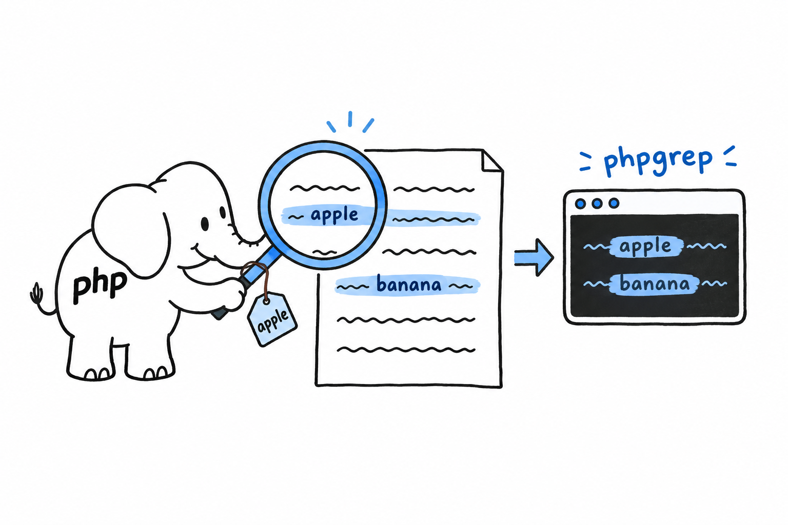

# A CLI Project: Building a Command Line Program

Somewhere on your disk sits a log, a list, an export of something, and you want only the lines that mention one word. On Unix, that job belongs to `grep`. Over the next six sections you will write your own. **phpgrep is a small command line tool that prints every line of a file containing a word**, and it is the biggest program in the book so far.

This is one program, not six examples. Each section starts exactly where the previous one stopped, the way [Chapter 2](ch02-00-guessing-game-tutorial.md) grew its guessing game one capability at a time. The first version is crude: read two arguments, print them. The last one reads its file properly, reports errors the way a real tool should, respects an environment variable, and is covered by tests written before the code that makes them pass. On the way you reuse most of what the book has taught: classes and constructor promotion from [Chapter 5](ch05-00-classes.md), exceptions from [Chapter 9](ch09-00-error-handling.md), PHPUnit from [Chapter 12](ch12-00-testing.md).

A search tool makes a good teaching project for a reason. It is small enough to hold entirely in your head, yet it has arguments to parse, a file to read, one place where things can legitimately go wrong (the file is missing) and one feature worth adding with care (ignoring case). Every piece of it is something you will do again, in some form, at work.

Type the code as you go rather than pasting the final file. **The value of this chapter is in watching the program change shape**: clumsy first, then modular, then tested, then polished. And keep the project once you are done. [Chapter 15](ch15-00-functional-features.md) comes back to phpgrep for one more upgrade, once you have met a PHP feature it is made for.
